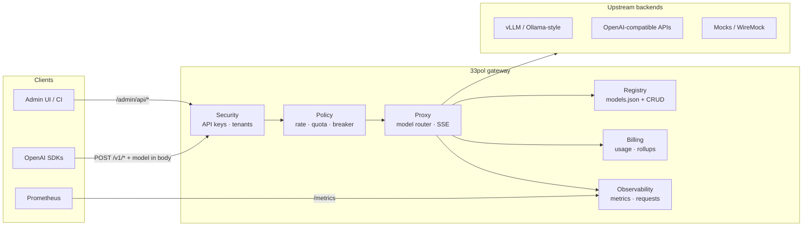

<div align="center">


<br/>

**OpenAI-compatible LLM gateway for .NET 10**

One URL for every model. Policy, tenancy, and FinOps built in — without changing your SDK.

<br/>

[](https://dotnet.microsoft.com/)
[](https://learn.microsoft.com/aspnet/core/)
[](https://platform.openai.com/docs/api-reference)
[](./deploy/docker/README.md)
[](./docs/observability.md)

[Quick start](#-quick-start) · [How it works](#-how-it-works) · [Features](#-features) · [Deploy](#-deployment) · [Docs](#-documentation)

</div>

---

## What is 33pol?

**33pol** is a production-oriented **reverse proxy and control plane** for large language model inference. Clients keep using the familiar OpenAI HTTP API (`/v1/chat/completions`, streaming SSE, embeddings, model list). The gateway reads the `model` field in the JSON body, selects the right upstream backend (vLLM, any OpenAI-compatible server, or a mock), and forwards with **minimal buffering** so token streams stay real-time.

Behind that simple client experience sits a **modular monolith**: API keys and tenants, per-model grants, rate limits and quotas, circuit breakers, usage billing, Prometheus metrics, an admin UI, and optional operator console — all in a single deployable process.

| You get | You keep |
|--------|----------|
| Central routing via `models.json` or live registry CRUD | Existing OpenAI SDKs (Python, Node, LangChain, LiteLLM, …) |
| Multi-tenant API keys with hashed storage | Upstream servers unchanged |
| Rate limits, concurrency caps, monthly quotas | Standard paths (`POST /v1/chat/completions`, etc.) |
| FinOps rollups, exports, budget webhooks | SSE streaming end-to-end |
| Grafana dashboards and alert rules | Health probes for Kubernetes |

> **Status:** Phases 1–5 are **code-complete**; GA sign-off is pending (staging perf, SDK smoke, Compose E2E, approvals). See [implementation plan](./docs/implementation-plan/README.md), [gap report](./docs/implementation-plan-gap-report.md), and [GA checklist](./docs/implementation-plan/GA-CHECKLIST.md).

---

## Table of contents

- [How it works](#-how-it-works)
- [Features](#-features)
- [Quick start](#-quick-start)
- [Client usage](#-client-usage)
- [Model registry](#-model-registry)
- [Control plane & admin](#-control-plane--admin)
- [Observability & FinOps](#-observability--finops)
- [Deployment](#-deployment)
- [Development](#-development)
- [Documentation](#-documentation)

---

## How it works

33pol runs as one **ASP.NET Core 10** process (Kestrel). Traffic splits into three **planes** — inference, control, and ops — with separate auth rules.



### Request path (inference)

1. **Authenticate** — Inference API key (`Authorization: Bearer` or `X-API-Key`) when Postgres/bootstrap is enabled.
2. **Authorize model** — Tenant must have a grant for the requested `model` (or alias).
3. **Policy** — Rate limit (RPM, burst, concurrent streams), then quota / budget checks.
4. **Route** — Resolve backend URL from registry; apply circuit breaker and timeouts.
5. **Forward** — Same path to upstream (`POST /v1/chat/completions` → `{backend}/v1/chat/completions`).
6. **Record** — Usage event enqueued; tokens committed after completion; metrics updated.

Middleware order on the hot path:

```text
Serilog → Routing → CORS → RequestId → Auth → Authorization
  → Rate limit → Quota → Model router → upstream HTTP
```

`/health/*`, `/metrics`, and `/admin` branches **do not** pass through the model router.

### Planes at a glance

| Plane | Paths | Auth |
|-------|-------|------|
| **Inference** | `POST /v1/chat/completions`, `/v1/completions`, `/v1/embeddings`, `GET /v1/models` | Inference or Admin key (when DB enabled) |
| **Control** | `/admin/api/*`, `/admin` UI | Admin key only |
| **Ops** | `/health/live`, `/health/ready`, `/metrics`, `/stats` | None (probes / scrape) |

Deeper architecture: [docs/architecture.md](./docs/architecture.md) · [solution layout](./docs/implementation-plan/01-solution-architecture.md).

---

## Features

| Area | Capability |
|------|------------|
| **Compatibility** | OpenAI-shaped requests, responses, errors, and SSE streaming |
| **Routing** | Body-based `model` → backend URL; aliases; hot reload of `models.json` |
| **Security** | Hashed API keys (HMAC + pepper), admin vs inference roles, model grants, [CORS for browser SPAs](docs/security.md#cors) |
| **Resilience** | Forward timeouts, body size limits, per-model concurrency, circuit breaker |
| **Policy** | RPM/burst, concurrent streams, monthly token quotas, budget hard-stop |
| **FinOps** | Usage events, daily rollups, CSV/JSON export, forecast API, signed webhooks |
| **Observability** | Prometheus `/metrics`, `X-Request-Id`, recent-request ring, Grafana dashboard |
| **Operations** | Static admin UI, REST control plane, optional Spectre.Console TUI |
| **Deploy** | Docker Compose stack, Helm chart, OTel collector sample, CI + k6 perf gates |

---

## Quick start

Pick the path that fits you — all three hit the same OpenAI-compatible surface on port **8080**.

### Option A — Full stack (Docker, recommended)

No local .NET SDK required. Gateway, Postgres, mock upstream, Prometheus, and Grafana in one command.

```bash
cp .env.example .env
cp deploy/docker/config/models.json.example deploy/docker/config/models.json
cp deploy/docker/config/upstream-secrets.enc.example deploy/docker/config/upstream-secrets.enc
docker compose up -d --build
bash perf/ci/verify-compose-health.sh
```

| Service | URL |
|---------|-----|
| Gateway | http://localhost:8080 |
| Admin UI | http://localhost:8080/admin |
| Grafana (folder **33pol**, two dashboards) | http://localhost:3000 — [observability.md](./docs/observability.md) |
| Prometheus | http://localhost:9090 |

Details: [deploy/docker/README.md](./deploy/docker/README.md).

**LM Studio on your machine:** step-by-step guide → [docs/lm-studio-with-33pol.md](./docs/lm-studio-with-33pol.md).

### Option B — .NET only (fastest loop)

```bash
dotnet build 33pol.sln
dotnet test 33pol.sln -c Release

# Terminal 1 — mock upstream
python3 perf/scripts/mock-upstream.py

# Terminal 2 — gateway (no DB → auth relaxed for local smoke)
export ASPNETCORE_ENVIRONMENT=Development
export Gateway__ModelsConfigPath=config/models.ci.json
export Gateway__OperatorConsole__Enabled=false
export ConnectionStrings__GatewayDb=
dotnet run --project src/33pol.App --urls http://localhost:8080

# Terminal 3 — smoke ([k6](https://grafana.com/docs/k6/latest/set-up/install-k6/) required)
bash perf/ci/run-smoke.sh
```

- Liveness: `GET http://localhost:8080/health/live`
- Models: `GET http://localhost:8080/v1/models`

### Option C — Verify health with curl

```bash
curl -s http://localhost:8080/health/live
curl -s http://localhost:8080/v1/models \
  -H "Authorization: Bearer <your-api-key>"
```

---

## Client usage

Point any OpenAI client at the gateway base URL and use a **gateway** API key — not the upstream provider key.

### Python

```python
from openai import OpenAI

client = OpenAI(
    base_url="http://localhost:8080/v1",
    api_key="sk-your-gateway-key",
)

# Non-streaming
response = client.chat.completions.create(
    model="gpt-local",  # must exist in registry (id or alias)
    messages=[{"role": "user", "content": "Hello from 33pol"}],
)
print(response.choices[0].message.content)

# Streaming — SSE preserved end-to-end
stream = client.chat.completions.create(
    model="gpt-local",
    messages=[{"role": "user", "content": "Stream me"}],
    stream=True,
)
for chunk in stream:
    if chunk.choices[0].delta.content:
        print(chunk.choices[0].delta.content, end="")
```

### Environment variables

| Variable | Example | Purpose |
|----------|---------|---------|
| `OPENAI_BASE_URL` | `http://gateway:8080/v1` | SDK base URL |
| `OPENAI_API_KEY` | `sk-…` | Gateway inference key |

LangChain, LiteLLM, and other OpenAI-compatible providers: set `openai_api_base` / `openai_api_key` to the same values. Model names must appear in `GET /v1/models`.

More: [docs/integrations.md](./docs/integrations.md) · SDK smoke: `python3 perf/scripts/sdk-smoke.py`.

---

## Model registry

Backends are defined in **`models.json`** (path via `Gateway:ModelsConfigPath`) or updated at runtime through admin APIs.

```json
{
  "models": [
    {
      "id": "local-mock",
      "url": "http://localhost:8080",
      "maxContextLength": 8192,
      "aliases": ["mock", "gpt-local"]
    }
  ]
}
```

| Field | Role |
|-------|------|
| `id` | Canonical model name clients use |
| `url` | Upstream base URL (gateway appends `/v1/...` paths) |
| `aliases` | Extra names accepted in the `model` field |
| `maxContextLength` | Advertised in `GET /v1/models` |

File changes can reload on an interval (`Gateway:ConfigReloadIntervalSeconds`) or via `POST /admin/api/config/reload`. Live CRUD: `GET/POST/PATCH/DELETE /admin/api/models`.

---

## Control plane & admin

| Surface | URL | Credential |
|---------|-----|------------|
| **Browser UI** | `/admin` | Admin API key (stored in `localStorage`) |
| **REST API** | `/admin/api/*` | `X-API-Key` or Bearer (admin scope) |
| **Operator console** | Optional TUI | Same admin APIs |

Typical admin tasks: manage API keys and tenants, edit models, reload config, inspect backends and recent requests, export usage.

```bash
# Example: operational snapshot
curl -s http://localhost:8080/admin/api/summary \
  -H "X-API-Key: $ADMIN_KEY" | jq .
```

When Postgres is configured, set `Gateway:Bootstrap:AdminApiKey` for first-run provisioning, then rotate.

Guides: [admin-ui.md](./docs/admin-ui.md) · [operator-console.md](./docs/operator-console.md) · [security.md](./docs/security.md).

---

## Observability & FinOps

| Signal | Where |
|--------|--------|
| **Metrics** | `GET /metrics` (Prometheus) |
| **Dashboards** | Grafana (Compose): `deploy/grafana/dashboards/` — [observability.md](./docs/observability.md) |
| **Alerts** | `deploy/prometheus/alerts/` |
| **Traces** | OTel → [deploy/otel-collector/](./deploy/otel-collector/) |
| **Recent requests** | `GET /admin/api/requests?limit=` |
| **Usage / forecast** | `GET /admin/api/usage`, `/forecast`, `/export` |

Every response carries **`X-Request-Id`** for correlation. Error bodies follow a stable JSON envelope — see [errors.md](./docs/errors.md).

Runbooks: [all backends down](./docs/runbooks/all-backends-down.md) · [high error rate](./docs/runbooks/high-error-rate.md).

FinOps detail: [finops.md](./docs/finops.md) · Observability: [observability.md](./docs/observability.md).

---

## Deployment

| Artifact | Use case |
|----------|----------|
| [scripts/install-33pol.sh](./scripts/install-33pol.sh) | Interactive install on a Linux server (GPU gateway profile) |
| [docs/deploy-remote-gpu.md](./docs/deploy-remote-gpu.md) | Remote GPU server walkthrough |
| [Dockerfile](./Dockerfile) | Production container (`ghcr.io` on `main`) |
| [docker-compose.yml](./docker-compose.yml) | Local full stack (`COMPOSE_PROFILES=full` in `.env.example`) |
| [deploy/helm/33pol/](./deploy/helm/33pol/) | Kubernetes (HPA, ServiceMonitor, ingress) |
| [deploy/README.md](./deploy/README.md) | Layout index |

**Server install (one-liner after clone):**

```bash
git clone https://github.com/sadeghhp/33pol.git && cd 33pol && ./scripts/install-33pol.sh install
```

**Helm (sketch):**

```bash
helm upgrade --install 33pol deploy/helm/33pol \
  --set image.repository=ghcr.io/<org>/33pol \
  --set postgresql.enabled=true \
  --set serviceMonitor.enabled=true
```

**Kubernetes notes:**

- Probes: `/health/live` (liveness), `/health/ready` (readiness) — no auth.
- **SSE / streaming:** configure long proxy timeouts on ingress; disable buffering for chat completion streams ([integrations.md](./docs/integrations.md)).
- **Multi-replica:** rate limits are per-pod unless a shared store is configured; coordinate registry updates or share `models.json`.

---

## Development

### Solution layout

```text
33pol.sln
├── src/
│   ├── 33pol.App          # Host, middleware, static admin
│   ├── 33pol.Proxy        # Model router, forwarding, streaming
│   ├── 33pol.Registry     # models.json + reload
│   ├── 33pol.Security     # API keys, authorization
│   ├── 33pol.Policy       # Rate limits, quotas, breaker config
│   ├── 33pol.Observability
│   ├── 33pol.Billing
│   ├── 33pol.Persistence  # EF Core + Postgres
│   ├── 33pol.Api          # Minimal API endpoints
│   └── 33pol.OperatorConsole
└── tests/                 # Unit, integration, architecture, conformance
```

### Build & test

```bash
dotnet build 33pol.sln
dotnet test 33pol.sln -c Release
dotnet test 33pol.sln -c Release --collect:"XPlat Code Coverage"
bash build/check-coverage.sh TestResults
```

### CI & performance

| Workflow | Trigger |
|----------|---------|
| [ci.yml](./.github/workflows/ci.yml) | PR / `main` — build, test, coverage, vuln scan |
| [docker-image.yml](./.github/workflows/docker-image.yml) | `main` — publish image |
| [k6-nightly.yml](./.github/workflows/k6-nightly.yml) | Scheduled load tests |

Load testing: [perf/README.md](./perf/README.md) · thresholds: [perf/k6/thresholds.json](./perf/k6/thresholds.json).

Conformance (OpenAI shapes + golden errors):

```bash
dotnet test tests/33pol.Conformance.Tests
```

---

## Documentation

| Topic | Document |
|-------|----------|
| Architecture | [docs/architecture.md](./docs/architecture.md) |
| Integrations (K8s, LangChain, k6) | [docs/integrations.md](./docs/integrations.md) |
| Security & threat model | [docs/security.md](./docs/security.md) |
| Error catalog | [docs/errors.md](./docs/errors.md) |
| Implementation plan (phases 1–5) | [docs/implementation-plan/README.md](./docs/implementation-plan/README.md) |
| GA sign-off checklist | [docs/ga-signoff.md](./docs/ga-signoff.md) |
| v1 behavior reference | [docs/old-version/](./docs/old-version/) |
| Testing strategy | [docs/implementation-plan/02-testing-strategy.md](./docs/implementation-plan/02-testing-strategy.md) |

---

## Disclaimer

> **Internal use only — not production-ready for public exposure**
>
> 33pol was built for **internal** LLM routing, operations, and experimentation within our organization. It has **not** been fully validated for untrusted, internet-facing, or multi-tenant public production workloads. GA sign-off items (staging performance, full E2E in Compose, SDK smoke runs, and formal approvals) may still be open — see [GA checklist](./docs/implementation-plan/GA-CHECKLIST.md).
>
> Before any production or customer-facing deployment, run your own security review, load testing, hardening (TLS, secrets, CORS, key rotation), and operational runbooks. **Do not** expose admin endpoints or default bootstrap credentials to the public internet.

---

## How this project was built

33pol was developed using a **Taiga-first, Cursor-assisted** workflow:

| Tool | Role |
|------|------|
| **[Taiga](https://taiga.io/) + MCP** | Backlog, epics, user stories, tasks, and sprint status on project `sadeghhp-33pol` — work is planned and tracked in Taiga before and after each implementation step |
| **[Cursor](https://cursor.com/)** | AI pair-programming in the IDE: architecture-aligned changes, unit tests per library, and docs/runbooks alongside code |

The [implementation plan](./docs/implementation-plan/README.md) (phases 1–5) is the source of truth for scope; Taiga tasks map to those phases. Cursor agents use the Taiga MCP server to sync story/task state, comment with test results, and keep delivery aligned with the board — not ad-hoc markdown backlogs.

---

<div align="center">

**33pol** — route every model through one gateway, with policy and visibility built in.

[Report issues](https://github.com/sadeghhp/33pol/issues) · [Implementation plan](./docs/implementation-plan/README.md) · [Deploy guide](./deploy/README.md)

</div>
