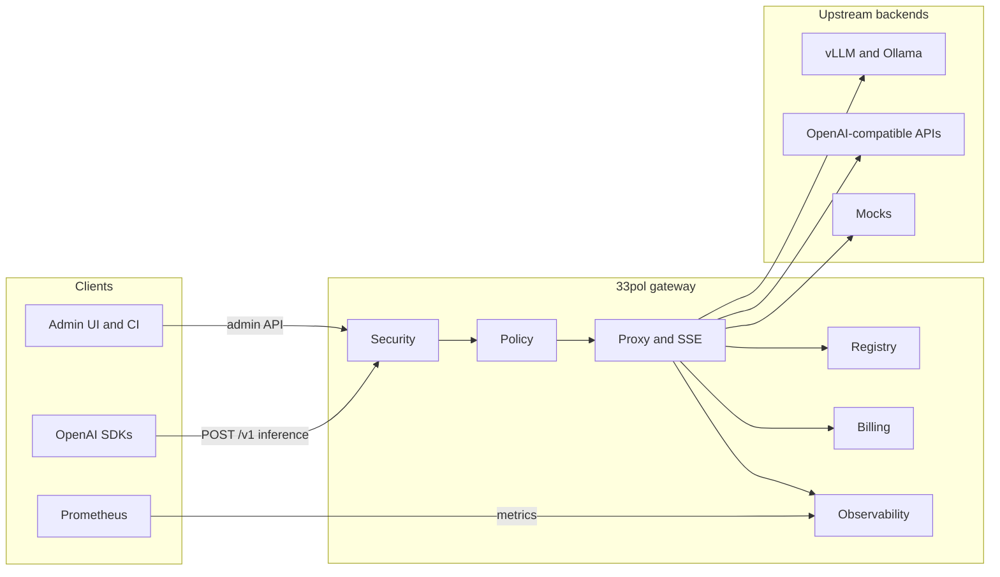

<div align="center">


<br/>

**OpenAI-compatible LLM gateway for .NET 10**

One URL for every model. Policy, tenancy, and FinOps built in — without changing your SDK.

<br/>

[](https://github.com/sadeghhp/33pol/actions/workflows/ci.yml)

<br/>

[](https://dotnet.microsoft.com/)
[](https://learn.microsoft.com/aspnet/core/)
[](https://platform.openai.com/docs/api-reference)
[](./deploy/docker/README.md)
[](./docs/observability.md)

[What is 33pol?](#what-is-33pol) · [Comparison](#how-33pol-compares) · [Quick start](#-quick-start) · [How it works](#-how-it-works) · [Features](#-features) · [Deploy](#-deployment) · [Docs](#-documentation) · [Security](SECURITY.md)

</div>

---

## What is 33pol?

**33pol** is a **self-hosted OpenAI-compatible LLM gateway** for **.NET 10**: one base URL in front of every model you operate (local **vLLM** / Ollama / LM Studio, cloud OpenAI-compatible APIs, mocks). Clients keep the standard OpenAI HTTP surface (`/v1/chat/completions`, SSE streaming, embeddings, `GET /v1/models`). The gateway reads **`model` in the JSON body**, picks the upstream from a live registry, and forwards with **minimal buffering** so token streams stay real-time.

It is **not** a model runtime (that is vLLM/Ollama) and **not** a hosted model marketplace (that is OpenRouter and similar)—though you can **route through** those as upstreams.

Behind the proxy sits a **modular monolith**: hashed API keys and tenants, per-key model grants, rate limits and quotas, circuit breakers, FinOps rollups and exports, Prometheus metrics, admin UI, and optional operator console—in **one deployable process**.

| You get | You keep |
|--------|----------|
| Central routing via `models.json` or live registry CRUD | Existing OpenAI SDKs (Python, Node, LangChain, LiteLLM, …) |
| Multi-tenant API keys with hashed storage; per-key model grants | Upstream servers unchanged |
| Rate limits (admin-configurable), concurrency caps, monthly quotas | Standard paths (`POST /v1/chat/completions`, etc.) |
| FinOps rollups, exports, budget webhooks | SSE streaming end-to-end |
| Grafana dashboards and alert rules; optional `publicAccess` for local upstreams | Health probes for Kubernetes |

> **Status:** `v2.0.0` is tagged and released; see [CHANGELOG.md](./CHANGELOG.md) for what has landed since. Sustained-load validation against a production-like upstream has not been run — treat capacity numbers as unverified and see [perf/README.md](./perf/README.md). Operator config (`models.json`, `upstream-secrets.enc`, `.env`) is gitignored for public-repo hygiene — see [security.md](./docs/security.md).

---

## How 33pol compares

Peers solve the same problem—**one OpenAI-shaped API in front of many backends**—with different stacks and trade-offs. 33pol targets teams that want a **.NET-native, self-hosted control plane** with policy and FinOps built in, not a managed cloud router.

| Category | Examples | vs 33pol |
|----------|----------|----------|
| **Open-source LLM proxies** | [LiteLLM](https://github.com/BerriAI/litellm), [TensorZero](https://github.com/tensorzero/tensorzero) | Closest fit. LiteLLM is Python with a huge provider matrix; 33pol is a single **ASP.NET Core** binary with strong tenancy, grants, and FinOps in-repo. LiteLLM clients can point `openai_api_base` at 33pol. |
| **Gateway + observability** | [Portkey](https://github.com/Portkey-AI/gateway), [Helicone](https://github.com/Helicone/helicone) | Often analytics- and SaaS-first. 33pol emphasizes **policy, routing, and self-hosted billing exports** in one process. |
| **API / ingress gateways** | [Kong AI Gateway](https://konghq.com/products/kong-ai-gateway), [Envoy AI Gateway](https://github.com/envoyproxy/ai-gateway) | General API traffic + AI plugins. Choose when you already standardize on Kong/Envoy; choose 33pol for a **dedicated LLM edge** with body-based `model` routing. |
| **Managed cloud gateways** | Cloudflare AI Gateway, Azure APIM AI | Hosted policy and caching. 33pol is **operator-run OSS** you deploy with Compose or Helm. |
| **Inference servers** | vLLM, Ollama, LM Studio | Run models; 33pol **sits in front** of them unchanged. |

| Dimension | 33pol | Typical peers |
|-----------|-------|----------------|
| **Runtime** | .NET 10 modular monolith | Python (LiteLLM), polyglot, or mesh plugins |
| **Routing** | `model` in JSON body → registry + aliases + health gating | Similar for LLM proxies; path/header rules on generic gateways |
| **Streaming** | YARP `IHttpForwarder`, minimal buffering | Varies by implementation |
| **Security** | Hashed keys, admin vs inference roles, per-key **model grants** | Budgets/keys everywhere; grant depth varies |
| **FinOps** | Usage events, rollups, CSV/JSON export, webhooks | Strong in observability-first products; LiteLLM has spend controls |
| **Deploy** | Compose profiles, Helm, installer script, k6 gates | Mature across ecosystems; Kong/Envoy win at large K8s mesh scale |

**Not in scope for v2** (by design): TLS termination at the gateway (use ingress), multi-URL load balancing per model, hosted SaaS control plane / Stripe, default prompt logging, and horizontal scaling — the gateway is a single writer against one embedded SQLite file, so it scales vertically only ([integrations.md](./docs/integrations.md#kubernetes)).

---

## Table of contents

- [What is 33pol?](#what-is-33pol)
- [How 33pol compares](#how-33pol-compares)
- [How it works](#-how-it-works)
- [Features](#-features)
- [Quick start](#-quick-start)
- [Client usage](#-client-usage)
- [Model registry](#-model-registry)
- [Control plane & admin](#-control-plane--admin)
- [Observability & FinOps](#-observability--finops)
- [Deployment](#-deployment)
- [Development](#-development)
- [Documentation](#-documentation)

---

## How it works

33pol runs as one **ASP.NET Core 10** process (Kestrel). Traffic splits into three **planes** — inference, control, and ops — with separate auth rules.



### Request path (inference)

1. **Authenticate** — Inference API key (`Authorization: Bearer` or `X-API-Key`) when the database/bootstrap is enabled, unless the model has `publicAccess: true`.
2. **Authorize model** — Tenant ceiling and per-key allowlist must include the requested `model` (or alias); public models skip grant checks.
3. **Policy** — Rate limit (RPM, burst, concurrent streams), then quota / budget checks.
4. **Route** — Resolve backend URL from registry; apply circuit breaker and timeouts.
5. **Forward** — Same path to upstream (`POST /v1/chat/completions` → `{backend}/v1/chat/completions`).
6. **Record** — Usage event enqueued; tokens committed after completion; metrics updated.

Middleware order on the hot path:

```text
Serilog → Routing → CORS → RequestId → Auth → Authorization
  → Rate limit → Quota → Model router → upstream HTTP
```

`/health/*`, `/metrics`, and `/admin` branches **do not** pass through the model router.

### Planes at a glance

| Plane | Paths | Auth |
|-------|-------|------|
| **Inference** | `POST /v1/chat/completions`, `/v1/completions`, `/v1/embeddings`, `GET /v1/models` | Inference or Admin key (when DB enabled); `publicAccess` models allow anonymous inference; `GET /v1/models` is optional (unauthenticated callers see public models only) |
| **Control** | `/admin/api/*`, `/admin` UI | Admin key only |
| **Ops** | `/health/live`, `/health/ready`, `/metrics`, `/stats` | None (probes / scrape) |

Deeper architecture: [docs/architecture.md](./docs/architecture.md).

---

## Features

| Area | Capability |
|------|------------|
| **Compatibility** | OpenAI-shaped requests, responses, errors, and SSE streaming |
| **Routing** | Body-based `model` → backend URL; aliases; DB-backed model routes with live admin CRUD (`models.json` seeds/falls back); encrypted upstream credentials |
| **Security** | Hashed API keys (HMAC + pepper), admin vs inference roles, tenant + per-key model grants, [CORS for browser SPAs](docs/security.md#cors), optional [`publicAccess`](docs/security.md#public-models-publicaccess) for local upstreams |
| **Resilience** | Forward timeouts, body size limits, per-model concurrency, circuit breaker |
| **Policy** | Admin-managed RPM/burst and plans, concurrent streams, monthly token quotas, budget hard-stop |
| **FinOps** | Usage events, daily rollups, CSV/JSON export, forecast API, signed webhooks |
| **Observability** | Prometheus `/metrics`, `X-Request-Id`, recent-request ring, Grafana dashboard |
| **Operations** | Static admin UI (rate limits, model grants, batch key revoke), REST control plane, optional Spectre.Console TUI |
| **Deploy** | Compose profiles (gateway-only → full demo stack), interactive installer, Helm chart, OTel collector sample, CI + k6 perf gates |

---

## Quick start

Pick the path that fits you — all three hit the same OpenAI-compatible surface on port **8080**.

### Option A — Docker Compose (recommended)

No local .NET SDK required. Default profile runs the **gateway** only (with an embedded SQLite database — no external DB service); enable optional services via `COMPOSE_PROFILES` in `.env`.

| Profile | `COMPOSE_PROFILES` | Services |
|---------|-------------------|----------|
| **gpu-gateway** (default) | empty | `gateway` (embedded SQLite) |
| **gpu-observability** | `observability` | above + `prometheus`, `grafana` |
| **full-stack** (local demo) | `full` | above + `mock-upstream` |

```bash
cp .env.example .env
cp deploy/docker/config/models.json.example deploy/docker/config/models.json
cp deploy/docker/config/upstream-secrets.enc.example deploy/docker/config/upstream-secrets.enc

# Local demo with mock upstream + Grafana (optional):
# COMPOSE_PROFILES=full

docker compose up -d --build
bash perf/ci/verify-compose-health.sh   # profile-aware (skips mock/Grafana when not enabled)
```

`models.json` and `upstream-secrets.enc` are **gitignored** operator config — copy from the `.example` templates; never commit real registry or upstream keys. See [security.md](./docs/security.md#going-public-checklist).

| Service | URL (when profile includes it) |
|---------|-----|
| Gateway | http://localhost:8080 |
| Admin UI | http://localhost:8080/admin |
| Mock upstream | http://localhost:18080 (`full` profile) |
| Grafana (folder **33pol**, two dashboards) | http://localhost:3000 — [observability.md](./docs/observability.md) |
| Prometheus | http://localhost:9090 |

Details: [deploy/docker/README.md](./deploy/docker/README.md).

**Remote GPU / server:** interactive installer → `./scripts/install-33pol.sh install` ([deploy-remote-gpu.md](./docs/deploy-remote-gpu.md)).

**LM Studio on your machine:** step-by-step guide → [docs/lm-studio-with-33pol.md](./docs/lm-studio-with-33pol.md).

### Option B — .NET only (fastest loop)

```bash
dotnet build 33pol.sln
dotnet test 33pol.sln -c Release

# Terminal 1 — mock upstream
python3 perf/scripts/mock-upstream.py

# Terminal 2 — gateway (no DB → auth relaxed for local smoke)
export ASPNETCORE_ENVIRONMENT=Development
export Gateway__ModelsConfigPath=config/models.ci.json
export Gateway__OperatorConsole__Enabled=false
export ConnectionStrings__GatewayDb=
dotnet run --project src/33pol.App --urls http://localhost:8080

# Terminal 3 — smoke ([k6](https://grafana.com/docs/k6/latest/set-up/install-k6/) required)
bash perf/ci/run-smoke.sh
```

- Liveness: `GET http://localhost:8080/health/live`
- Models: `GET http://localhost:8080/v1/models`

### Option C — Verify health with curl

```bash
curl -s http://localhost:8080/health/live
curl -s http://localhost:8080/v1/models \
  -H "Authorization: Bearer <your-api-key>"
```

---

## Client usage

Point any OpenAI client at the gateway base URL and use a **gateway** inference API key — not the upstream provider key. New inference keys have **no model access** until an operator grants models in the admin UI (**API keys → Models**). For local upstreams (e.g. LM Studio), operators can enable **Allow use without 33pol API key** (`publicAccess`) so clients may omit the gateway key.

### Python

```python
from openai import OpenAI

client = OpenAI(
    base_url="http://localhost:8080/v1",
    api_key="sk-your-gateway-key",
)

# Non-streaming
response = client.chat.completions.create(
    model="gpt-local",  # must exist in registry (id or alias)
    messages=[{"role": "user", "content": "Hello from 33pol"}],
)
print(response.choices[0].message.content)

# Streaming — SSE preserved end-to-end
stream = client.chat.completions.create(
    model="gpt-local",
    messages=[{"role": "user", "content": "Stream me"}],
    stream=True,
)
for chunk in stream:
    if chunk.choices[0].delta.content:
        print(chunk.choices[0].delta.content, end="")
```

### Environment variables

| Variable | Example | Purpose |
|----------|---------|---------|
| `OPENAI_BASE_URL` | `http://gateway:8080/v1` | SDK base URL |
| `OPENAI_API_KEY` | `sk-…` | Gateway inference key (omit for `publicAccess` models) |

LangChain, LiteLLM, and other OpenAI-compatible providers: set `openai_api_base` / `openai_api_key` to the same values. Model names must appear in `GET /v1/models`.

More: [docs/integrations.md](./docs/integrations.md) · SDK smoke: `python3 perf/scripts/sdk-smoke.py`.

---

## Model registry

Model routes live in the **SQLite database** and are managed at runtime through the admin APIs (and admin UI). On first boot an empty database is seeded from **`models.json`** (path via `Gateway:ModelsConfigPath`), which also serves as a fallback when no database is configured; thereafter the database is the source of truth. In Docker Compose, copy `deploy/docker/config/models.json.example` → `models.json` locally to seed (the file is gitignored).

```json
{
  "models": [
    {
      "id": "local-mock",
      "url": "http://mock-upstream:8080",
      "maxContextLength": 8192,
      "aliases": ["mock", "gpt-local"],
      "publicAccess": false
    }
  ]
}
```

| Field | Role |
|-------|------|
| `id` | Canonical model name clients use |
| `url` | Upstream base URL (gateway appends `/v1/...` paths) |
| `aliases` | Extra names accepted in the `model` field |
| `maxContextLength` | Advertised in `GET /v1/models` |
| `publicAccess` | When `true`, inference works without a 33pol API key (local upstreams only; see [security.md](./docs/security.md#public-models-publicaccess)) |
| `upstreamAuth` | Reference to encrypted secret (`upstream-secrets.enc`) or `.env` var (e.g. `OPENROUTER_API_KEY`) — set via admin UI or GitOps |

Upstream API keys entered in the admin UI are stored in **`upstream-secrets.enc`** (gitignored), not in `models.json`. Provider keys can also live in `.env` for GitOps — see [deploy/docker/README.md](./deploy/docker/README.md#openrouter-cloud).

File changes can reload on an interval (`Gateway:ConfigReloadIntervalSeconds`) or via `POST /admin/api/config/reload`. Live CRUD: `GET/POST/PATCH/DELETE /admin/api/models`.

---

## Control plane & admin

| Surface | URL | Credential |
|---------|-----|------------|
| **Browser UI** | `/admin` | Admin API key (stored in `localStorage`) |
| **REST API** | `/admin/api/*` | `X-API-Key` or Bearer (admin scope) |
| **Operator console** | Optional TUI | Same admin APIs |

Typical admin tasks: manage API keys (per-key model grants; inference keys start with **no models** until granted), edit models and upstream credentials, configure rate limits, reload config, inspect backends and recent requests, export usage.

```bash
# Example: operational snapshot
curl -s http://localhost:8080/admin/api/summary \
  -H "X-API-Key: $ADMIN_KEY" | jq .
```

For first-run provisioning, set `Gateway:Bootstrap:AdminApiKey`, then rotate.

Guides: [admin-ui.md](./docs/admin-ui.md) · [operator-console.md](./docs/operator-console.md) · [security.md](./docs/security.md).

---

## Observability & FinOps

| Signal | Where |
|--------|--------|
| **Metrics** | `GET /metrics` (Prometheus) |
| **Dashboards** | Grafana (Compose): `deploy/grafana/dashboards/` — [observability.md](./docs/observability.md) |
| **Alerts** | `deploy/prometheus/alerts/` |
| **Traces** | OTel → [deploy/otel-collector/](./deploy/otel-collector/) |
| **Recent requests** | `GET /admin/api/requests?limit=` |
| **Usage / forecast** | `GET /admin/api/usage`, `/forecast`, `/export` |

Every response carries **`X-Request-Id`** for correlation. Error bodies follow a stable JSON envelope — see [errors.md](./docs/errors.md).

Runbooks: [all backends down](./docs/runbooks/all-backends-down.md) · [high error rate](./docs/runbooks/high-error-rate.md).

FinOps detail: [finops.md](./docs/finops.md) · Observability: [observability.md](./docs/observability.md).

---

## Deployment

| Artifact | Use case |
|----------|----------|
| [scripts/install-33pol.sh](./scripts/install-33pol.sh) | Interactive install on a Linux server (`install`, `upgrade`, `reapply`, `doctor`, `status`, `logs`) |
| [docs/deploy-remote-gpu.md](./docs/deploy-remote-gpu.md) | Remote GPU server walkthrough |
| [Dockerfile](./Dockerfile) | Production container (`ghcr.io` on `main`) |
| [docker-compose.yml](./docker-compose.yml) | Compose entry point; profiles via `COMPOSE_PROFILES` in `.env` (default: gateway only, embedded SQLite) |
| [deploy/helm/33pol/](./deploy/helm/33pol/) | Kubernetes (HPA, ServiceMonitor, ingress, CORS values) |
| [deploy/README.md](./deploy/README.md) | Layout index |
| [scripts/host-health/](./scripts/host-health/) | Optional Ubuntu host health checks (independent of 33pol) |

**Server install (one-liner after clone):**

```bash
git clone https://github.com/sadeghhp/33pol.git && cd 33pol && ./scripts/install-33pol.sh install
```

**Apply `.env` changes without full reinstall:**

```bash
./scripts/install-33pol.sh reapply              # quota, ports, profiles
./scripts/install-33pol.sh reapply --service gateway   # gateway-only (faster)
./scripts/install-33pol.sh upgrade              # git pull + rebuild
```

**Helm (sketch):**

```bash
helm upgrade --install 33pol deploy/helm/33pol \
  --set image.repository=ghcr.io/<org>/33pol \
  --set persistence.enabled=true \
  --set serviceMonitor.enabled=true
```

**Kubernetes notes:**

- Probes: `/health/live` (liveness), `/health/ready` (readiness) — no auth.
- **SSE / streaming:** configure long proxy timeouts on ingress; disable buffering for chat completion streams ([integrations.md](./docs/integrations.md)).
- **Browser SPAs:** set `gateway.cors.allowedOrigins` in Helm values when `ASPNETCORE_ENVIRONMENT` is Production ([security.md](./docs/security.md#cors)).
- **Single-instance:** the gateway runs one replica on embedded SQLite (the Helm chart rejects `replicaCount > 1` and `autoscaling.enabled`). All config and routes are in the database; scale vertically and point the PVC at durable, backed-up storage ([backup runbook](docs/runbooks/backup-restore.md)).

---

## Development

### Solution layout

```text
33pol.sln
├── src/
│   ├── 33pol.App          # Host, middleware, static admin
│   ├── 33pol.Proxy        # Model router, forwarding, streaming
│   ├── 33pol.Registry     # models.json + reload
│   ├── 33pol.Security     # API keys, authorization
│   ├── 33pol.Policy       # Rate limits, quotas, breaker config
│   ├── 33pol.Observability
│   ├── 33pol.Billing
│   ├── 33pol.Persistence  # EF Core + SQLite
│   ├── 33pol.Api          # Minimal API endpoints
│   └── 33pol.OperatorConsole
└── tests/                 # Unit, integration, architecture, conformance
```

### Build & test

```bash
dotnet build 33pol.sln
dotnet test 33pol.sln -c Release
dotnet test 33pol.sln -c Release --collect:"XPlat Code Coverage"
bash build/check-coverage.sh TestResults
```

### CI & performance

| Workflow | Trigger |
|----------|---------|
| [ci.yml](./.github/workflows/ci.yml) | PR / `main` — build, test, coverage, vuln scan |
| [ci-reusable.yml](./.github/workflows/ci-reusable.yml) | Called by CI and release (shared test gate) |
| [docker-image.yml](./.github/workflows/docker-image.yml) | `main` — publish `ghcr.io/.../33pol:latest` |
| [release.yml](./.github/workflows/release.yml) | Tag `v*` — tests, semver image, GitHub Release + tarball |
| [k6-nightly.yml](./.github/workflows/k6-nightly.yml) | Scheduled load tests |

Release process: [docs/release.md](./docs/release.md) · [CHANGELOG.md](./CHANGELOG.md)

Load testing: [perf/README.md](./perf/README.md) · thresholds: [perf/k6/thresholds.json](./perf/k6/thresholds.json).

Conformance (OpenAI shapes + golden errors):

```bash
dotnet test tests/33pol.Conformance.Tests
```

---

## Documentation

| Topic | Document |
|-------|----------|
| Architecture | [docs/architecture.md](./docs/architecture.md) |
| Integrations (K8s, LangChain, k6, OpenRouter) | [docs/integrations.md](./docs/integrations.md) |
| Security & threat model | [SECURITY.md](./SECURITY.md) · [docs/security.md](./docs/security.md) |
| Admin UI & rate limits | [docs/admin-ui.md](./docs/admin-ui.md) · [docs/runbooks/rate-limit-admin.md](./docs/runbooks/rate-limit-admin.md) |
| Remote GPU / server deploy | [docs/deploy-remote-gpu.md](./docs/deploy-remote-gpu.md) |
| LM Studio walkthrough | [docs/lm-studio-with-33pol.md](./docs/lm-studio-with-33pol.md) |
| Error catalog | [docs/errors.md](./docs/errors.md) |
| Observability & metric catalog | [docs/observability.md](./docs/observability.md) |
| FinOps & billing | [docs/finops.md](./docs/finops.md) |
| Operator console | [docs/operator-console.md](./docs/operator-console.md) |
| Backup & restore | [docs/runbooks/backup-restore.md](./docs/runbooks/backup-restore.md) |
| Incident runbooks | [docs/runbooks/](./docs/runbooks/) |
| Performance & load testing | [perf/README.md](./perf/README.md) |
| Releases (tags, GHCR, tarball) | [docs/release.md](./docs/release.md) · [CHANGELOG.md](./CHANGELOG.md) |

---

## Disclaimer

> **Open source — harden before production on the public internet**
>
> This repository is intended to be **public** for learning, contribution, and self-hosted deployments. It has **not** been fully validated for untrusted, internet-facing, or multi-tenant production workloads. In particular, sustained-load and soak testing against a production-like upstream has not been run — see [perf/README.md](./perf/README.md) before making any capacity commitment.
>
> Before any production or customer-facing deployment: copy `models.json.example` and `upstream-secrets.enc.example`, rotate all secrets (never use dev defaults), terminate TLS at the edge, configure CORS for browser clients, and follow [security.md](./docs/security.md) (including the [going-public checklist](./docs/security.md#going-public-checklist)). **Do not** expose admin endpoints or bootstrap credentials to the public internet. Operator registry and encrypted upstream files must stay out of Git.

---

## How this project was built

33pol was developed using a **Taiga-first, Cursor-assisted** workflow:

| Tool | Role |
|------|------|
| **[Taiga](https://taiga.io/) + MCP** | Backlog, epics, user stories, tasks, and sprint status on project `sadeghhp-33pol` — work is planned and tracked in Taiga before and after each implementation step |
| **[Cursor](https://cursor.com/)** | AI pair-programming in the IDE: architecture-aligned changes, unit tests per library, and docs/runbooks alongside code |

Scope and backlog live in Taiga, not in markdown. Cursor agents use the Taiga MCP server to sync story/task state, comment with test results, and keep delivery aligned with the board — so this repository deliberately carries no plan, roadmap, or backlog files.

---

<div align="center">

**33pol** — route every model through one gateway, with policy and visibility built in.

[Report issues](https://github.com/sadeghhp/33pol/issues) · [Architecture](./docs/architecture.md) · [Deploy guide](./deploy/README.md)

</div>
