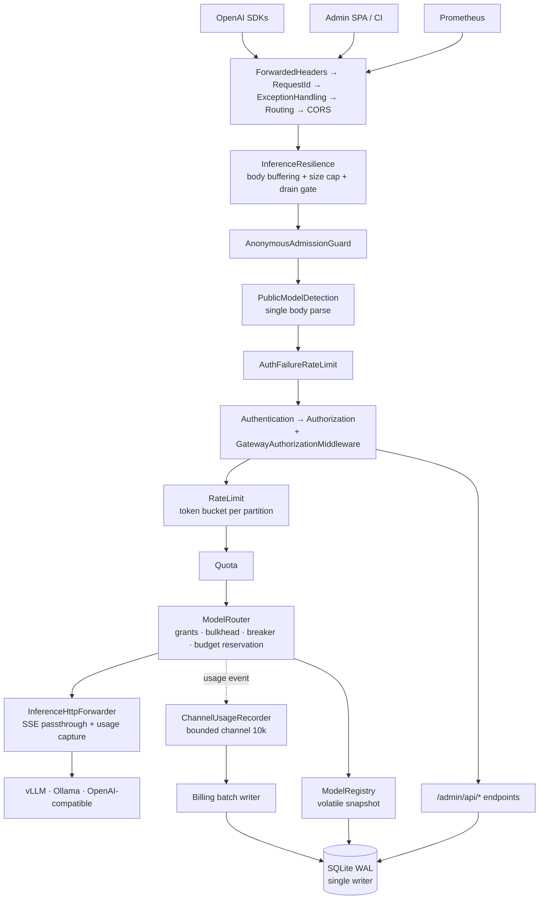

# 33pol Gateway — Technical Audit, 2026-09-13

Principal-engineer review of the whole repository: correctness, security, data integrity,
concurrency, reliability, performance, tests, and operational safety.

| | |
|---|---|
| **Scope** | 120,531 LOC · 11 source projects · 13 test suites |
| **Revision** | `main` @ `675a5ea` plus the 11 working-tree files since committed as `afeb6e0` — see [Audit provenance](#audit-provenance) |
| **Build** | .NET 10.0.401, Release — green |
| **Tests** | 2,334 passed · 1 failed · 0 skipped |
| **Method** | Full static trace, plus live reproduction against two locally-run gateway instances |
| **Findings** | 1 × S0 · 2 × S1 · 11 × S2 · 23 × S3 · 17 × S4 · 3 claims tested and disproved |

Severity is `S0` blocker → `S4` low. Confidence is marked **Confirmed** only where code, a test
run, or a live reproduction demonstrates the finding directly.

---

## A. Executive summary

33pol is a genuinely well-engineered codebase. The hot path is carefully reasoned, the module
boundaries are real, and almost every non-obvious decision carries a comment naming the incident
that motivated it. There is no dead code, no `async void`, no sync-over-async, no raw SQL, no
certificate-validation bypass, and no XSS in the 7,200-line admin SPA. The SSRF defences on
provider discovery are better than most commercial products ship.

Against that, the audit found **one blocker** and **two critical defects**, all three of which
share a single shape: *a safety mechanism exists, is well-designed, is documented, and is not
actually wired up.* The fail-closed authentication guard is registered after the early return in
the branch it guards. The eviction APIs written to bound the bulkhead and stats registries have no
production callers. Five of the nine architecture dependency rules match a namespace string that
cannot exist, so they pass green while the boundary they protect is already violated.

This is the repository's dominant risk: not absent engineering, but engineering that was never
connected.

**The blocker is reachable from the project's own release instructions.** A Production deployment
with an empty `ConnectionStrings:GatewayDb` — the shipped default, and precisely what
[release.md](./release.md) tells operators to run to verify a release — boots cleanly and serves
the entire admin control plane to anonymous callers.

### Highest-risk findings

1. **[GW-01](#gw-01--a-production-gateway-with-no-database-configured-serves-the-entire-control-plane-anonymously) (S0)** — anonymous control-plane takeover when no database is configured; the guard is unreachable dead code and a unit test asserts the bug.
2. **[GW-02](#gw-02--the-demo-model-registry-ships-inside-the-release-image-and-permanently-disarms-the-outage-alert) (S1)** — the demo `models.json` ships inside the release image and seeds two self-referential routes that report healthy forever, permanently disarming `GatewayNoHealthyBackends` and holding `/health/ready` at 200 with zero real upstreams.
3. **[GW-03](#gw-03--a-rollup-write-that-fails-after-the-ledger-commits-can-never-be-repaired) (S1)** — a rollup write that fails after the billing ledger commits can never be repaired by the retry, so budgets under-count that spend permanently and the hard stop silently stops stopping.

### Strongest areas

Request forwarding and header handling; SSRF validation at `ConnectCallback` time; the request-body
parser's rejection of duplicate top-level `model` keys; idempotent billing-ledger append behind a
real unique index; decimal discipline and the deliberate in-memory summation that avoids SQLite's
IEEE-754 coercion; CSV formula-injection escaping; SQLite pragmas (`WAL`, `foreign_keys=ON`,
`busy_timeout`) applied on every connection and proven by test; Kubernetes pod hardening at the
restricted PSS bar; and an admin SPA with a real CSP and zero DOM sinks.

### Weakest areas

Composition-root wiring (where all three top findings live); shutdown and lifecycle budgets, which
are documented but never configured; test-suite fidelity, where 145 integration call sites run
against EF InMemory and 72 run with authorization removed entirely; and operational alerting, which
has no rule for `up == 0`, quota rejection, bulkhead saturation, or undecryptable upstream
credentials — the last being the exact incident `UpstreamSecretsHealthCheck` says "survived nine
restarts in production unnoticed".

### Recommended remediation order

Fix **GW-01** today — it is a four-line move and the exposure is total. Then **GW-02** and
**GW-08** (shutdown budget), both configuration-only and both silently degrading every deployment.
Then repair the test seams — **GW-09** and **GW-10** — before touching anything else, because the
current suite cannot tell you whether the remaining fixes worked. Billing correctness (**GW-03**,
**GW-06**, **GW-07**) follows, then the rate-limit semantics defects, then the improvement backlog.

---

## B. System model

33pol is a single ASP.NET Core 10 process (Kestrel) fronting many model backends. Clients keep the
OpenAI HTTP surface; the gateway reads `model` from the JSON body, resolves a backend from a live
registry, and forwards with minimal buffering so SSE token streams stay real-time. State lives in
one embedded SQLite file with a single writer, so the deployment scales vertically only — the Helm
chart enforces `replicas: 1` and `strategy: Recreate` at render time.

Three planes share the process with different auth rules: **inference** (`/v1/*`), **control**
(`/admin/api/*` plus the static SPA), and **ops** (`/health/*`, `/metrics`, `/stats`). Nothing on
the request path awaits a database write: usage, errors and stats are enqueued to bounded in-memory
buffers drained by 22 background hosted services.



### Runtime and storage

One container, non-root uid 1654, SQLite on a ReadWriteOnce volume. `GatewayDbContext` is pooled and
scoped; every singleton and hosted service that needs a repository opens its own
`IServiceScopeFactory` scope — all fourteen were checked, no captive dependency. Configuration is a
database-backed immutable snapshot swapped through a `volatile` reference, with scheduled
rate-limit windows projected lazily and a refresh that fails *static* (keeps last-good) rather than
reverting to defaults.

**Confirmed empirically during this audit:** hosted services run to completion *before* Kestrel
binds. Migrations completed at `11:20:09`, authentication initialised at `11:20:14`, and
`Now listening on` appeared at `11:20:17`. There is no window in which traffic is served against an
unmigrated schema or an unset auth state.

---

## C. Repository map

| Module | `.cs` | Responsibility | Audit depth |
|--------|------:|----------------|-------------|
| `33pol.Core` | 226 | Domain models, options + validation, error catalog, abstractions, rate-limit schedule model, diagnostics redaction. No framework dependencies. | Deep |
| `33pol.Persistence` | 127 | EF Core + SQLite, 24 migrations, 18 repositories, bootstrap, backup/maintenance, API-key hashing. | Deep |
| `33pol.Api` | 39 | All 71 minimal-API endpoints, admin contracts, health/readiness/stats, provider discovery. | Deep |
| `33pol.Billing` | 31 | Usage pricing, budget reservation ledger, daily rollups, webhooks, reconciliation, CSV export, forecast. | Deep |
| `33pol.App` | 30 | Composition root, middleware order, Kestrel/Serilog/OTel config, config snapshot service, admin SPA assets. | Deep |
| `33pol.Proxy` | 29 | Forwarder, SSE transformer, body parser, model router, bulkhead, breaker registry, drain state, policy middlewares. | Deep |
| `33pol.Observability` | 25 | Meters, in-memory error/log/recent-request stores, rolling stats, usage channel, control-plane commands. | Deep |
| `33pol.Security` | 20 | API-key auth handler, authorization handler + middleware, grants, negative cache, admin key service, file audit log. | Deep |
| `33pol.Registry` | 17 | Model registry snapshot, loader/writer, backend health prober, encrypted upstream secret store. | Deep |
| `33pol.Policy` | 13 | Token-bucket store, plan/policy resolvers, adaptive governor, quotas, circuit breaker, admin config services. | Deep |
| `33pol.OperatorConsole` | 5 | Optional Spectre.Console TUI, off by default. | Sampled |
| `tests/` (13 projects) | 330 | Unit per library, integration HTTP surface, NetArchTest rules, OpenAI conformance goldens, bats installer tests. | Deep |
| `deploy/` · `.github/` · `scripts/` | — | Dockerfile, Compose profiles, Helm chart, Prometheus rules + Grafana, 6 workflows, interactive installer, k6 perf gates. | Deep |
| `docs/` · `perf/` | — | 12 guides + 6 runbooks; measured WAL-concurrency and request-concurrency reports. | Deep |

**Reduced depth:** `33pol.OperatorConsole` (optional, disabled by default, no network surface) and
the Grafana dashboard JSON were sampled rather than read line-by-line. Everything else above was
traced end-to-end.

---

## D. Critical flow analysis

### 1 · Inference request, end to end

`POST /v1/chat/completions` passes forwarded-headers → request-id → exception handling → routing →
CORS → resilience (buffering, size cap, drain gate) → anonymous admission guard → public-model
detection (the single body parse) → auth-failure limiter → authentication + authorization → rate
limit → quota → model router → forwarder.

The parse is done *once* and published through `InferenceRequestParseCache`; the router re-resolves
the model from the registry rather than trusting the public-access flag the earlier middleware set,
so a registry change racing the two lookups fails closed in both directions. The parser rejects a
duplicate top-level `model` key, which closes the last-key-wins split between what the gateway
authorises and what the upstream serves. Route matching is exact-set, not prefix, so
`/x/v1/chat/completions` cannot reach the forwarder.

**Weaknesses.** The body is fully buffered before the bulkhead is taken, so the documented memory
bound (`256 × 256 KB`) is really `concurrent-connections × 256 KB` plus a temp file up to 25 MB
each. A proxied 5xx correctly counts as a breaker failure, but a stale in-flight request completing
after the breaker re-opened takes the half-open branch and can close it on pre-outage evidence
(**GW-16**).

### 2 · Authentication and authorization

Keys are HMAC-SHA256 under a pepper, compared with `CryptographicOperations.FixedTimeEquals` after
a prefix-narrowed lookup; identity is always decided by the hash. The negative cache is keyed by the
peppered hash, bounded at 10,000 entries with a 30-second TTL, and caches only "never issued"
outcomes. Positive-cache invalidation fires on update, revoke, archive and delete, and the TTL is
capped at five minutes *and* at the key's own remaining lifetime.

Every one of the 71 endpoints was enumerated: **no admin-capable route is anonymous or
inference-protected**. The `Operator` policy correctly requires both the Admin role and
operator-tenant membership, so a non-operator tenant admin cannot escalate. Per-tenant surfaces take
the tenant from `TenantContext`, never from input.

**Weakness.** The entire chain is gated on `IsAuthenticationRequired`, which defaults to `false` and
is only ever set by a hosted service that is not registered in the one configuration that matters —
**GW-01**.

### 3 · Usage capture → billing ledger → budget

Usage is captured during response disposal, enqueued to a 10,000-slot bounded channel, batched,
priced, appended idempotently (real unique index on `RequestId`, with a row-by-row fallback that
detaches the failed entity), then rolled up with additive deltas inside a `BEGIN IMMEDIATE`
transaction. Budget reservation is taken before the forward and settled by the usage event; the
router's `finally` releases it when the recorder did not accept the event.

**Weaknesses.** The ledger append and the rollup increment are two separate commits, and a rollup
failure is permanently unrepairable because the retry sees the events already appended and returns
early (**GW-03**). Batches dropped after retry exhaustion never release their reservations
(**GW-11**). Streaming requests are billed from a frame-count guess because
`stream_options.include_usage` is never injected (**GW-06**), and nothing records which figures were
guessed (**GW-14**).

### 4 · Shutdown

The drain service raises the not-ready flag in `StoppingAsync` — the last point at which readiness
probes are still answered — holds a window, then lets Kestrel unbind. The usage recorder then
completes the channel writer, drains, and flushes the batch handler after it, because hosted
services stop in reverse registration order.

**Weakness.** `HostOptions.ShutdownTimeout` is never set anywhere in `src/`, `config/`, `deploy/` or
CI, so the .NET default of 30 seconds applies. Helm's `terminationGracePeriodSeconds: 60` is
therefore never reached, and the 15-second drain leaves ~15 seconds for in-flight generations
against a 300-second forward budget (**GW-08**). The final billing flush has its own 5-second
deadline and, when it expires, abandons accepted events without counting them as dropped — which the
test suite reproduced under load (**GW-07**).

---

## E. Bugs, defects and risks — ranked

Sorted by severity, then risk × blast radius × likelihood.

| # | ID | Sev | Confidence | Category | Component | Finding | Effort |
|---|----|-----|------------|----------|-----------|---------|--------|
| 1 | GW-01 | S0 | Confirmed · live | Auth bypass | Security DI | Production boot with empty `GatewayDb` serves the whole control plane anonymously; the fail-closed guard is registered after the early return | XS |
| 2 | GW-02 | S1 | Confirmed · live | Ops safety | Image / Registry | Demo `models.json` ships in the image and seeds two self-referential routes that stay healthy forever, disarming the no-healthy-backends alert | XS |
| 3 | GW-03 | S1 | Confirmed | Data integrity | Billing | Rollup failure after the ledger commits is permanently unrepairable; budgets under-count that spend forever | S |
| 4 | GW-04 | S2 | Confirmed | Correctness | Policy | `rpm: 0` — documented as "unlimited" — becomes a **1 rpm** limit on every scope except `tenant` | XS |
| 5 | GW-05 | S2 | Confirmed | Crypto | Persistence | Stored key prefix is 20 raw characters of the secret; the bootstrap admin-key minimum is 24 — four characters of residual entropy | S |
| 6 | GW-06 | S2 | Confirmed | Billing accuracy | Proxy / Billing | `stream_options.include_usage` is never injected, so every streaming request is billed from a frame count and a `bytes/4` prompt guess | M |
| 7 | GW-07 | S2 | Confirmed · observed | Data loss | Billing | The 5 s shutdown flush abandons accepted billing events under load without counting them dropped | S |
| 8 | GW-08 | S2 | Confirmed | Reliability | Host / Deploy | `HostOptions.ShutdownTimeout` is never configured; the 30 s default truncates in-flight generations on every deploy | S |
| 9 | GW-09 | S2 | Confirmed | Test integrity | Tests | A unit test asserts the GW-01 bug as intended behaviour, and 72 integration call sites run with authorization and grants removed | M |
| 10 | GW-10 | S2 | Confirmed · run | Architecture | Tests | Five of nine dependency rules match `"33pol.X"`, a namespace that cannot exist; 14/14 pass green while Api→Security is already violated | S |
| 11 | GW-11 | S2 | High | Availability | Billing | Dropped usage batches never release their budget reservations, hard-stopping healthy tenants for the full 40-minute TTL | S |
| 12 | GW-12 | S2 | High | Observability | Observability | The usage drain loop is unobserved fire-and-forget and readiness cannot see it die or saturate | S |
| 13 | GW-13 | S2 | Confirmed | Observability | App config | The only Serilog sink is async with `blockWhenFull: false` and no monitor — logs are discarded silently during an incident | XS |
| 14 | GW-14 | S2 | Confirmed | Auditability | Billing schema | `TokenSource` (estimated vs authoritative) is computed and commented on, but has no column and never reaches the ledger | S |
| 15 | GW-15 | S3 | Confirmed | Resource leak | Proxy | Bulkhead never evicts retired models and hard-refuses new ones at the 1024 cap; `RetainOnly`/`Forget` exist, are tested, and have no production caller | S |
| 16 | GW-16 | S3 | Medium-High | Concurrency | Policy | Breaker outcomes carry no probe identity, so a stale long-running request can close or re-open a half-open breaker | M |
| 17 | GW-17 | S3 | High | Reliability | Helm / Api | Readiness 503s when all backends are down, removing the only pod from the Service — admin console and Prometheus scrape go with it | S |
| 18 | GW-18 | S3 | High | Ops | Helm / Backup | No Kubernetes backup path at all; in-volume backups retain 7 copies and can fill the database's own PVC | M |
| 19 | GW-19 | S3 | Confirmed | Alerting | Prometheus | No alert for `up == 0`, quota rejections, bulkhead saturation, partition-table ceiling, or undecryptable upstream credentials | S |
| 20 | GW-20 | S3 | Confirmed | DoS | Api / Security | `/health` and `/metrics` run full API-key validation with no limiter and no auth-failure budget — an unmetered DB read per guess | XS |
| 21 | GW-21 | S3 | High | CSRF-via-CORS | App CORS | Development applies `AllowAnyOrigin` to `/admin/api/*` in the same mode that disables auth | XS |
| 22 | GW-22 | S3 | Medium-High | DoS | Api services | Model-test and provider-discovery clients buffer whole upstream responses with no `MaxResponseContentBufferSize` | XS |
| 23 | GW-23 | S3 | High | Correctness | Policy | `suspend` on a tenant-scope window resolves to "no stream cap", strictly more permissive than the rule not existing | S |
| 24 | GW-24 | S3 | Confirmed | Correctness | Policy | Cross-kind equal-rank schedule windows pass validation; precedence is then decided by window name | XS |
| 25 | GW-25 | S3 | Confirmed | Correctness | Core | `IsKnown` is case-insensitive but `IsSingleton`/`IsPair` are ordinal, so `"Anonymous"` stores a rule that is never loaded | XS |
| 26 | GW-26 | S3 | Confirmed | Disclosure | Api | Anonymous `GET /v1/models` returns every healthy model id even when no model is public | XS |
| 27 | GW-27 | S3 | High | Idempotency | Billing | Webhooks are at-least-once with no event id, and the signature timestamp is regenerated per attempt | S |
| 28 | GW-28 | S3 | Confirmed | Growth | Billing | `UsageRetentionDays` prunes nothing; two code comments state it does. `billing_events` grows without bound | M |
| 29 | GW-29 | S3 | High | Money | Billing | Budget reservation assumes 4096 output tokens when `max_tokens` is omitted; a burst can overshoot a hard cap by an order of magnitude | M |
| 30 | GW-30 | S3 | High | Concurrency | Persistence | Rate-limit config save is a non-transactional read-modify-write with no version check | S |
| 31 | GW-31 | S3 | Confirmed | Performance | Persistence | `gateway_errors` has no `ApiKeyId` index; the admin key list full-scans it on every render | XS |
| 32 | GW-32 | S3 | High | Data integrity | Persistence | The rollup bucket key trims `CostCenter`; the unique index does not — a whitespace-variant row poisons every flush for that day | S |
| 33 | GW-33 | S3 | Confirmed | Observability | App | Overview warm-refresh aborts on the first failing section and reports it at `Debug`, below the configured level | XS |
| 34 | GW-34 | S3 | Confirmed | Resource leak | Observability | Three exporters create observable gauges on a process-static Meter and never dispose them | XS |
| 35 | GW-35 | S3 | Confirmed | Performance | Observability | `ConcurrentDictionary.Count` — which takes every bucket lock — runs on the admitted-request path once the usage table is full | XS |
| 36 | GW-36 | S3 | Confirmed | Memory | Policy | `InMemoryQuotaService` is keyed by attacker-controlled anonymous partitions with no ceiling and monthly-only eviction | S |
| 37 | GW-37 | S3 | Confirmed | Crypto | Registry | One pepper keys both the API-key HMAC and the upstream-secret AES-GCM key, derived by bare SHA-256 with a static salt and no rotation path | M |
| 38 | GW-38 | S4 | Confirmed | Docs drift | `docs/finops.md` | The documented webhook signature (`HMAC(body)` hex) does not match the implementation (`t=…,v1=…` over `{unix}.{body}`) | XS |
| 39 | GW-39 | S4 | Confirmed | Docs drift | README | "Planes at a glance" lists `/stats` as requiring no auth; it requires the Operator policy | XS |
| 40 | GW-40 | S4 | Confirmed | Hardening | App | Admin security headers are set in a static-file hook, so no `/admin/api/*` JSON or CSV export carries `nosniff` | XS |
| 41 | GW-41 | S4 | Confirmed | Insecure default | Compose | Compose and `.env.example` default `Gateway__Metrics__AllowAnonymous` to `true`, inverting the safe app default | XS |
| 42 | GW-42 | S4 | Confirmed | Insecure default | appsettings | Shipped production CORS allows `https://*.github.io` — a shared-tenant namespace anyone can publish to | XS |
| 43 | GW-43 | S4 | Confirmed | Validation gap | App CORS | Environment-supplied origins skip `CorsConfigValidation` entirely; a port-less wildcard ignores the port where an exact origin does not | XS |
| 44 | GW-44 | S4 | Confirmed | Phantom control | Security | `Scopes` is accepted, persisted, seeded as `["admin"]` and echoed back, but no authorization path reads it | S |
| 45 | GW-45 | S4 | Confirmed | Supply chain | CI / Docker | Floating base-image tags, every Action on a mutable tag, no SBOM, no signing, no checksums; workflow-level `contents: write` | M |
| 46 | GW-46 | S4 | Confirmed | Secret exposure | Installer | `install_merge_env_file` leaves a 0644 temp file in `/tmp` holding the pepper and admin key | XS |
| 47 | GW-47 | S4 | Confirmed | Secret exposure | Deploy script | Host backup directory is created 0755 and restored DBs are chmod 644, contradicting the 0700 the backup service sets in-container | XS |
| 48 | GW-48 | S4 | Confirmed | Container | Dockerfile | `USER $APP_UID` relies on an undeclared base-image ENV; an empty expansion silently yields root | XS |
| 49 | GW-49 | S4 | Confirmed | Concurrency | Persistence | `config_version` is bumped by read-modify-write in three repositories; two writers can both write the same version and hide a reload | XS |
| 50 | GW-50 | S4 | Confirmed | Consistency | Api | `GatewayOperatorAccess.ExtractApiKey` re-implements credential parsing and lets a blank `X-API-Key` shadow a valid bearer token | XS |
| 51 | GW-51 | S4 | Medium | Data integrity | Persistence | No unique index on `api_keys.KeyHash`; the same secret can exist twice and resolve non-deterministically | XS |
| 52 | GW-52 | S4 | Confirmed | CI quality | Build | Analyzers run at `latest` but nothing fails on their output — `TreatWarningsAsErrors=false` and no `-warnaserror` in CI | S |
| 53 | GW-53 | S4 | Confirmed | CI quality | Build | The coverage gate thresholds 6 of 12 production assemblies — excluding the two files holding GW-01 and GW-02 | XS |
| 54 | GW-54 | S4 | Confirmed | Reliability | Compose | No `stop_grace_period`, so Docker's 10-second default SIGKILLs in-flight streams on every redeploy | XS |

---

## F. Detailed findings

### S0 — Blockers

#### GW-01 · A Production gateway with no database configured serves the entire control plane anonymously

**Severity** S0 · **Confidence** Confirmed, reproduced live · **Category** Authentication bypass

**Affected components** `33pol.Security` (DI + authorization handler), `33pol.App`
(appsettings default), `docs/release.md`.

**Evidence.** In `src/33pol.Security/DependencyInjection/SecurityServiceCollectionExtensions.cs`
the early return is at line 84 and the guard's registration at line 98:

```csharp
78  if (string.IsNullOrWhiteSpace(connectionString))
79  {
80      services.AddSingleton<IApiKeyValidator, NullApiKeyValidator>();
       …
84      return services;                                    // ← early return
85  }
       …
98  services.AddHostedService<GatewayAuthenticationInitializer>();   // ← never reached
```

`GatewayAuthenticationInitializer.StartAsync` contains the only fail-closed check — "refuse to
start without a database outside Development" — and it runs *only* when the connection string is
blank. That is exactly the case in which the service is not registered, so the `throw` is
unreachable dead code.

`GatewayAuthenticationState.IsAuthenticationRequired` is a plain auto-property defaulting to
`false`. `GatewayAuthorizationHandler.cs:33-37` then short-circuits every policy:

```csharp
if (!_authState.IsAuthenticationRequired)
{
    context.Succeed(requirement);   // Admin, Operator and Inference alike
    return Task.CompletedTask;
}
```

`src/33pol.App/appsettings.json:2-4` ships `"GatewayDb": ""`, and the aspnet base image leaves
`ASPNETCORE_ENVIRONMENT` unset, which means Production.

**Reproduction** — Release build, `ASPNETCORE_ENVIRONMENT=Production`, `ConnectionStrings__GatewayDb=""`:

```console
$ curl -s -w "HTTP %{http_code}\n" http://127.0.0.1:5199/admin/api/rate-limits
{"enabled":true,"default":{"rpm":3000,"burst":500,…},"rules":[…]}   HTTP 200

$ curl -s -w "HTTP %{http_code}\n" http://127.0.0.1:5199/admin/api/config/status
{"hotReloadEnabled":true,"modelCount":0,"models":[]}                HTTP 200

$ curl -s -w "HTTP %{http_code}\n" http://127.0.0.1:5199/admin/api/cors
{"allowedOrigins":["https://*.github.io","http://localhost:3000"]}  HTTP 200

$ curl -s -X POST -w "HTTP %{http_code}\n" http://127.0.0.1:5199/admin/api/config/reload
{"status":"success","message":"Model registry reloaded."}           HTTP 200

$ curl -s -w "HTTP %{http_code}\n" http://127.0.0.1:5199/stats
{"uptime":"00.00:00:21","requestsPerModel":{},…}                    HTTP 200
```

The process started with no error. `/admin/api/errors` also returned 200 with captured fault
detail. Writes that need the database return a clean 503, which is the only thing limiting this —
the read surface and every DB-free action are fully exposed.

**Failure scenario.** An operator follows `docs/release.md:50` —
`docker run --rm -p 8080:8080 ghcr.io/<owner>/33pol:2.0.0` — to verify a release, or deploys with a
mistyped or unmounted `ConnectionStrings__GatewayDb` secret. The gateway comes up healthy and
answers probes. Anyone who can reach the port reads the rate-limit configuration, the CORS
allow-list, the captured error stream (request paths, model ids, upstream targets), the traffic
profile, and can force registry reloads.

**Impact.** Complete loss of the control-plane trust boundary in the deployment shape the project's
own documentation demonstrates. The Helm chart and Compose file always set a connection string, so
orchestrated installs are not exposed — the blast radius is `docker run`, the tarball, and any
hand-rolled manifest or systemd unit.

**Root cause.** Registration ordering: the guard lives inside the branch it is meant to protect.

**Remediation.** Move `services.AddHostedService<GatewayAuthenticationInitializer>()` above the
`return services;` at line 84. The initializer already handles the empty-connection-string case
internally and throws unless the environment is Development or
`Gateway:Security:AllowAnonymous=true` is explicitly set. Additionally register
`GatewaySecurityOptionsValidator` unconditionally so the pepper-strength check is not also skipped,
and make `GatewayAuthorizationHandler`'s anonymous short-circuit refuse the `Admin` and `Operator`
policies outright rather than succeeding them.

**Implementation considerations.** Anyone deliberately running DB-less outside Development must now
set `Gateway:Security:AllowAnonymous=true` — the documented contract, never enforced. Call it out
in the release notes as a breaking change for that configuration, and fix the verification snippet
in `docs/release.md`.

**Regression risk.** Low in code, real in process: three existing tests encode the current behaviour
and must be rewritten (see GW-09), including one that explicitly asserts the initializer is *not*
registered.

**Validation.** Boot with `ASPNETCORE_ENVIRONMENT=Production` and an empty connection string: the
host must fail to start. Repeat with `AllowAnonymous=true`: it must start and log the warning.
Repeat the five probes above against a correctly configured Production instance: all must be 401.

**Tests to add.**

- Integration: a factory booting in `Production` with a blank connection string asserts `InvalidOperationException` at start.
- Integration: the same with `AllowAnonymous=true` starts and serves `/admin/api/rate-limits` anonymously (the documented escape hatch, pinned deliberately).
- Unit: `AddGatewaySecurity` registers `GatewayAuthenticationInitializer` in *both* branches — replacing the current inverted assertion.
- Unit: `GatewayAuthorizationHandler` refuses `Admin`/`Operator` even when `IsAuthenticationRequired` is false.

**Effort.** XS for the fix; S including the test rewrite.

---

### S1 — Critical

#### GW-02 · The demo model registry ships inside the release image and permanently disarms the outage alert

**Severity** S1 · **Confidence** Confirmed, reproduced live · **Category** Operational safety

**Affected components** `config/models.json`, `33pol.App.csproj`, `GatewayDbBootstrap`,
`HealthCheckService`, `GatewayReadinessService`, `deploy/prometheus/alerts/33pol.yml`,
Helm `values.yaml`.

**Evidence.** `config/models.json` defines two routes that both point at the gateway's own listen
address:

```json
{ "id": "local-mock",  "url": "http://localhost:8080", "aliases": ["mock","gpt-local"] },
{ "id": "other-mock",  "url": "http://localhost:8080", "aliases": [] }
```

`src/33pol.App/33pol.App.csproj:22` copies it to the build output, so it lands at
`/app/config/models.json` in the image — confirmed present in `bin/Release/net10.0/config/`. Helm's
default is `modelsConfigPath: /app/config/models.json` (`values.yaml:85`) and the chart mounts
nothing over `/app/config`. `GatewayDbBootstrap` seeds these into `model_routes` whenever the table
is empty, defaulting to state `serving`.

The probe then scores the gateway's own answer as success: `GET /v1/models` is an anonymous path
(`PublicModelAccess.AllowsAnonymousModelsListing`), so it returns **200** to the health prober.

**Reproduction** — default `models.json`, Production, zero real upstreams:

```console
$ curl -s http://127.0.0.1:8080/health
{"status":"healthy","totalBackends":2,"healthyBackends":2,"unhealthyBackends":0,
 "backends":[{"modelId":"local-mock","isHealthy":true},
             {"modelId":"other-mock","isHealthy":true}]}

$ curl -s -w " HTTP:%{http_code}" http://127.0.0.1:8080/health/ready
{"status":"ready","registryLoaded":true,"modelCount":2,
 "healthyBackends":2,"isDraining":false} HTTP:200
```

**Failure scenario.** An operator installs via Helm or `docker run`, adds their real models through
the admin console, and runs in production. Every real upstream then fails. Because `local-mock` and
`other-mock` are still "healthy":

- `GatewayNoHealthyBackends` (`max(gateway_backend_health) == 0`) never fires, so the
  [all-backends-down](./runbooks/all-backends-down.md) runbook is unreachable by its own trigger.
- `/health/ready` keeps returning 200, so Kubernetes and any load balancer keep routing into a
  gateway that can serve nothing.
- `GET /v1/models` advertises `local-mock`, `other-mock`, `mock` and `gpt-local` to every client;
  requests to them re-enter the gateway and fail confusingly.

**Impact.** The single most important availability alert in the repository is disarmed on every
fresh install and stays disarmed until somebody notices and deletes two routes they never created.
The outage is real, total, and invisible to monitoring.

**Root cause.** A development fixture is a build artifact of the production image, compounded by a
health verdict that cannot tell "the backend answered" from "I answered myself".

**Remediation.**

- Stop publishing `config/models.json` into the image — drop the `<None … CopyToOutputDirectory>`,
  or point the shipped copy at `{"models":[]}`. The bootstrap already handles an absent file by
  logging "left empty until an admin write".
- Default Helm's `modelsConfigPath` to a path that does not exist in the image.
- In `HealthCheckService`, refuse to mark a backend healthy when the probe target resolves to the
  gateway's own listen address, and log it as a misconfiguration.

**Regression risk.** The local demo Compose stack and the quick-start docs rely on a seeded route
existing. Keep the fixture for the Compose profile via a bind mount rather than baking it into the
image, and update the quick start accordingly.

**Validation.** Build the image, run it with no config volume, and assert `/health` reports
`totalBackends: 0`. Then assert `/health/ready` still returns 200 (an empty registry is a legal
state — `modelCount == 0` is explicitly allowed) and that adding one unreachable route drives
`gateway_backend_health` to 0.

**Tests to add.**

- Integration: a seeded registry whose URL equals the test server's own base address is marked unhealthy.
- A packaging test asserting the published output contains no `config/models.json`.
- A `promtool test rules` case driving `gateway_backend_health` to 0 and asserting the alert fires.

**Effort.** XS for the packaging change; S with the self-probe guard and the alert test.

---

#### GW-03 · A rollup write that fails after the ledger commits can never be repaired

**Severity** S1 · **Confidence** Confirmed · **Category** Data integrity / money

**Affected components** `BillingUsagePersistenceHandler`, `BillingEventRepository`,
`DailyUsageRollupRepository`, `BillingBudgetEnforcementService`, `BillingReconciliationService`.

**Evidence.** `BillingUsagePersistenceHandler` commits the ledger and the rollups in two separate
transactions, and the retry path short-circuits on the first:

```csharp
var appended = await AppendAsync(records, cancellationToken);   // commit #1
…
if (appended.Count == 0)
{
    return;                                                    // ← retry dies here
}
…
try { await rollups.IncrementRollupsAsync(deltas, ct); }       // commit #2
catch (Exception ex) when (ex is not OperationCanceledException)
{
    logger.LogError(ex,
      "… Their spend is recorded in billing_events but is NOT reflected in "
    + "daily_usage_rollups, so budget and quota totals will under-count until "
    + "the rollups are rebuilt from billing_events.");
    ReleaseReservations(appended);
    throw;
}
```

The code names the consequence precisely. The problem is what happens next: the caller requeues the
batch, the retry calls `TryAppendManyAsync`, which probes `billing_events`, finds every `RequestId`
already present (a real unique index), and returns an empty `appended` — so control reaches `return`
and the rollup is never attempted again. The same holds for a process crash between the two commits.

There is no rebuild tool: `BillingReconciliationHostedService` states "The sweep is read-only. It
deliberately does not repair what it finds," and a repository-wide search finds no rollup-rebuild
command, endpoint or script.

**Failure scenario.** SQLite returns busy or the disk fills while `IncrementRollupsAsync` holds
`BEGIN IMMEDIATE` — plausible during a backup, a long `VACUUM`, or contention with the stats
writer. The batch's cost (up to 100 requests, and after a requeue-and-accumulate cycle up to 10,000)
is in the ledger but absent from `daily_usage_rollups` permanently. Budget enforcement sums rollups,
so the tenant's hard stop under-counts by that amount for the rest of the period and they are
silently allowed to overspend.

**Impact.** Permanent divergence between the ledger and the totals every budget, quota check, admin
usage page and daily webhook reads. The hard stop quietly stops enforcing, and the only signal is
one historical log line.

**Root cause.** Idempotency is keyed on the ledger append alone while the unit of work spans two
commits, so "already appended" is read as "already fully applied".

**Remediation.** Preferred: put both writes in one `GatewayWriteTransaction`. They already run on
the same scoped `GatewayDbContext`. If the two must stay separate, make the retry repairable: when
`appended.Count == 0` but the records exist, re-derive the deltas for records whose rollup
contribution is unconfirmed, or carry a per-batch `rollup_applied` marker. Either way, ship a
`rebuild-rollups-from-ledger` maintenance command, since existing deployments may already be
diverged.

**Implementation considerations.** Widening the transaction lengthens the window the single SQLite
writer is held; [perf/reports/sqlite-wal-2026-07-19.md](../perf/reports/sqlite-wal-2026-07-19.md)
shows zero `SQLITE_BUSY` at concurrency 64 with batched writes, so the headroom exists — but re-run
`perf/scripts` after the change. The rebuild command must be idempotent and bounded (page by day).

**Regression risk.** A single transaction means a rollup failure now also rolls back the ledger
append, so the batch retries wholly — correct, but it changes the duplicate-handling path. The
row-by-row unique-violation fallback must be exercised inside the new transaction scope.

**Validation.** Fault-inject a failure in `IncrementRollupsAsync`, let the batch retry, and assert
`SUM(daily_usage_rollups.cost) == SUM(billing_events.cost)` for the affected day. Then kill the
process between the two commits and assert the same after restart plus a reconcile pass.

**Effort.** S for the transaction; M including the rebuild command and tests.

---

### S2 — High

#### GW-04 · The documented "unlimited" rate-limit value silently becomes one request per minute

`docs/runbooks/rate-limit-admin.md:143` states that an `rpm` of `0` means "this rule does not limit
the rate". The validator only enforces the `rpm:0 ⇒ burst:0` pairing for the `tenant` scope
(`RateLimitConfigValidation.cs:144-150`), so `{"scope":"global","rpm":0,"burst":500}` saves cleanly.
At runtime `Capacity => Rpm + Burst` is 500, so `EnforcesRate` is true and the rule is emitted — and
the bucket refills at `Math.Max(1, policy.Rpm) / 60.0`, inventing a rate the operator never wrote.

An operator setting a `global` rule to "unlimited" per the runbook gets 500 requests, then **one
request per minute deployment-wide** with `Retry-After: 60`. The same applies to `model`, `api_key`,
`tenant_model`, `api_key_model` — and to a scheduled window, which can do it on a timer.

**Fix.** Extend the `rpm == 0 ⇒ burst == 0` check to every scope (the comment above it already gives
the correct reasoning) and make `EnforcesRate` require `Rpm > 0` so a stored row cannot resurrect
the state. Validate windows through the same path — `TryValidateWindowTier` has the identical
tenant-only gate. **Effort: XS.**

#### GW-05 · The stored key prefix leaves a compliant operator admin key with four characters of entropy

`ApiKeyHashing.PrefixLength = 20`, and `CreatePrefix` stores the first 20 characters of the raw
secret verbatim in `api_keys.KeyPrefix` next to the hash. `GatewayBootstrapOptions.MinimumAdminKeyLength = 24`
is the only floor on an operator-supplied bootstrap admin key.

Gateway-minted keys are safe: `GenerateSecret()` emits `sk-33pol-` + 48 hex characters, leaving 148
bits unknown after the prefix. The gap is entirely in the operator-supplied path, which the
validator blesses at 24 characters. The database, every backup taken through
`/admin/api/maintenance/backup`, and the admin console's key list then carry 20 of its 24 characters
in cleartext — recoverable with a four-character search by exactly the adversary the peppered HMAC
exists to defeat.

**Fix.** Derive the stored prefix from the hash rather than the secret (first 12 characters of the
Base64 hash, keeping the multi-length probe for existing rows), or refuse any key whose length is
below `PrefixLength + 32` at both creation and bootstrap. Raise `MinimumAdminKeyLength` well above
`PrefixLength` regardless — the two constants live in different projects and were clearly set
independently. **Effort: S.**

#### GW-06 · Every streaming request is billed from a frame count and a bytes-divided-by-four prompt guess

`grep -rn "include_usage\|stream_options" src/ tests/ docs/` returns nothing. The gateway forwards
the client body as-is and never injects `stream_options: {"include_usage": true}`, so an
OpenAI-compatible upstream emits no terminal usage frame for a `stream: true` request.
`InferenceUsageCapture` then takes the estimate path unconditionally:
`estimatedCompletionTokens = Math.Max(1, stats.FrameCount - 1)` and
`estimatedPromptTokens = requestBodyBytes / 4`. The code frames this as a client-disconnect
fallback; without `include_usage` it is the normal path for every streaming request.

- A 2 MB base64 `image_url` data URL estimates 524,288 prompt tokens against a real cost near
  1–2k — roughly a 300× over-bill.
- CJK prompts under-bill by 25–33% (UTF-8 is ~3 bytes per character and ~1 token per character).
- A vLLM or TGI backend that batches several tokens per SSE frame under-bills proportionally;
  keep-alive or role-only frames over-bill.

**Fix.** Inject `stream_options.include_usage = true` on streaming chat-completions requests — the
byte-splice machinery in `StreamingHttpTransformer` already rewrites the body — and strip the
synthetic final usage chunk when the client did not ask for it. Keep the frame estimate only for a
genuine disconnect, and tag it (GW-14).

**Regression risk.** Some upstreams reject unknown body fields; gate injection on a per-route
capability flag and fall back to the estimate when the upstream 400s on it. **Effort: M.**

#### GW-07 · The shutdown flush abandons accepted billing events under load without counting them

`ChannelUsageRecorder.StopAsync` gives the final flush a hard five-second deadline, and the drain
before it is bounded by the host's shutdown token. When either expires the buffered events are
abandoned: the `catch` logs, but nothing calls `RecordUsageEventsDropped`, so
`gateway_usage_writer_dropped_total` under-reports exactly when loss is largest.

This audit's full-suite run reproduced it. Under CPU contention the test that guards this path
failed:

```
Pol33.Billing.Tests.DependencyInjection.BillingPersistenceServiceCollectionExtensionsTests
  .ResolvedHandler_Shutdown_PersistsPartialBatch [FAIL]  [28 s]
  Expected billingEvents.ReceivedAppends to be 1, but found 0 (difference of -1).
```

Run in isolation the same test passes in 2 seconds, twice. The 28-second duration is the tell: the
flush deadline expired under load and the accepted billing event was silently lost — the production
failure mode, not a test artefact. SIGTERM commonly arrives while a node is under pressure, which is
often *why* the pod is being replaced; up to 20,000 served requests (10,000 in the channel plus
10,000 in the batch buffer) can disappear with no ledger row and no metric.

**Fix.** Count every abandoned event into `RecordUsageEventsDropped` at both the drain-timeout and
flush-timeout paths and log at Error with the count. Give the drain its own bounded deadline rather
than the host token — the flush below it was already changed to do exactly this, and the two
adjacent comments currently contradict each other. Raise `HostOptions.ShutdownTimeout` (GW-08) so
the budget is adequate in the first place. **Effort: S.**

#### GW-08 · The host shutdown budget is never configured

`grep -rn "ShutdownTimeout\|HostOptions" src/ config/ deploy/ .github/` returns **nothing**, so the
.NET default of 30 seconds applies. `GatewayShutdownHostedService`'s own documentation says "the
host's own shutdown timeout must exceed it", and `GatewayOptionsValidation.cs:152` checks only that
`ShutdownDrainSeconds >= 0` — never the relationship the doc requires.

Helm sets `shutdownDrainSeconds: 15` and `terminationGracePeriodSeconds: 60`. The 60 is never
reached: the app self-limits at 30, so the drain consumes 15 and in-flight requests get roughly 15
against a `ForwardTimeoutSeconds` of 300 (and a `MaxForwardTimeoutSeconds` of 3600). Compose sets no
`stop_grace_period` at all, so Docker's 10-second default applies (GW-54).

Every `helm upgrade` and every `docker compose up -d` therefore cuts long generations mid-stream.
Clients see a stream that simply stops — no error frame, because the 200 and its headers were sent
long before.

**Fix.** Set `HostOptions.ShutdownTimeout` explicitly from configuration, defaulting to
`ShutdownDrainSeconds` plus a real in-flight allowance; extend `GatewayOptionsValidation` to assert
`ShutdownTimeout > ShutdownDrainSeconds` and warn when it is below the forward timeout; raise Helm's
`terminationGracePeriodSeconds` above the host timeout; add `stop_grace_period` to Compose.
**Effort: S.**

#### GW-09 · The suite pins the authentication bypass, and most integration tests run with authorization removed

`tests/33pol.Security.Tests/DependencyInjection/SecurityServiceCollectionExtensionsTests.cs:26-28`
asserts the GW-01 defect as intended behaviour:

```csharp
services.Any(d => d.ServiceType == typeof(IHostedService)
               && d.ImplementationType == typeof(GatewayAuthenticationInitializer))
    .Should().BeFalse();
```

Meanwhile `GatewayAuthenticationInitializerTests` hand-constructs the initializer and asserts it
throws — proving logic the container never invokes. Two green tests assert contradictory things
across a seam neither crosses.

`GatewayWebApplicationFactory.Create()` defaults `clearGatewayDatabase: true`, which blanks the
connection string. That skips `GatewayAuthorizationMiddleware` entirely and binds
`NullModelGrantService`, whose `IsModelAllowedAsync` returns `true` unconditionally. 72 call sites
across 22 files use it — including `InferenceProxyEndpointTests`, which POSTs
`/v1/chat/completions` with no Authorization header and asserts 200. The harness also sets
`IsAuthenticationRequired` by hand, re-implementing the decision it should be verifying. No
integration test boots in Production; both factories hardcode Development.

**Impact.** Any regression inside the authorization middleware or the grant service leaves the
entire integration suite green. This is why GW-01 survived, and why the fix cannot be trusted until
the seams are repaired.

**Fix.** Invert the DI assertion and add the Production-boot tests from GW-01; flip the factory
default to a configured database and make `clearGatewayDatabase: true` an explicit opt-in; delete
the manual `IsAuthenticationRequired` assignment; add a Production-environment factory. Expect a
substantial wave of red — that wave is the missing coverage made visible. **Effort: M.**

#### GW-10 · Five of nine architecture rules match a namespace that cannot exist

`Directory.Build.props:10` sets `<RootNamespace>Pol33$(MSBuildProjectName.Substring(5))</RootNamespace>`,
so assembly `33pol.Persistence` has namespace `Pol33.Persistence` — a C# namespace cannot begin with
a digit. NetArchTest matches namespace-qualified type names, so every `"33pol.X"` literal in
`DependencyRulesTests.cs` matches nothing. The same file uses `Pol33.*` in its own `typeof`
expressions, on adjacent lines.

Rule 4 forbids `"33pol.Security"` from Api, while `src/33pol.Api/33pol.Api.csproj` carries
`<ProjectReference Include="..\33pol.Security\33pol.Security.csproj" />` and
`src/33pol.Api/Endpoints/ModelsEndpoints.cs:9` has `using Pol33.Security.Identity;`:

```console
$ dotnet test tests/33pol.Architecture.Tests -c Release --no-build
Passed!  - Failed: 0, Passed: 14, Skipped: 0, Total: 14, Duration: 3 s
```

The helper compounds it: `AssertArchitectureRule` reads `result.FailingTypes ?? []` and never checks
`result.IsSuccessful`, and `FailingTypes` is null whenever nothing was evaluated — so a rule that
matches no types is indistinguishable from a rule that passes.

**Dead rules.** Proxy ⇏ Persistence; Api ⇏ 8 siblings (*violated*); Policy ⇏ Proxy/Registry;
Persistence ⇏ siblings; Observability ⇏ siblings. Half-dead: OperatorConsole (its framework tokens
still match). Live and valuable: Core ⇏ AspNetCore/EF/Yarp, Registry ⇏ Http types, the
singleton-identity rule, and the hosted-service double-registration rule.

**Also missing.** No rule confines EF Core to Persistence — already leaking, since
`GatewayAuthenticationInitializer` uses `Microsoft.EntityFrameworkCore` and resolves
`GatewayDbContext` from inside Security. No rule bans ASP.NET Core from
Policy/Observability/Billing/Persistence. `tests/Directory.Build.props` does not import the root
one, so analyzer settings never reach any test project.

**Fix.** Replace every `"33pol.X"` literal with `"Pol33.X"` and assert on `result.IsSuccessful`. Do
it on a branch and expect rule 4 to go red immediately — then decide whether Api→Security is an
intentional relaxation (move the shared identity types into Core) or a real violation.
**Effort: S.**

#### GW-11 · Dropped usage batches strand budget reservations and hard-stop healthy tenants for forty minutes

`BillingUsageBatchPersistenceHandler` drops a batch after `UsageWriterMaxFlushRetries` (5) and also
sheds the oldest entries in `TrimToCapacityLocked`. Neither path touches `BudgetReservationLedger`.
The only releases are for events that actually persisted, and the router's `finally` is skipped
precisely when the recorder *accepted* the event (`settledByUsage = usageCapture.HasEnqueuedUsage`).

The codebase already fixed the identical shape for channel saturation — `InferenceUsageCapture`
describes it verbatim as "phantom spend that hard-stopped tenants nowhere near their limit" — but
the batch-drop and buffer-shed paths were not covered. A brief SQLite outage therefore leaves each
dropped event's reservation (the conservative maximum: prompt plus `max_tokens` at the dearer rate)
outstanding for the full `BudgetReservationTtlSeconds` of 2400, so a tenant nowhere near its budget
receives `429 quota_exceeded` for up to 40 minutes on requests that were never billed.

**Fix.** Give the batch handler a reservation-ledger reference or drop callback and release by
`RequestId` in both the retry-exhausted branch and the capacity-trim branch. **Effort: S.**

#### GW-12 · The usage drain loop is unobserved, and readiness cannot see it die or saturate

`ChannelUsageRecorder.StartAsync` does `_worker = Task.Run(() => ProcessAsync(_stopping.Token), CancellationToken.None)`
and nothing ever awaits `_worker` except a `Task.WhenAny` at shutdown that discards the exception.
The per-event `try/catch` is correct, but anything thrown outside it — the channel reader faulting,
or the meter decrement — terminates the loop silently. Because this is an `IHostedService` and not a
`BackgroundService`, it also gets none of the host's `StopHost` protection.

`GatewayReadinessService` computes `registryLoaded && !draining && (modelCount == 0 || healthyCount > 0)`
— no usage-writer signal and no database check. The signal exists and is already consumed elsewhere:
`IUsageWriterStateSource.QueueDepth` feeds the admin Overview and raises a Critical attention item
reading "Usage events are being dropped … those requests are unbilled". Readiness ignores it.

If the drain loop dies, `Enqueue` returns `false` forever on a full bounded channel, so the router
releases every reservation and serves every request — unbilled — for the lifetime of the process,
while the pod stays in rotation and every probe is green.

**Fix.** Attach a continuation that logs Critical and sets a faulted flag on
`IUsageWriterStateSource`; wrap `ProcessAsync` in an outer restart loop with backoff; extend
readiness to fail when the writer is faulted or the queue has been at capacity beyond a threshold;
add the matching Prometheus alert (GW-19). **Effort: S.**

#### GW-13 · The only log sink discards events during a burst, with no counter

`src/33pol.App/appsettings.json` configures exactly one sink:

```json
{ "Name": "Async", "Args": { "configure": [ { "Name": "Console" } ],
  "bufferSize": 10000, "blockWhenFull": false } }
```

`Serilog.Sinks.Async` with `blockWhenFull: false` discards once the ring is full, and no `monitor`
is configured, so `DroppedMessages` is never surfaced. A backend goes down, every request logs a
warning or error, the synchronous stdout write falls behind a pipe-buffered collector, the queue
fills, and log lines vanish — exactly the window an operator needs them. The admin Logs tab is not a
substitute: it is fed independently and holds 500 coalesced entries.

**Fix.** Configure the async sink's `monitor` and export the dropped count with an alert, or set
`blockWhenFull: true` and accept back-pressure. **Effort: XS.**

#### GW-14 · Estimated and authoritative token counts are indistinguishable once persisted

`UsageEvent.TokenSource` carries `Estimated` / `TotalOnly` / `Split`, and two comments promise it
survives — "recorded as `UsageTokenSource.Estimated` so it stays distinguishable from authoritative
usage for reconciliation" and "so reconciliation can exclude them". But `BillingEventRecord` and
`BillingEventEntity` have no such field, `BillingEventFactory.FromUsageEvent` never carries it, and
`BillingReconciliationService` has no exclusion logic.

Combined with GW-06, essentially every streaming row in the ledger is an estimate and nothing — not
the ledger, the rollups, the CSV export, nor the admin UI — can tell a measured charge from a
guessed one. Any billing dispute is unanswerable.

**Fix.** Add a `TokenSource` column to `billing_events`, plumb it through the factory and mapper,
surface it in `UsageExportFormatter.EventsToCsv` and the admin events API, and have reconciliation
report estimated versus authoritative totals separately. Pair with GW-06. **Effort: S.**

---

### S3 and S4

GW-15 through GW-54 are fully specified in the ranked table in §E — each row states the mechanism,
the component, the realistic risk and the effort — and each appears as an executable task with
acceptance criteria in §U. They are grouped by root cause in §I.

---

## Verified sound

Areas checked in depth where no defect was found.

| Area | What was verified |
|------|-------------------|
| **Forwarding and SSRF** | Route matching is an exact set, so no client segment reaches the URL builder. `BuildOutboundUri` trims leading slashes and rejects any resolved URI whose authority differs from the configured base. Request headers are an explicit allow-list; response headers a denylist covering hop-by-hop plus `Set-Cookie`, `WWW-Authenticate` and all `Access-Control-*`. The client's gateway key never reaches an upstream. Provider discovery validates the address at `ConnectCallback` time, closing the TOCTOU, and covers NAT64, 6to4, Teredo, IPv4-mapped and CGNAT. |
| **Body parsing / model rewriting** | The forward-only `Utf8JsonReader` scan rejects a duplicate top-level `model`, unescapes before comparing so `"model"` cannot smuggle a key, and ignores nested `model` via a depth guard. Rewriting splices the raw token range and recomputes `Content-Length`, so multi-byte and escaped content survive byte-for-byte. All four `ArrayPool` rent sites return exactly once. |
| **SQLite configuration** | `foreign_keys=ON`, `journal_mode=WAL`, `busy_timeout=5000` and `synchronous=NORMAL` applied on every EF-opened connection through an interceptor wired into runtime DI, the design-time factory and the test factory alike — FK enforcement proven by an integration test. |
| **Billing primitives** | The ledger's `RequestId` unique index is real, with a batch probe and a row-by-row fallback that detaches the failed entity. Rollups apply additive deltas inside `BEGIN IMMEDIATE`. Costs are `decimal` end to end, and totals are deliberately summed in memory because SQLite would coerce decimal-as-TEXT through IEEE-754. Concurrent budget reservation is correct — check and mutation share one lock. |
| **Admin SPA** | Zero occurrences of `innerHTML`, `outerHTML`, `insertAdjacentHTML`, `document.write`, `eval` or `new Function` across 7,200 lines. All 70 `x-html` bindings resolve through a static icon map. No inline scripts or handlers. CSP is `script-src 'self'` with no `unsafe-eval`, and the bundled CSP-build Alpine genuinely contains no `Function` constructor. Authentication is header-only with no cookie, so CSRF does not apply in an authenticated deployment. |
| **Authorization coverage** | All 71 endpoints enumerated: every `/admin/api` route carries an explicit `RequireAuthorization`, with the blanket middleware as defence in depth. The `Operator` policy requires operator-tenant membership as well as the Admin role. Every by-id operation scopes from `TenantContext`. |
| **Bounded state** | Every in-memory store has an enforced cap on every insert path — recent requests 500, errors 1000 records plus 500 aggregates, logs 500, rolling stats 64 rings, count dimensions 200 keys, rate-limit partitions 50,000 with an off-path sweep. No metric tag is attacker-controlled: `model` always comes from the canonical registry id, and an unresolved model returns before any model-tagged metric is touched. |
| **Hygiene** | No raw SQL, no `Process.Start`, no `BinaryFormatter`, no certificate-validation bypass, no `async void`, no sync-over-async, no TODO/FIXME markers. `.env` has never been committed — full-history scans found only the two documented dev sentinels, both already on the startup denylist. Kubernetes pod hardening meets the restricted PSS bar, and the chart `fail`s at render time on `replicaCount > 1`. |

---

## G. Improvements — ranked by importance and effectiveness

Distinct from defects. Ranked by importance × effectiveness × reach, divided by effort and
implementation risk. Importance is `I0` essential → `I4` low; effectiveness `E0` transformative →
`E4` marginal.

| # | ID | Imp | Eff | Category | Improvement | Expected benefit | Reach | Effort | Risk |
|---|----|-----|-----|----------|-------------|------------------|-------|--------|------|
| 1 | IMP-01 | I0 | E0 | Safety architecture | A single startup safety contract: one component asserts every security-relevant invariant (authentication decided, pepper strong, registry loaded, usage writer alive) and refuses to serve when any is unmet | Removes the entire "guard exists but is not wired" defect class that produced GW-01, GW-02 and GW-15 | Whole process | M | Med |
| 2 | IMP-02 | I0 | E0 | Test fidelity | Make the integration default a real SQLite database with authentication on, and repair the architecture rules to match the actual namespaces | Restores the regression protection every other fix depends on; turns 14 vacuous assertions into real ones | All 353 integration tests | M | Med |
| 3 | IMP-03 | I1 | E1 | Data integrity | One transactional unit-of-work abstraction for every multi-statement write, with `expectedVersion` where a config snapshot round-trips | Closes GW-03, GW-30 and GW-49 at the root instead of patching three call sites | All write paths | M | Med |
| 4 | IMP-04 | I1 | E1 | Billing correctness | Make usage authoritative: request `include_usage`, persist `TokenSource`, give reconciliation a repair mode | Turns billing from "mostly estimated, unauditable" into measured and defensible | Every streaming request | M | Med |
| 5 | IMP-05 | I1 | E1 | Observability | Export a writer-health gauge and add the missing alerts: `up == 0`, quota rejections, bulkhead saturation, partition-table ceiling, undecryptable upstream credentials | The conditions that actually take this gateway down become visible; each gets a runbook | All deployments | S | Low |
| 6 | IMP-06 | I1 | E2 | Lifecycle | A registry-churn contract: one place where model add/rename/delete notifies every per-model registry to retain only live ids | Fixes GW-15 and two other unbounded registries; makes the existing tested `RetainOnly` methods live | Long-running processes | S | Low |
| 7 | IMP-07 | I1 | E2 | Security | Derive both keys with HKDF and distinct `info` labels, version the ciphertext, ship a pepper-rotation path that re-encrypts on read | Separates two trust domains that share one secret today; makes rotation possible without destroying upstream credentials | Every stored secret | M | Med |
| 8 | IMP-08 | I2 | E2 | Ops | A Kubernetes backup CronJob that evacuates the SQLite copy off the data volume, plus a K8s section in the restore runbook | Gives the Helm path a tested restore story and stops backups filling the database's own PVC | All K8s installs | M | Low |
| 9 | IMP-09 | I2 | E2 | Architecture | Split the 1,198-line `ModelRouterMiddleware` into admission, forward and settle stages behind explicit contracts | The highest-churn file (35 commits) becomes reviewable; reservation-settlement logic gets a single owner | Hot path | L | Med |
| 10 | IMP-10 | I2 | E2 | Supply chain | Pin base images to digests and Actions to commit SHAs; emit `SHA256SUMS`, an SBOM and build provenance; move `permissions` to the jobs that need them | Release artifacts become verifiable; a compromised third-party Action can no longer rewrite releases | Every release | M | Low |
| 11 | IMP-11 | I2 | E2 | Migration safety | A migrate-from-last-release test plus a `HasPendingModelChanges` guard in CI | The v2.0.0 chain was replaced wholesale and nothing asserts a real v2.0.0 database can be upgraded | Every upgrade | S | Low |
| 12 | IMP-12 | I2 | E2 | Diagnosability | Add distributed tracing — there is none today, only metrics — with spans across gateway, policy and upstream call | A slow request can finally be attributed past the gateway boundary | All inference | M | Low |
| 13 | IMP-13 | I2 | E3 | Scalability | Let admin key issuance name a tenant, and optionally include the key id in the rate-limit partition | Ends the collapse of all API-key traffic into one bucket, where one noisy key throttles every other | Multi-consumer installs | M | Med |
| 14 | IMP-14 | I3 | E3 | CI quality | Enforce analyzers (`-warnaserror` in CI), widen the coverage gate to all 12 production assemblies, shellcheck the four omitted scripts | Makes the existing analyzer and coverage configuration actually load-bearing | All contributors | S | Low |
| 15 | IMP-15 | I3 | E3 | Docs as contract | Executable doc tests: verify the webhook signature example against the real implementation, and the planes/auth table against endpoint metadata | Stops the drift that makes `finops.md` webhooks unusable and the README auth table wrong | Integrators | S | Low |

---

## H. Top improvements

**Highest impact on system quality.** IMP-01 (startup safety contract), IMP-02 (test fidelity),
IMP-04 (authoritative usage). These three change what the system *guarantees* rather than what it
does: the first makes an unwired guard impossible, the second makes a regression detectable, the
third makes the money numbers defensible.

**Best cost-to-benefit.** IMP-05 turns invisible failures into paged alerts. IMP-06 makes three
already-written, already-tested eviction methods live. IMP-11 closes the upgrade-safety gap with two
tests. IMP-14 and IMP-15 make existing configuration and existing documentation load-bearing. None
of the five requires a design decision.

**Strategic investments.** IMP-09 (decomposing the model router), IMP-03 (a real unit-of-work
abstraction), IMP-07 (key derivation and rotation), IMP-12 (tracing). Each removes a class of future
defect rather than an instance. Sequence them after the critical fixes and after IMP-02, because all
four are risky to land without trustworthy tests.

---

## I. Cross-cutting root causes

Most findings are instances of five systemic causes.

**1 · The guard that was never connected.** A safety mechanism is designed, documented, sometimes
unit-tested, and never invoked from the composition root. GW-01 (initializer registered after the
early return), GW-15 (`RetainOnly`/`Forget` with no production caller, across three registries),
GW-10 (rules that match nothing), GW-14 (`TokenSource` computed and discarded), GW-28
(`UsageRetentionDays` prunes nothing), GW-44 (`Scopes` stored and never read). The common shape is
that nothing fails when the wiring is absent.

**2 · Budgets documented but never configured.** A limit is described in a comment as a contract the
operator must satisfy, and no default satisfies it. GW-08 (`ShutdownTimeout` absent everywhere while
the drain service requires it to exceed the drain), GW-07 (the flush deadline that follows), GW-54
(no Compose `stop_grace_period`), GW-05 (two constants set in different projects, never reconciled).
Validation checks each value in isolation and never the relationship between them.

**3 · Two commits treated as one unit of work.** GW-03 (ledger then rollups), GW-30 (config
read-modify-write with no transaction or version), GW-49 (`config_version` lost update), GW-32 (an
application key coarser than the index meant to enforce it). A single transactional unit-of-work
abstraction with an optional version token — which `ModelRouteRepository` already implements
correctly and alone — resolves all four.

**4 · Dev-shaped defaults shipped as production defaults.** GW-02 (demo registry in the release
image), GW-42 (`*.github.io` CORS), GW-41 (anonymous `/metrics` in Compose and `.env.example`),
GW-21 (`AllowAnyOrigin` in the same mode that disables auth), GW-01 (empty connection string as the
shipped default). The convenient local value is the fallback rather than an explicit opt-in.

**5 · Tests that cannot observe the thing they name.** GW-09 (72 sites with authorization removed; a
DI test asserting the bug), GW-10 (rules matching nothing), the 145 EF-InMemory call sites that
cannot see a unique index, FK, collation or transaction, and GW-07's exact-count assertion that
flakes under load. Production code has already bent to accommodate this — `ApiKeyRepository` carries
a branch whose comment names the InMemory provider.

**Where the causes meet.** Causes 1 and 5 reinforce each other: unwired guards survive precisely
because the tests that would catch them run in a configuration where the guard is irrelevant. That
is why IMP-02 is sequenced before the bulk of remediation rather than after it — without it, the
fixes for GW-01, GW-03 and GW-11 all land unverified.

---

## J. Security assessment

**Attack surface.** Three planes on one port: inference (`/v1/*`, reachable anonymously for
`publicAccess` models and for `GET /v1/models`), control (`/admin/api/*` plus the static SPA), and
ops (`/health/*`, `/metrics`, `/stats`). Outbound surface is the model registry (admin-controlled
URLs), provider discovery, and billing webhooks.

**Authentication.** Peppered HMAC-SHA256 with constant-time comparison and a prefix-narrowed lookup
where identity is always decided by the hash. Bounded, non-poisonable negative cache; positive cache
invalidated on every mutation and capped at five minutes and the key's own lifetime. Generated keys
carry 192 bits. The two defects are structural rather than cryptographic: the whole chain is gated
on a flag that defaults to insecure (GW-01), and the stored prefix can leave an operator-supplied
key with four characters of entropy (GW-05).

**Authorization.** Complete across all 71 endpoints, with the `Operator` policy correctly requiring
operator-tenant membership in addition to role. Deny-wins model grants match the canonical id with
no wildcard expansion and fail closed on an empty key grant list. No path was found by which a key
reaches a model it was not granted.

**Trust boundaries.** One is deliberately porous and worth a conscious decision: an operator-tenant
admin can point a model route at any address and read up to 2 KB of the response through the error
store, and can cause any `*_TOKEN` or `*_API_KEY` environment variable to be sent to a URL they
choose. `UpstreamEnvVarPolicy` covers the gateway's own secrets thoroughly and is enforced at
resolve time rather than only on the write path — but the boundary assumes the admin key is as
trusted as the host.

**Data exposure.** The redactor scrubs at capture time, drops whole query strings rather than
pattern-matching parameters, and fails closed on timeout. It misses non-`sk-` provider formats and
`Basic` auth, which matters because `UpstreamBodySnippet` captures 2 KB of every upstream 4xx/5xx by
default and providers echo credentials in 401s. Anonymous callers can enumerate the model inventory
(GW-26).

**Secrets.** Never committed — the full history was scanned. Weak-pepper and weak-admin-key
denylists are enforced outside Development in both bootstrap and runtime paths, and the upstream
secret store disables itself entirely rather than encrypt under a known default. Helm secrets are
file-backed with no inline default. The structural issue is one pepper serving two cryptographic
purposes with a bare SHA-256 KDF and no rotation path (GW-37).

**Dependencies and infrastructure.** CI runs `dotnet list --vulnerable --include-transitive` with a
hard fail, and two transitive pins carry comments naming the advisories they patch. Nothing is
pinned by digest or SHA, and there is no SBOM, signing or checksum (GW-45). Pod hardening is at the
restricted PSS bar. No NetworkPolicy ships despite [SECURITY.md](../SECURITY.md) requiring network
isolation for `/admin`.

---

## K. Data integrity & concurrency assessment

**Transaction safety.** `GatewayWriteTransaction` uses `BEGIN IMMEDIATE` correctly and the rollup
path uses it. Three whole-collection replace paths do not, and only `ModelRouteRepository` carries
an `expectedVersion` token (GW-30, GW-49). The helper itself has three hygiene issues: a synchronous
`BeginTransaction` that can park a thread-pool thread for the full busy timeout, no retry on
`SQLITE_BUSY` anywhere in the layer, and a `finally` that can throw over the original exception.

**Invariants.** Enforced in the database where it counts: unique `RequestId` on the ledger, unique
`(UsageDate, TenantId, ModelId, CostCenter)` on rollups with sentinels instead of nulls, foreign
keys actually on. Two invariants are application-only and should not be: `api_keys.KeyHash` has no
unique index (GW-51), and the rollup bucket key trims a column the index compares raw (GW-32).

**Races.** The token bucket is correct — refill, decide and debit happen under one per-partition
lock, a refused request never consumes a token, and the refill anchor only moves forward so a
backwards clock step pauses refilling rather than granting a windfall. Budget reservation is likewise
correct under concurrency. The real races are elsewhere: breaker outcomes with no probe identity
(GW-16), config replace with no version (GW-30), and a recent-request queue rebuilt under a lock the
hot-path writer does not take.

**Idempotency and duplicates.** The ledger is genuinely idempotent. Quota commit is idempotent per
request id with a bounded dedupe set. Webhooks are not: no event id, and the signature timestamp
regenerates per attempt (GW-27).

**Crash consistency.** Up to 20,000 usage events live in memory at steady state, and a hard kill
loses all of them silently (GW-07, GW-12). A crash between the two billing commits leaves permanent
divergence (GW-03).

**Migration safety.** All 24 reviewed. The 2026-07-19 ticks migration genuinely corrupted data, and
the 2026-08-18 repair is correct and idempotent — the `typeof(col) = 'text'` guard makes it a no-op
on already-numeric rows, `julianday` honours trailing offsets so non-UTC values convert to the true
instant, and the column list covers every `DateTimeOffset` column created before it. The one gap is
that an unparseable nullable value silently becomes NULL, and a NULLed `ExpiresAt` or `RevokedAt`
reads as "never expires" / "not revoked". `PersistenceHardening` merge ordering is correct, and the
lifecycle migration's hand-rolled UUID generator correctly emits uppercase dashed text to match the
provider's Guid binding.

---

## L. Reliability assessment

Failure handling on the forward path is unusually well judged. Client 4xx from an upstream counts as
a dashboard error but a breaker *success*; client disconnect and client-write timeout abandon the
breaker probe rather than failing it; a mid-stream stall after bytes have flowed is abandoned while
a zero-byte stall is counted. Timeouts are separated into connect, header, first-byte, idle and
downstream-write deadlines, with `HttpClient.Timeout` set to infinite so no hidden whole-exchange
cap fights them — and with no total-duration deadline, so long generations survive. Every CTS is
disposed and the header deadline is explicitly disarmed once headers arrive.

Health probing is equally considered: a 401/403 counts as healthy because the backend answered, two
consecutive failures are required before a model leaves rotation, the model's own credential is
carried into the probe, and the last-good probe path is remembered. One record per transition, not
per sweep.

The weaknesses are at the edges. Readiness 503s when all backends are down, which on a
single-replica deployment removes the only pod from the Service and takes the admin console and the
Prometheus scrape with it (GW-17) — outage amplification, not failover. The liveness probe has a
1-second default timeout against a check that decrypts every stored credential on every probe.
Shutdown budgets are unset (GW-08). The bulkhead fails closed rather than degrading when its model
cap is reached, unlike the breaker, which has a shared overflow instance (GW-15). Retry amplification
is not a risk: the gateway does not retry upstream calls, deliberately.

---

## M. Performance & scalability assessment

**Confirmed bottlenecks.** `gateway_errors` has no `ApiKeyId` index and the admin key list scans it
per render (GW-31). `ConcurrentDictionary.Count` — which takes every bucket lock — runs on the
admitted-request path once the usage table is full (GW-35), a pattern the codebase explicitly avoids
two files away. The error store holds one lock across `Record`, a substring search over every
record's 8 KB stack trace, and an O(500) eviction scan.

**Strongly inferred.** A linked CTS plus a timer is allocated per response chunk on the streaming
path (thousands of timer schedule/cancel pairs per second at 256 concurrent streams). Request bodies
are fully buffered before the bulkhead, so the documented memory bound is wrong by the ratio of
connections to per-model concurrency. `BuildLookup` is O(n²) in route count — negligible at
realistic sizes.

**Requires profiling.** The single SQLite writer under a workload heavier than the measured one. The
existing evidence is good: 12,000 requests at concurrency 64 produced 3,182 billing rows with zero
`SQLITE_BUSY`, zero unhandled exceptions and a clean `integrity_check`, and the measured ceiling was
the mock upstream rather than the gateway. A second report shows 128 concurrent 2-second streams
completing in 2.16 s wall-clock through the gateway, identical to hitting the mock directly.

**Scalability limit.** Vertical only, by design and enforced by the chart. The honest constraint is
that all API-key traffic shares one rate-limit partition because every console-issued key belongs to
the operator tenant (IMP-13), so the default tier is a deployment-wide budget rather than a
per-consumer one.

---

## N. Test strategy assessment

**2,334 passing, 1 failing, 0 skipped** across 13 projects in this audit's Release run. Zero `Skip=`
attributes, zero `Assert.True(true)`, zero commented-out facts — the hygiene is genuinely good, and
`Integration.Tests` is correctly the only project with parallelisation disabled. The SQLite
integration suite covers serializable transactions, lost updates, NOCASE, LIKE escaping and the
ticks migrations properly.

The problem is fidelity, not discipline. 145 integration call sites use EF InMemory against 13 on
real SQLite, so unique indexes, foreign keys, collations and transactions are invisible to most of
the suite — and production code already carries a branch shaped by that divergence. 72 sites run
with authorization middleware and grants removed. Five architecture rules assert nothing.

**Uncovered critical behaviour**, each named or confirmed absent:

- 429 under genuinely concurrent load at the HTTP layer (store-level only).
- The token quota under two concurrent requests (the budget path *is* covered — 8 concurrent, exactly 2 admitted).
- Streaming token *values* through misaligned chunk boundaries (only frame counts asserted).
- Upstream cancellation on client disconnect — no stub handler ever observes its cancellation token.
- Bulkhead queue-full at the HTTP layer (unit-level only, and only the no-queue branch).
- Migration from the last released schema; a pending-model-changes guard.
- SSE byte-for-byte fidelity and flush ordering (every assertion is `Contain`, never equality).
- `\uXXXX` escapes in a rewritten model value.
- An HTTP-status assertion for `RateLimitExceeded`, `QuotaExceeded` and `ConcurrencyLimitExceeded` — their 429s could be changed to 400 without breaking a test.

**Flakiness.** One confirmed and reproduced (GW-07) — an exact-count assertion on a deadline-bounded
shutdown flush. One latent: a 300 ms key-expiry window whose *setup* assertion can fail on a loaded
runner. The rate-limit tests were checked and are not time-fragile, because the store is a
continuously refilling bucket rather than a fixed window.

---

## O. Operational & observability assessment

Metrics are well-designed where they exist: every tag traced to its source, and none
attacker-controlled — an unresolved model returns before any model-tagged metric is touched, which
is the cardinality bug most gateways ship. Request ids flow through logs, the error store and the
response header, and the server-generated id — not the client-echoed one — is used as the
correlation key.

The gaps are what an operator would actually need. There is **no distributed tracing at all**, only
metrics, so a slow request cannot be attributed past the gateway boundary. The only log sink drops
silently under burst (GW-13). No alert exists for `up == 0`, quota rejections, bulkhead saturation,
the rate-limit partition ceiling, or undecryptable upstream credentials — the last being the incident
the code says "survived nine restarts in production unnoticed", whose remedy was a `Degraded` health
result that maps to HTTP 200 and is therefore invisible to every probe. Readiness cannot see a dead
usage writer (GW-12). Three exporters leak their gauges (GW-34).

**Could a production failure be diagnosed efficiently?** For an upstream fault, yes — the error
store is rich and the hints are specific. For a billing discrepancy, no: estimated and measured
figures are indistinguishable and rollup divergence is unrepairable. For a latency regression,
partially: there are duration and time-to-first-token histograms but no spans.

---

## P. Architecture & maintainability assessment

**Strengths.** The dependency graph is genuinely clean — `Core` has no package references at all and
is pure domain; `Persistence`, `Observability`, `Policy` and `Registry` each depend only on `Core`;
`Api` reaches the rest through `Core` abstractions. There are no cycles and no god service outside
the router. Every singleton that needs a repository opens its own scope. The comment culture is
exceptional: nearly every non-obvious decision names the incident that motivated it, which made this
audit far faster than it would otherwise have been.

**Weaknesses.** `ModelRouterMiddleware` is 1,198 lines and the highest-churn file in the repository,
carrying routing, grants, bulkhead, breaker, budget reservation, metrics, recent-request recording
and error capture in one method chain — and it is where GW-11's settlement bug lives. The
architecture tests that should have kept the rest honest are mostly inert (GW-10), and one boundary
has already drifted. EF Core has leaked out of `Persistence` into `Security`. `33pol.Persistence`
ships `Microsoft.EntityFrameworkCore.InMemory` as a production package reference.

**Debt shape.** This is not a codebase with accumulated mess; it is one with accumulated
*disconnection*. The technical debt is almost entirely "correct component, absent wiring" — cheap to
repay once visible, and exactly why the highest-leverage investment is the startup safety contract
(IMP-01) plus restored test fidelity (IMP-02) rather than any refactor.

---

## Q. Quick wins

Meaningful benefit, low effort, low regression risk. Sorted by cost-to-benefit.

| ID | Change | Why it pays | Effort |
|----|--------|-------------|--------|
| GW-01 | Move one `AddHostedService` call above an early return | Closes a total control-plane bypass | XS |
| GW-02 | Stop copying `config/models.json` into the published output | Re-arms the no-healthy-backends alert on every install | XS |
| GW-13 | Set the Serilog async `monitor`, or `blockWhenFull: true` | Stops losing logs during the incident you need them for | XS |
| GW-22 | `MaxResponseContentBufferSize` on the two admin HTTP clients | Removes a remote OOM from a hostile or misbehaving upstream | XS |
| GW-31 | One index on `gateway_errors.ApiKeyId` | Removes a full scan from every admin key-list render | XS |
| GW-04 | Extend the `rpm:0 ⇒ burst:0` check to all scopes | Stops the documented "unlimited" value causing a 1 rpm outage | XS |
| GW-25 | Case-insensitive comparison in `IsSingleton`/`IsPair` | Stops a saved rule silently never loading | XS |
| GW-33 | Guard each Overview section individually; raise the log to Warning | One failing section stops silently disabling budget alerts | XS |
| GW-20 | Add `/health`, `/metrics` and `/v1/models` to the credential-guarded path set | Closes an unmetered database-read amplification | XS |
| GW-41/42 | Flip the two insecure shipped defaults (anonymous metrics, wildcard CORS) | Makes the safe value the default rather than the opt-in | XS |
| GW-34 | Hold each observable gauge and dispose it in `StopAsync` | Stops duplicate series accumulating across hosts | XS |
| GW-38/39 | Correct the webhook signature docs and the README planes table | Makes a shipped feature usable and the auth story accurate | XS |

---

## R. Strategic refactors

Only those whose benefit clearly justifies the cost and migration risk. Three qualify; a full
rewrite of anything does not.

### IMP-09 · Decompose the model router into admission → forward → settle — L, medium risk

**Why.** 1,198 lines and 35 commits — the highest-churn file in the repository — carrying model
resolution, grant checks, bulkhead, circuit breaker, budget reservation, metrics, recent-request
recording and error capture. The reservation-settlement logic that produced GW-11 has no single
owner, and the settlement flag is read across three widely separated code paths.

**Long-term impact.** Each stage becomes independently testable, which is what makes the concurrency
findings (GW-11, GW-16) verifiable rather than reasoned.

**Scope & migration.** Extract an admission result type carrying the leases and the reservation, then
move the three phases behind it one at a time, keeping the middleware as a thin composition. No
public contract changes; no data migration.

**Risk & dependencies.** The hot path is where correctness matters most, and current integration
coverage would not catch a regression. **Depends on IMP-02.** Land after the S0/S1 fixes and after
test fidelity is restored, never before.

### IMP-03 · A single transactional unit-of-work with optional version tokens — M, medium risk

**Why.** Four findings — GW-03, GW-30, GW-32, GW-49 — are the same defect: a logical unit of work
spanning two commits, or a read-modify-write with no version check. `ModelRouteRepository` already
does this correctly and alone; the pattern exists, it is simply not generalised.

**Long-term impact.** Removes an entire class of lost-update and partial-write defect, and gives the
admin API a consistent optimistic-concurrency contract instead of a 500 on conflict.

**Scope & migration.** Promote the existing helper to take a version token and a body; migrate the
three whole-collection replace paths and the `config_version` bump. Add `SQLITE_BUSY` retry with
jitter in one place, and make the transaction begin asynchronously so it stops parking thread-pool
threads.

**Risk.** Widening a transaction lengthens the single writer's hold — re-run the WAL benchmark.
Conflict now surfaces as a 409 rather than a 500, an API behaviour change worth a note.

### IMP-07 · Separate the two key-derivation domains and make rotation possible — M, medium risk

**Why.** One operator-chosen pepper keys both the API-key HMAC and the AES-GCM encryption of upstream
provider credentials, derived by a bare SHA-256 over a constant salt. Rotating it to respond to a
suspected hash compromise destroys every stored upstream credential.

**Scope & migration.** Derive both keys with HKDF using distinct `info` labels; add a version byte to
the ciphertext envelope; decrypt v1 with the legacy derivation and re-encrypt as v2 on read. Require
a generated pepper of 32 bytes rather than 16 characters of anything.

**Risk.** Changing the API-key HMAC derivation would invalidate every issued key, so that half must
stay on the legacy derivation until a deliberate key-rotation event — or leave the HMAC alone and
change only the secret-store side, which delivers most of the benefit at a fraction of the risk.

---

## S. Remediation roadmap

Dependency-aware. Phase 3 sits deliberately early: without it, every later fix lands unverified.

### Phase 0 — Emergency (today)

- **Findings:** GW-01
- **Dependencies:** none
- **Rationale:** a total control-plane bypass reachable from the project's own release-verification instructions, with the shipped default configuration. Four lines of code plus three test rewrites.
- **Risk:** low in code; three existing tests encode the bug and must change with it.
- **Validation:** Production boot with a blank connection string must fail to start; the five probes in §F must all return 401 against a configured instance.

### Phase 1 — Critical risk reduction (this week)

- **Findings:** GW-02, GW-03, GW-05, GW-13, GW-22, GW-41, GW-42
- **Improvements:** IMP-05, partial IMP-01
- **Dependencies:** Phase 0
- **Rationale:** GW-02 silently disarms the outage alert on every install; GW-03 permanently corrupts budget totals; GW-05 defeats at-rest key hashing for the most privileged credential. The default-flips and the buffering cap are each a single line.
- **Risk:** medium for GW-03 (transaction widening — re-run the WAL benchmark); low elsewhere.
- **Validation:** fresh image reports zero backends; a fault-injected rollup failure leaves ledger and rollups in agreement after retry; `promtool test rules` proves the outage alert fires.

### Phase 2 — High-risk correctness and reliability

- **Findings:** GW-04, GW-07, GW-08, GW-11, GW-12, GW-17, GW-20, GW-21, GW-23, GW-24, GW-25, GW-54
- **Improvements:** IMP-06 (closing GW-15)
- **Dependencies:** Phase 1; GW-07 depends on GW-08 landing first, since the shutdown budget is what makes the flush deadline adequate.
- **Rationale:** the defects that degrade a correctly configured production deployment — throughput collapse from a documented value, silent billing loss and false hard-stops at shutdown, truncated streams on every deploy, and four rate-limit semantics bugs.
- **Risk:** medium for GW-17 (splitting readiness changes orchestration behaviour) and GW-08 (longer grace periods slow rollouts).
- **Validation:** a load-generating shutdown test asserts zero unaccounted usage events; a rolling restart under streaming load completes with no truncation.

### Phase 3 — Regression protection (before anything else lands)

- **Findings:** GW-09, GW-10
- **Improvements:** IMP-02, IMP-11, IMP-14
- **Dependencies:** Phases 0–2 deliver the fixes; this phase makes them verifiable and keeps them fixed.
- **Rationale:** until these are repaired, a green suite carries almost no information about the areas this audit found broken. Placed after Phase 2 only because the S0/S1 fixes cannot wait — but nothing beyond Phase 2 should start until it is done.
- **Risk:** high churn. Expect a substantial wave of red once the integration default requires real credentials and grants. That wave is the missing coverage made visible; budget for it explicitly.
- **Validation:** architecture rule 4 goes red, then is resolved deliberately. A deliberately introduced authorization regression fails the suite. A v2.0.0 database upgrades cleanly under test.

### Phase 4 — High-value improvements

- **Findings:** GW-06, GW-14, GW-18, GW-19, GW-27, GW-28, GW-29, GW-31, GW-32, GW-33, GW-34, GW-35, GW-36
- **Improvements:** IMP-01 (complete), IMP-04, IMP-08, IMP-15
- **Dependencies:** Phase 3
- **Rationale:** billing becomes authoritative and auditable; the Kubernetes path gets a real backup and restore story; remaining performance and unbounded-growth defects are cleared.
- **Risk:** medium for GW-06 — some upstreams reject unknown body fields, so injection needs a per-route capability flag and a fallback.
- **Validation:** a streaming request's billed tokens match the upstream's own usage frame; reconciliation reports estimated rows separately; a restore from a CronJob backup produces a byte-identical database.

### Phase 5 — Architecture and scalability

- **Findings:** GW-15 (if not closed by IMP-06), GW-16, GW-30, GW-37, GW-49, GW-51
- **Improvements:** IMP-03, IMP-07, IMP-09, IMP-12, IMP-13
- **Dependencies:** Phase 3 is a hard prerequisite for IMP-09 and IMP-03.
- **Rationale:** removes the defect classes rather than the instances.
- **Risk:** highest of any phase. Land each piece behind the restored test suite, one at a time.
- **Validation:** the WAL concurrency benchmark is re-run and holds; a breaker test with a deliberately stale in-flight outcome no longer flips state.

### Phase 6 — Maintainability and cleanup

- **Findings:** GW-26, GW-38, GW-39, GW-40, GW-43, GW-44, GW-45, GW-46, GW-47, GW-48, GW-50, GW-52, GW-53
- **Improvements:** IMP-10, remaining IMP-14 scope
- **Dependencies:** none — interleave freely.
- **Rationale:** documentation drift, shipped-default hygiene, supply-chain pinning, and the CI configuration that is currently decorative.
- **Risk:** low throughout.
- **Validation:** a doc test verifies the webhook signature example; the release produces checksums and provenance; CI fails on a new analyzer warning.

---

## T. Master priority matrix

Issues and improvements in one execution order. Critical issues precede improvements except where an
improvement is a prerequisite for safely fixing several.

| Order | Type | ID | Sev / Imp | Eff | Risk | Effort | Expected value | Dependencies |
|-------|------|----|-----------|-----|------|--------|----------------|--------------|
| 1 | ISSUE | GW-01 | S0 | E0 | Low | XS | Closes total anonymous control-plane access | — |
| 2 | ISSUE | GW-02 | S1 | E0 | Low | XS | Re-arms the outage alert on every install | — |
| 3 | ISSUE | GW-13 | S2 | E1 | Low | XS | Logs survive the incident that needs them | — |
| 4 | ISSUE | GW-22 | S3 | E2 | Low | XS | Removes a remote OOM | — |
| 5 | ISSUE | GW-41/42 | S4 | E2 | Low | XS | Safe values become the defaults | — |
| 6 | ISSUE | GW-05 | S2 | E1 | Low | S | Restores at-rest protection for the operator key | — |
| 7 | ISSUE | GW-03 | S1 | E1 | Med | S–M | Stops irreversible budget divergence | WAL re-benchmark |
| 8 | IMPROVE | IMP-05 | I1 | E1 | Low | S | The failures that matter become visible | GW-12 gauge |
| 9 | ISSUE | GW-08 | S2 | E1 | Med | S | Deploys stop truncating generations | — |
| 10 | ISSUE | GW-07 | S2 | E1 | Low | S | Shutdown stops losing billing events silently | GW-08 |
| 11 | ISSUE | GW-12 | S2 | E1 | Low | S | A dead writer stops being invisible | — |
| 12 | ISSUE | GW-11 | S2 | E1 | Low | S | No more 40-minute false hard-stops | — |
| 13 | ISSUE | GW-04 | S2 | E1 | Low | XS | "Unlimited" stops meaning 1 rpm | — |
| 14 | ISSUE | GW-23/24/25 | S3 | E2 | Low | S | Policy engine matches its documentation | — |
| 15 | ISSUE | GW-20/21 | S3 | E2 | Low | XS | Closes two unmetered / dev-mode exposures | — |
| 16 | ISSUE | GW-17 | S3 | E2 | Med | S | An upstream outage stops removing the pod | — |
| 17 | IMPROVE | IMP-06 | I1 | E2 | Low | S | Three tested eviction methods become live; closes GW-15 | — |
| 18 | IMPROVE | IMP-02 | I0 | E0 | Med | M | **Gate:** makes everything above verifiable and everything below safe | GW-09, GW-10 |
| 19 | IMPROVE | IMP-11 | I2 | E2 | Low | S | Upgrades from the last release become tested | IMP-02 |
| 20 | IMPROVE | IMP-14 | I3 | E3 | Low | S | Analyzers and the coverage gate become load-bearing | IMP-02 |
| 21 | IMPROVE | IMP-04 | I1 | E1 | Med | M | Billing becomes measured and auditable | IMP-02; GW-06, GW-14 |
| 22 | ISSUE | GW-27/28/29 | S3 | E2 | Low | M | Webhook dedup, bounded ledger growth, honest budget ceiling | IMP-04 |
| 23 | IMPROVE | IMP-08 | I2 | E2 | Low | M | Kubernetes gets a tested backup and restore path | — |
| 24 | ISSUE | GW-31–36 | S3 | E2 | Low | S | Hot-path contention, missing index and unbounded growth cleared | — |
| 25 | IMPROVE | IMP-01 | I0 | E0 | Med | M | Makes the "unwired guard" defect class structurally impossible | IMP-02 |
| 26 | IMPROVE | IMP-03 | I1 | E1 | Med | M | Removes the lost-update / partial-write class; closes GW-30, GW-49 | IMP-02 |
| 27 | IMPROVE | IMP-09 | I2 | E2 | Med | L | The hot path becomes reviewable and testable | IMP-02, IMP-03 |
| 28 | IMPROVE | IMP-07 | I1 | E2 | Med | M | Key domains separated; pepper rotation becomes supported | IMP-02 |
| 29 | IMPROVE | IMP-12 | I2 | E2 | Low | M | Latency becomes attributable past the gateway | — |
| 30 | IMPROVE | IMP-10 | I2 | E2 | Low | M | Releases become verifiable; closes GW-45 | — |
| 31 | IMPROVE | IMP-13 | I2 | E3 | Med | M | One noisy key stops throttling every other | IMP-02 |
| 32 | IMPROVE | IMP-15 | I3 | E3 | Low | S | Docs stop drifting; closes GW-38, GW-39 | — |
| 33 | ISSUE | GW-40, 43–54 | S4 | E3 | Low | S | Hardening, hygiene and supply-chain cleanup | — |

---

## U. Executable backlog

In execution order. Each task is self-contained: another engineer or agent should be able to
implement it without rediscovering the problem. Paths are repo-relative.

### 01 · Register the authentication initializer in both DI branches — S0

- **Finding:** GW-01
- **Objective:** a Production gateway with no database must refuse to start unless anonymous mode is explicitly opted into.
- **Scope:** move `services.AddHostedService<GatewayAuthenticationInitializer>()` above the `return services;` in the blank-connection-string branch. Register `GatewaySecurityOptionsValidator` unconditionally. Make `GatewayAuthorizationHandler` refuse `Admin` and `Operator` when `IsAuthenticationRequired` is false instead of succeeding them.
- **Files:** `src/33pol.Security/DependencyInjection/SecurityServiceCollectionExtensions.cs` (78–100), `src/33pol.Security/Authorization/GatewayAuthorizationHandler.cs` (33–37), `docs/release.md` (48–58), `tests/33pol.Security.Tests/DependencyInjection/SecurityServiceCollectionExtensionsTests.cs` (26–28)
- **Dependencies:** none
- **Considerations:** breaking for anyone deliberately running DB-less outside Development — they must now set `Gateway:Security:AllowAnonymous=true`. Call it out in the release notes and fix the `docker run` snippet.
- **Acceptance:** Production + blank connection string throws at start; Production + blank + `AllowAnonymous=true` starts and logs the warning; Development + blank starts unchanged; against a configured Production instance, `/admin/api/rate-limits`, `/admin/api/config/status`, `/admin/api/cors`, `/admin/api/errors`, `/stats` and `POST /admin/api/config/reload` all return 401 with no credential.
- **Tests:** the four listed under GW-01 in §F.
- **Validation:** `dotnet test tests/33pol.Security.Tests -c Release` and `dotnet test tests/33pol.Integration.Tests -c Release --filter "FullyQualifiedName~Production"`
- **Effort / impact:** XS–S · removes the only unauthenticated administrative-reach finding.

### 02 · Stop shipping the demo registry in the release image — S1

- **Finding:** GW-02
- **Objective:** a fresh install must report zero backends, so `GatewayNoHealthyBackends` can fire.
- **Scope:** remove the `<None Include="..\..\config\models.json" … CopyToOutputDirectory>` item (keep `models.ci.json` if CI needs it). Point Helm's `gateway.modelsConfigPath` at a path absent from the image. Add a guard in `HealthCheckService` refusing to mark a backend healthy when the probe target resolves to the gateway's own listen address. Move the demo fixture into the Compose profile as a bind mount.
- **Files:** `src/33pol.App/33pol.App.csproj:22`, `config/models.json`, `deploy/helm/33pol/values.yaml:85`, `deploy/docker/docker-compose.yml`, `src/33pol.Registry/Health/HealthCheckService.cs`, `README.md` quick start
- **Acceptance:** `docker run` with no config volume reports `totalBackends: 0` and `/health/ready` still returns 200; a route whose URL is the gateway's own address is unhealthy with an explanatory error; the published output contains no `config/models.json`.
- **Effort / impact:** XS–S · restores the most important availability alert on every install.

### 03 · Make the ledger and rollup writes one repairable unit — S1

- **Finding:** GW-03 (root cause shared with GW-30, GW-49 → IMP-03)
- **Scope:** wrap `TryAppendManyAsync` and `IncrementRollupsAsync` in a single `GatewayWriteTransaction` — they already share the scoped `DbContext`. If they must stay separate, replace the `appended.Count == 0 → return` early exit with a path that re-derives deltas for records whose rollup contribution is unconfirmed. Ship a bounded, idempotent `rebuild-rollups-from-ledger` maintenance command.
- **Files:** `src/33pol.Billing/Usage/BillingUsagePersistenceHandler.cs` (60–140), `src/33pol.Persistence/Repositories/BillingEventRepository.cs`, `DailyUsageRollupRepository.cs`, `src/33pol.Persistence/Infrastructure/GatewayWriteTransaction.cs`, `src/33pol.Api/Endpoints/MaintenanceAdminEndpoints.cs`
- **Acceptance:** after a fault-injected rollup failure and a retry, `SUM(daily_usage_rollups.cost) == SUM(billing_events.cost)` for the affected day; after a simulated crash between the commits, the rebuild command restores agreement; reconciliation reports zero drift; the WAL benchmark shows no new `SQLITE_BUSY`.
- **Effort / impact:** S–M · stops irreversible under-counting of the totals every budget reads.

### 04 · Three one-line default and configuration flips — S2

- **Findings:** GW-13, GW-22, GW-41, GW-42
- **Scope:** add a `monitor` to the Serilog async sink and export its dropped count (or set `blockWhenFull: true`); set `MaxResponseContentBufferSize` on both admin `AddHttpClient` registrations (1 MB discovery, 64 KB probe); default `GATEWAY_METRICS_ALLOW_ANONYMOUS` to `false` in Compose and `.env.example` with a matching token default on the Prometheus side; ship `Cors.AllowedOrigins: []` and move the wildcard example to `.env.example`.
- **Files:** `src/33pol.App/appsettings.json`, `src/33pol.Api/DependencyInjection/GatewayApiServiceCollectionExtensions.cs`, `deploy/docker/docker-compose.yml` (67–72, 149–152), `.env.example` (45–53)
- **Acceptance:** a 100 MB upstream body to the model-test probe fails with a bounded error; `docker compose --profile observability up` still scrapes; a Production instance with no CORS configuration rejects all cross-origin preflights.
- **Effort / impact:** XS · removes a remote OOM and two standing exposures.

### 05 · Decouple the stored key prefix from the raw secret — S2

- **Finding:** GW-05
- **Scope:** add a hash-derived prefix form as the newest entry in `LookupPrefixLengths`' probe order, keeping the raw forms so existing rows resolve. Raise `MinimumAdminKeyLength` to at least `PrefixLength + 32` and reject shorter keys at creation and bootstrap.
- **Files:** `src/33pol.Persistence/Security/ApiKeyHashing.cs`, `src/33pol.Persistence/Bootstrap/GatewayBootstrapOptions.cs:21`, `GatewayBootstrapOptionsValidator.cs:61`, `src/33pol.Security/Services/AdminKeyService.cs`
- **Considerations:** the prefix is surfaced in the admin console and used for the delete confirmation, so UI copy changes with it. Existing keys keep working through the multi-format probe; no migration required.
- **Acceptance:** a 24-character bootstrap key is rejected with a clear message; a key created before the change still authenticates; a new key's `KeyPrefix` shares no substring with the secret.
- **Effort / impact:** S · restores at-rest hashing for the most privileged credential.

### 06 · Configure the shutdown budget and account for abandoned events — S2

- **Findings:** GW-08 then GW-07, GW-54
- **Scope:** set `HostOptions.ShutdownTimeout` from configuration, defaulting to `ShutdownDrainSeconds` plus an explicit in-flight allowance. Extend `GatewayOptionsValidation` to assert `ShutdownTimeout > ShutdownDrainSeconds` and warn when it is below `ForwardTimeoutSeconds`. Raise Helm's `terminationGracePeriodSeconds` above the host timeout; add `stop_grace_period` to Compose. Give the channel drain its own bounded deadline and count every abandoned event into `RecordUsageEventsDropped`. Reconcile the two contradictory comments in `StopAsync`.
- **Files:** `src/33pol.App/GatewayHostBuilderExtensions.cs`, `src/33pol.Core/Configuration/GatewayResilienceOptions.cs:137`, `GatewayOptionsValidation.cs:152`, `src/33pol.Observability/Usage/ChannelUsageRecorder.cs` (108–147), `deploy/helm/33pol/values.yaml:91,142`, `deploy/docker/docker-compose.yml`
- **Acceptance:** a rolling restart under streaming load completes with no truncated stream; a shutdown under induced CPU pressure either persists every accepted event or reports the exact count dropped; startup validation fails when the drain exceeds the shutdown timeout.
- **Tests:** replace the exact-count assertion in `ResolvedHandler_Shutdown_PersistsPartialBatch` with a deadline-aware one; add a test that forces the flush deadline to expire and asserts the dropped counter equals the abandoned count.
- **Effort / impact:** S · deploys stop truncating generations and stop losing billing events silently.

### 07 · Release stranded budget reservations and surface writer health — S2

- **Findings:** GW-11, GW-12 (+ IMP-05)
- **Scope:** give `BillingUsageBatchPersistenceHandler` a reservation-ledger reference or drop callback and release by `RequestId` in the retry-exhausted branch and in `TrimToCapacityLocked`. Attach a fault continuation to `ChannelUsageRecorder._worker` that logs Critical and sets a faulted flag on `IUsageWriterStateSource`; wrap `ProcessAsync` in a restart loop with backoff. Extend `GatewayReadinessService` to fail when the writer is faulted or the queue has been at capacity beyond a threshold; export a writer-health gauge with an alert.
- **Files:** `src/33pol.Billing/Usage/BillingUsageBatchPersistenceHandler.cs` (200–290), `BudgetReservationLedger.cs`, `src/33pol.Observability/Usage/ChannelUsageRecorder.cs`, `src/33pol.Api/Services/GatewayReadinessService.cs:26-28`, `src/33pol.Observability/Metrics/GatewayMeters.cs`, `deploy/prometheus/alerts/33pol-writer.yml`
- **Acceptance:** forcing persistence failure past the retry budget leaves zero outstanding reservations for the dropped ids and a following request for that tenant is admitted; killing the drain loop marks the pod not-ready within one probe interval and fires an alert.
- **Effort / impact:** S · removes 40-minute false hard-stops and makes a dead writer visible.

### 08 · Fix the four rate-limit semantics defects — S2

- **Findings:** GW-04, GW-23, GW-24, GW-25
- **Scope:**
  - **GW-04:** extend the `rpm == 0 ⇒ burst == 0` refusal to every scope in `TryValidateRules` and `TryValidateWindowTier`; make `EnforcesRate` require `Rpm > 0`.
  - **GW-23:** carry suspension explicitly (omit the tenant override, or add a `Suspended` flag `Compose` honours) rather than encoding it as `(0,0,0)`, which `Compose` reads as "no stream cap".
  - **GW-24:** move the `a.Rank != b.Rank` test above the kind test in `FindWindowOverlaps`; collapse `OnceSpan` when `end <= start`.
  - **GW-25:** use `OrdinalIgnoreCase` in `IsSingleton`/`IsPair`, or normalise `rule.Scope` before persisting.
- **Files:** `src/33pol.Core/Configuration/RateLimitConfigValidation.cs` (135–170, 289–365, 449–455), `src/33pol.Core/RateLimiting/RateLimitPolicy.cs:33-35`, `RateLimitWindowDefinition.cs:68-69`, `RateLimitScopeNames.cs:38-46`, `src/33pol.Policy/RateLimiting/RateLimitPolicyResolver.cs:120-123`
- **Considerations:** build on the uncommitted working-tree changes in `RateLimitConfigValidation.cs` rather than reverting them. Add a startup sanity clamp that logs and ignores an out-of-range stored window rather than applying it.
- **Acceptance:** a per-scope validation test rejects `rpm:0, burst>0` for all eight scopes; a `(0, 500)` policy enforces nothing rather than 1 rpm; a suspended tenant window leaves the plan's stream cap intact; `{"scope":"Anonymous","target":"acme"}` is rejected at save time.
- **Effort / impact:** S · the policy engine stops doing the opposite of what the runbook documents.

### 09 · Restore test fidelity — the gate for everything after it — S2

- **Findings:** GW-09, GW-10 (IMP-02, IMP-11, IMP-14)
- **Objective:** make a green suite mean something for authorization, module boundaries and upgrades.
- **Scope:** flip `GatewayWebApplicationFactory.Create()` to a configured SQLite database with authentication on and make `clearGatewayDatabase: true` an explicit opt-in; delete the manual `IsAuthenticationRequired` assignment; add a Production-environment factory; replace every `"33pol.X"` literal in `DependencyRulesTests.cs` with `"Pol33.X"` and assert on `result.IsSuccessful`; resolve the resulting Api→Security violation deliberately; add a migrate-from-v2.0.0 test and a `HasPendingModelChanges` CI guard; add `-warnaserror` to the CI build and widen the coverage gate to all 12 production assemblies.
- **Files:** `tests/33pol.Integration.Tests/Support/GatewayWebApplicationFactory.cs` (29, 46–52, 87, 200), `tests/33pol.Architecture.Tests/DependencyRulesTests.cs` (60–199), `tests/33pol.Persistence.Tests/Integration/`, `.github/workflows/ci-reusable.yml:25`, `build/check-coverage.sh:5`, `tests/Directory.Build.props`
- **Dependencies:** tasks 01–08 should land first; nothing after task 09 should start until it is complete.
- **Considerations:** expect substantial churn — tests currently passing with no credential will need keys and grants. That churn is the missing coverage becoming visible; budget for it as a work item, not a surprise.
- **Acceptance:** architecture rule 4 goes red on the branch then is resolved deliberately; a deliberately introduced authorization regression fails the integration suite; a real v2.0.0 database upgrades cleanly under test; CI fails on a newly introduced analyzer warning.
- **Effort / impact:** M · without it, every fix above and below lands unverified.

### 10 · Make usage accounting authoritative — S2

- **Findings:** GW-06, GW-14 (IMP-04)
- **Scope:** inject `stream_options.include_usage = true` on streaming chat-completions requests using the existing byte-splice machinery, gated on a per-route capability flag with a fallback to the estimate when an upstream rejects it; strip the synthetic final usage chunk when the client did not ask for it. Add a `TokenSource` column to `billing_events`, plumb it through the factory and mapper, surface it in the CSV export and admin events API, and have reconciliation report estimated and authoritative totals separately.
- **Files:** `src/33pol.Proxy/Forwarding/StreamingHttpTransformer.cs`, `ModelRewritingHttpContent.cs`, `InferenceUsageCapture.cs` (85–120), `src/33pol.Core/Billing/BillingEventRecord.cs`, `src/33pol.Persistence/Entities/BillingEventEntity.cs` + configuration + a new migration, `src/33pol.Billing/Usage/BillingEventFactory.cs`, `UsageExportFormatter.cs`, `BillingReconciliationService.cs`
- **Dependencies:** task 09
- **Acceptance:** a streaming request's billed tokens equal the upstream's own usage frame; a client disconnect still produces an event tagged `Estimated`; an upstream that rejects `stream_options` falls back without failing the request; the CSV export and events API expose the token source.
- **Tests:** streaming usage parsed correctly when the usage frame is split across misaligned chunk boundaries, asserting token *values*; an upstream 400 on `stream_options` falls back to the estimate path.
- **Effort / impact:** M · billing becomes measured and defensible.

### 11 · Wire the registry-churn eviction contract — S3

- **Finding:** GW-15 (IMP-06)
- **Scope:** add one notification point for model add/rename/delete and have it call `RetainOnly` on every per-model registry. `ModelCircuitBreakerRegistry.RetainOnly` and `RollingWindowStats.RetainOnly` exist and are unit-tested but have **no production caller**; `BackendHealthStore.RetainOnly` is already called from `HealthCheckService.PruneRemovedModels` and is the model to follow. Add an equivalent to `BulkheadRegistry`, which has no removal path at all — or give it a shared overflow bulkhead so it degrades like the breaker.
- **Files:** `src/33pol.Proxy/Resilience/BulkheadRegistry.cs:66-80`, `ModelCircuitBreakerRegistry.cs:69-89`, `src/33pol.Observability/Runtime/RollingWindowStats.cs:144`, `src/33pol.Registry/Health/HealthCheckService.cs:145-166`
- **Acceptance:** creating and deleting 2,000 distinct model ids leaves all four registries at the live-route count; a model added after the cap has been reached is admitted normally.
- **Effort / impact:** S · makes three already-written, already-tested methods live.

### 12 · Close the alerting and observability gaps — S3

- **Findings:** GW-17, GW-19, GW-33, GW-34, GW-35 (IMP-05)
- **Scope:** add alert rules for `up{job="gateway"} == 0`, quota rejection rate, bulkhead rejection/queue depth, `gateway_rate_limit_partitions` approaching the 50,000 ceiling, and a new undecryptable-upstream-credentials gauge exported from `UpstreamSecretsHealthCheck` — each with a runbook. Split readiness so an all-backends-down condition no longer un-readies the only pod (or set `publishNotReadyAddresses: true`). Guard each Overview section individually and raise its failure log to Warning. Hold and dispose the three observable gauges. Replace `ConcurrentDictionary.Count` on the admitted-request path with an `Interlocked` counter.
- **Files:** `deploy/prometheus/alerts/33pol.yml` + `33pol-writer.yml`, `docs/runbooks/`, `src/33pol.Api/Services/GatewayReadinessService.cs`, `deploy/helm/33pol/templates/{deployment,service}.yaml`, `src/33pol.App/DependencyInjection/Overview/GatewayOverviewSectionService.cs:141-147`, `GatewayOverviewRefreshHostedService.cs:36-39`, `src/33pol.Observability/Metrics/Gateway*MetricsExporter.cs`, `RateLimiting/RateLimitUsageTracker.cs:254-262`, `Runtime/CountDimension.cs:28-36`
- **Acceptance:** every alert rule has a runbook and every runbook has a trigger; with all backends down `/admin` and the Prometheus scrape remain reachable; a failing FinOps section no longer prevents the other three refreshing.
- **Effort / impact:** S–M · the failures that actually take this gateway down become visible.

### 13 · Remaining medium findings, batched — S3

- **Findings:** GW-16, GW-18, GW-20, GW-21, GW-26, GW-27, GW-28, GW-29, GW-30, GW-31, GW-32, GW-36, GW-37
- **Suggested grouping:**
  - *(a) persistence* — GW-30, GW-31, GW-32, GW-49, GW-51 behind IMP-03.
  - *(b) billing* — GW-27 (event id + stable signature timestamp), GW-28 (implement the pruning job the option implies, or delete the option and its two false comments), GW-29 (reserve against the model's configured output ceiling, or re-reserve mid-stream).
  - *(c) security* — GW-20 (widen the credential-guarded path set), GW-21 (exclude `/admin*` from the Development CORS policy), GW-26 (gate the anonymous inventory hint on a public model existing), GW-37 (HKDF, per IMP-07).
  - *(d) resilience* — GW-16 (stamp the breaker lease with a probe epoch), GW-18 (backup CronJob per IMP-08), GW-36 (bound the quota dictionary).
- **Dependencies:** task 09; group (a) depends on IMP-03.
- **Effort / impact:** M–L across the batch.

### 14 · Documentation, hygiene and supply chain — S4

- **Findings:** GW-38, GW-39, GW-40, GW-43, GW-44, GW-45, GW-46, GW-47, GW-48, GW-50, GW-52, GW-53 (IMP-10, IMP-15)
- **Scope:** rewrite the `docs/finops.md` webhook section to the real `t=<unix>,v1=<hex>` scheme over `{unix}.{body}` (also correcting the stale `DropOldest` and `QuotaMiddleware` claims); correct the README planes table for `/stats`; move `AdminSecurityHeaders.Apply` into a middleware matching `/admin`; validate environment-supplied CORS origins through `CorsConfigValidation` and give a port-less wildcard the scheme's default port; remove or enforce `Scopes`; pin base images by digest and Actions by SHA, emit checksums, an SBOM and provenance, scope workflow `permissions`; `umask 077` in `install_merge_env_file`; `chmod 700` the host backup directory; declare `ENV APP_UID=1654` in the final Docker stage; replace `GatewayOperatorAccess.ExtractApiKey` with `GatewayCredential.Extract`.
- **Dependencies:** none — interleave freely.
- **Acceptance:** a receiver implemented from `docs/finops.md` verifies a real delivery's signature; the release publishes `SHA256SUMS` and a provenance attestation; `shellcheck -S warning` is clean across all 20 scripts in CI.
- **Effort / impact:** M across the batch.

---

## V. Unverified risks & corrected claims

### Meaningful uncertainties

| What is uncertain | Why unresolved | Potential impact | Evidence needed |
|-------------------|----------------|------------------|-----------------|
| Single-writer SQLite headroom under a production-shaped workload | The two measured reports used a GIL-bound Python mock and an asyncio mock; both were the ceiling, not the gateway. No sustained-load run against a real model server exists — the README says so explicitly. | Capacity planning numbers are unvalidated; the vertical scaling limit is unknown | A multi-hour k6 soak through `perf/ci/run-ga-compose-k6.sh` against a compiled upstream, watching WAL growth, `SQLITE_BUSY` and writer queue depth |
| Whether an upstream rejects an injected `stream_options` (GW-06) | No upstream was available to test against during this audit | Determines whether the fix needs a per-route capability flag or can be unconditional | Send the injected body to vLLM, Ollama, LM Studio and one cloud provider and record which 400 |
| Real-world rate of the GW-32 cost-centre collision | Depends on whether any deployment holds a whitespace-variant row predating the trim normalisation | If present, every usage flush for that day/tenant fails and is eventually dropped unbilled | `SELECT DISTINCT CostCenter FROM daily_usage_rollups WHERE CostCenter <> trim(CostCenter)` on a production database |
| Whether the GW-16 breaker race has occurred in production | Requires an in-flight request outliving a break cycle; plausible given 60–300 s generations against a 30 s break, but no telemetry distinguishes it | Traffic reopened onto a broken backend, or a recovered backend held closed | Add the probe epoch to breaker transition logs and look for transitions attributed to a lease older than the current epoch |
| Practical exploitability of the GW-05 prefix gap | Depends entirely on whether any operator supplied a short bootstrap admin key; gateway-generated keys are unaffected | Where it applies, a four-character search recovers the operator admin key from a leaked database | `SELECT length(KeyPrefix) FROM api_keys` against the known secret length for bootstrap-seeded rows |

### Claims tested and disproved

Recorded so nobody spends effort on them.

**Not a defect — Kestrel accepting traffic before migrations.** A plausible reading of minimal
hosting is that `GenericWebHostService` is registered during `CreateBuilder` and therefore starts
first. Tested: migrations completed at `11:20:09`, authentication initialised at `11:20:14`, and
`Now listening on` appeared at `11:20:17`. Hosted services run to completion before the port binds.
There is no unmigrated-schema or unset-auth-state window.

**Not a defect — quadratic scan in the new fingerprint parser.** The hand-rolled `OwnedFrame`
replacement looks quadratic because it re-runs `IndexOf` after each rejected candidate. It is not:
`start` advances past each match, so the scan distances telescope to O(line length). The character
classes and the greedy last-dot choice are also equivalent to the regex they replace.

**Largely not a defect — Docker `USER $APP_UID`.** The variable is genuinely undeclared in the
Dockerfile, but `mcr.microsoft.com/dotnet/aspnet:10.0` sets `ENV APP_UID=1654`, so it resolves today
and the container does run non-root. It remains as GW-48 because a floating base tag (GW-45) could
change that silently — a latent hazard, not a current root-container.

---

## Audit provenance

Nine parallel subsystem investigations were reconciled into one system model, and every conflicting
conclusion was settled by direct evidence rather than by majority — which is how the three claims
above were removed.

**Method.** Full-repository static trace across 120,531 lines; a Release build (green); the complete
test suite (2,334 passed / 1 failed / 0 skipped); a targeted architecture-rule run; and live
reproduction against two locally-run gateway instances bound to loopback and terminated afterwards,
with their SQLite files deleted. Findings are marked *Confirmed* only where code, a test run, or a
reproduction demonstrates them directly.

**Working tree at audit time.** The audit ran against `675a5ea` plus 11 then-uncommitted files —
the scheduled rate-limit windows, the `GatewayErrorFingerprint` regex removal, and the
`ChannelUsageRecorder` scope-factory change, with their tests. Those files were committed unchanged
as `afeb6e0` (`Enhance Rate Limiting and Error Handling`) during the audit, so every finding below
applies to `afeb6e0` as written. Findings touching that work specifically: GW-04, GW-07, GW-24 and
GW-25; two claims about it were tested and disproved (see above). The audit modified no source file.
