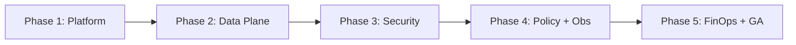

# Phase Overview — Five-Phase Implementation Order

## Why this order?

Phases are ordered so each layer **depends only on completed layers**, tests can run **without optional infrastructure** early, and **risk is front-loaded** into testable pure logic before distributed concerns.

```text
Phase 1 ──► Phase 2 ──► Phase 3 ──► Phase 4 ──► Phase 5
 Platform     Data        Security     Policy       FinOps
 & tests       plane       & resilience & obs        UI & GA
```

### Dependency graph



| Phase | Depends on | Enables |
|-------|------------|---------|
| 1 | — | Buildable solution, CI, test pyramid |
| 2 | 1 | Working OpenAI proxy without auth DB |
| 3 | 2 | Authenticated, hardened gateway |
| 4 | 3 | Rate limits tied to identity; full metrics |
| 5 | 4 | Billing on usage events; production release |

### What is deliberately *not* reordered

| Temptation | Why we wait |
|------------|-------------|
| PostgreSQL in Phase 1 | Slows proxy iteration; Phase 2 uses in-memory/fake stores |
| Full Prometheus in Phase 2 | Needs stable routes and request lifecycle; Phase 4 completes catalog |
| Admin UI in Phase 3 | Needs metrics/usage APIs from Phase 4; key CRUD available in Phase 3 (WP3.8) |
| Operator console before admin APIs | Console requires `IControlPlaneCommands` + summary APIs (WP4.6 before WP4.9) |
| Load tests before proxy works | Phase 2 establishes **baseline**; Phase 5 runs **GA gates** |
| Billing before auth | Usage must attach to `tenant_id` / `api_key_id` |

---

## Phase summary

| # | Name | Duration (guide) | Primary deliverable |
|---|------|------------------|---------------------|
| 1 | Platform foundation | 1–2 weeks | Solution + CI + test harness + host shell |
| 2 | Core data plane | 2–3 weeks | OpenAI-compatible proxy (v1 parity) |
| 3 | Security & resilience | 2–3 weeks | Auth, DB, hardening, SDK errors |
| 4 | Policy & observability | 2–3 weeks | Limits, quotas, OTel, ops APIs, optional Spectre operator console |
| 5 | FinOps, UI, ecosystem & GA | 2–4 weeks | Billing, admin UI, Helm, load tests |

*Durations are planning estimates for a small team; parallel work within a phase is noted in each phase doc.*

---

## Cross-phase quality gates

Every phase **must** satisfy before closure:

1. `dotnet build` / `dotnet test` green on CI  
2. New production logic has **unit tests** (see [02-testing-strategy.md](./02-testing-strategy.md))  
3. Phase exit criteria checklist completed  
4. Taiga epic for the phase closed or explicitly deferred with user sign-off  

---

## Phase exit criteria (summary)

### Phase 1

- Solution builds; empty host responds on `/health/live`  
- Unit + integration test projects run in CI  
- Architecture projects and dependency rules documented  

### Phase 2

- Inference POSTs forward to mock upstream with streaming  
- Registry, aliases, health gating, `/v1/models` covered by tests  
- **Live registry:** `IModelRegistryWriter` + watch/poll ([13-live-model-registry.md](./13-live-model-registry.md))  
- Integration test suite for proxy paths  

### Phase 3

- API key auth enforced; admin routes separated; **admin key CRUD** (WP3.8)  
- Postgres migrations apply; keys stored hashed  
- `X-Request-Id` on all responses; timeouts, circuit breaker, SDK errors  
- `/health/ready` reflects configured policy  

### Phase 4

- Rate limits and concurrency return 429 with stable codes  
- Prometheus + OTel exported; Grafana dashboard JSON + promtool (Compose in P5)  
- Admin REST APIs for config, **`/admin/api/models` CRUD**, and operational summary  
- Optional operator console (WP4.9): shared control-plane commands, disabled in CI/production defaults  

### Phase 5

- Usage persistence and FinOps export APIs  
- Admin UI operational against control plane (**Models** page for live registry)  
- Inference conformance suite; k6 load tests pass thresholds; GA checklist signed  

---

## Taiga mapping (recommended)

| Taiga epic | Phase doc |
|------------|-----------|
| `EPIC-P1-platform` | [phase-1-platform-foundation.md](./phases/phase-1-platform-foundation.md) |
| `EPIC-P2-data-plane` | [phase-2-core-data-plane.md](./phases/phase-2-core-data-plane.md) |
| `EPIC-P3-security` | [phase-3-security-and-resilience.md](./phases/phase-3-security-and-resilience.md) |
| `EPIC-P4-policy-obs` | [phase-4-policy-and-observability.md](./phases/phase-4-policy-and-observability.md) |
| `EPIC-P5-finops-ga` | [phase-5-finops-ui-ecosystem-and-ga.md](./phases/phase-5-finops-ui-ecosystem-and-ga.md) |

Decompose each epic into user stories using the **Work packages** sections inside phase documents.
