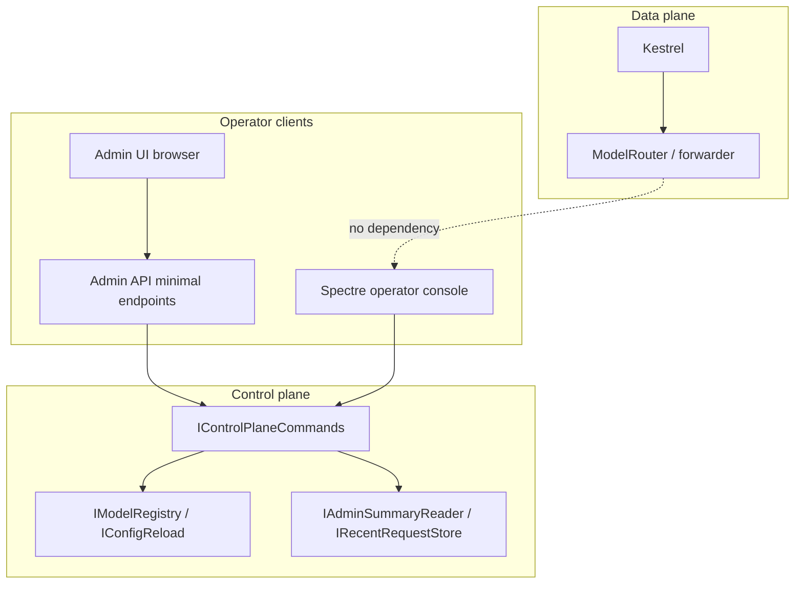

# Operator Console — Spectre.Console Control Plane (v2)

**Status:** Planning authoritative (not implemented)  
**Phase:** 4 (optional work package WP4.9); registry write commands deferred to Phase 5  
**Depends on:** WP4.6 control-plane HTTP APIs, shared command layer, metrics/registry snapshots  
**Canonical architecture:** [01-solution-architecture.md](./01-solution-architecture.md) § Control plane surfaces  

---

## 1. Purpose

The **operator console** is an optional, **in-process** terminal UI for local and on-box operations. It lets an operator **inspect** gateway health, metrics summaries, backends, and recent requests, and **trigger** control-plane actions (e.g. config reload) **without**:

- Stopping or restarting Kestrel  
- Routing admin traffic through `ModelRouterMiddleware`  
- Blocking in-flight inference streams on a shared lock  

Presentation uses **[Spectre.Console](https://spectreconsole.net/)** (tables, panels, prompts, optional live dashboard). **Business logic** lives in testable types shared with HTTP admin APIs—not in Spectre markup.

**Canonical control plane remains HTTP** (`/admin/api/*`). The console is a **second client** of the same services, not a replacement for automation, OpenAPI, or the Phase 5 browser admin UI.

---

## 2. Control plane surfaces (summary)

| Surface | Transport | Primary audience | Phase | Default in production |
|---------|-----------|------------------|-------|------------------------|
| Admin API | HTTP `/admin/api/*` | Scripts, CI, remote ops | 3–4 | **On** (secured) |
| Admin UI | Browser → same-origin API | Dashboards, FinOps | 5 | **On** |
| Operator console | stdin/stdout, Spectre | Local dev, on-box troubleshoot | 4 (opt.) | **Off** |
| Prometheus / Grafana | `GET /metrics`, dashboards | SRE, alerting | 4–5 | **On** |

---

## 3. Hosting model

### 3.1 Process layout

```text
┌──────────────────────────────────────────────────────────────┐
│ 33pol.App (single process)                                   │
│  ├─ Kestrel + middleware (data plane + HTTP control plane) │
│  ├─ IHostedServices (ConfigReload, HealthCheck, …)           │
│  └─ OperatorConsoleHostedService (IHostedService)            │
│       └─ when Enabled: long-running read/eval loop on        │
│          dedicated Task (not inference thread pool)          │
└──────────────────────────────────────────────────────────────┘
```



- **Do not** model the gateway as a manual `Thread` + blocking `Main`. Use `WebApplication` / generic host lifecycle.
- **Do not** call `Console.ReadLine()` on the thread that runs `app.Run()` without a hosted service; use `OperatorConsoleHostedService` for clean shutdown via `CancellationToken`.
- The console loop **must not** reference `ModelRouterMiddleware`, YARP forwarder types, or HTTP context from inference requests.

### 3.2 Activation

| Environment | `Gateway:OperatorConsole:Enabled` | Notes |
|-------------|-----------------------------------|-------|
| Development | `true` (recommended default in `appsettings.Development.json`) | Local terminal expected |
| Production | `false` (required default) | Use HTTP admin + Grafana |
| Docker Compose `gateway` service | `false` | No TTY; document optional `docker compose run -it` in [deploy/docker/README.md](../../deploy/docker/README.md) |

Registration in `33pol.App`:

```csharp
// Pseudocode — composition only
if (builder.Configuration.GetValue<bool>("Gateway:OperatorConsole:Enabled"))
    builder.Services.AddOperatorConsole();
```

`AddOperatorConsole()` is implemented in `33pol.OperatorConsole` and registers `OperatorConsoleHostedService` + command handlers.

### 3.3 Logging separation

| Stream | Technology | When |
|--------|------------|------|
| Application / request logs | Serilog → structured JSON stdout | Always |
| Operator console UI | Spectre.Console → interactive ANSI stdout | Only when console enabled |

**Rules:**

- Do **not** route Serilog through Spectre sinks in any environment.
- When console is enabled in Development, Serilog may use plain console template **or** JSON; operator UI uses Spectre separately. Avoid interleaved garbled output: document that operators should use structured log aggregation for request logs, not the interactive console buffer.
- CI and test hosts: console **disabled**; no TTY assumptions.

**Mitigation (Development):** When the console is enabled, prefer one of:

- Serilog **structured JSON → stderr**, Spectre interactive UI → **stdout**, or  
- `Serilog:WriteTo:Console` restricted to **Warning+** while the REPL is active, or  
- Run gateway with console enabled only in a dedicated terminal (no concurrent `dotnet run` log flood).

Document the chosen default in `docs/operator-console.md`.

---

## 4. Solution structure

### 4.1 Projects

| Project | Role | References |
|---------|------|------------|
| `33pol.OperatorConsole` | Spectre UI, hosted service, command parsing/rendering | `33pol.Core` only (no ASP.NET, no YARP) |
| `33pol.OperatorConsole.Tests` | Unit tests for command handlers | `33pol.OperatorConsole`, `33pol.Core` |
| `33pol.App` | Conditional `AddOperatorConsole()` | `33pol.OperatorConsole` (reference only; no Spectre in App) |

**Forbidden:**

- `33pol.OperatorConsole` → `33pol.Proxy`, `33pol.Api`, ASP.NET packages  
- Spectre package reference in any project except `33pol.OperatorConsole`  
- Command handlers that perform HTTP self-calls to localhost (use DI services directly)

### 4.2 Shared command layer

Introduce in **`33pol.Core`** (interfaces only; implementations in feature libraries):

| Interface | Responsibility | Implementation owner |
|-----------|----------------|----------------------|
| `IControlPlaneCommands` | Orchestrate operator actions (reload, list backends, summary, backends list) | **`ControlPlaneCommands`** class in `33pol.Observability` — injects Core abstractions (`IConfigReload`, `IModelRegistry`, `IBackendHealthStore`, `IAdminSummaryReader`, `IRecentRequestStore`, …); **registered in `33pol.App`** |
| `IAdminSummaryReader` | Read-only operational snapshot DTO for UI/console | `33pol.Observability` |

**Not in `33pol.Api`:** `33pol.Api` references **`33pol.Core` only** and must stay thin. It does **not** host `IControlPlaneCommands` implementation. Minimal API delegates call `IControlPlaneCommands` resolved from DI.

**Console-only (not Core):** enable flag and refresh throttle come from `OperatorConsoleOptions` + `OperatorConsoleHostedService` in `33pol.OperatorConsole` — no `IOperatorConsoleGate` interface required.

HTTP minimal API endpoints in `33pol.Api` delegate to `IControlPlaneCommands`; Spectre commands call the **same** interface. Endpoints remain thin; no duplicated reload/registry logic.

---

## 5. Configuration

Nested under `Gateway` (bound with `GatewayOptions`):

```json
{
  "Gateway": {
    "OperatorConsole": {
      "Enabled": false,
      "RefreshInterval": "00:00:01",
      "RequireAdminApiKey": true,
      "LiveDashboardMaxRows": 20
    }
  }
}
```

| Property | Type | Default | Validation |
|----------|------|---------|------------|
| `Enabled` | `bool` | `false` | If `true` in Production without `ASPNETCORE_ENVIRONMENT=Development`, log warning at startup (not fatal) |
| `RefreshInterval` | `TimeSpan` | 1 second | Min 250 ms, max 60 s (live dashboard throttle) |
| `RequireAdminApiKey` | `bool` | `true` | When `true`, console prompts once per session for admin key and validates via `IApiKeyValidator` admin scope (Phase 3+) |
| `LiveDashboardMaxRows` | `int` | 20 | Max rows for `requests` / backend tables in live view |

Environment overrides: `Gateway__OperatorConsole__Enabled=true`.

`IValidateOptions<OperatorConsoleOptions>` fails fast if `RefreshInterval` is out of range.

---

## 6. Performance and isolation contract

These requirements are **normative** for implementation and review:

| ID | Requirement |
|----|-------------|
| P1 | Console reads **snapshots** only (`IAdminSummaryReader`, immutable registry view, ring-buffer **copy**) — O(1) or O(limit), not full request history scans per keystroke |
| P2 | Config reload uses existing `IConfigReload` / `ConfigReloadService` — **queued, atomic swap**; no stop-the-world lock held during upstream streaming |
| P3 | Live dashboard (`watch summary`, `AnsiConsole.Live`) refresh rate ≤ `RefreshInterval`; default 1 Hz |
| P4 | No admin/console code on inference hot path; middleware branch for `/admin` unchanged |
| P5 | Console command processing runs on **hosted service task**; never `Task.Run` per inference request |
| P6 | When disabled: **`AddOperatorConsole()` not called** — no `OperatorConsoleHostedService`, no Spectre render loop, no stdin loop. A project reference to `33pol.OperatorConsole` may still load the assembly; **no Spectre APIs run** until `Enabled` is true. Do not instantiate `AnsiConsole` at startup when disabled |
| P7 | Under load test with console enabled at 1 Hz refresh, gateway overhead p99 vs console disabled must stay within **+1 ms** (smoke in Phase 4 exit criteria; full gate optional Phase 5) |

**In-flight inference:** Requests that already resolved a model id continue with that resolution; reload swaps registry for **new** requests only (document in runbook).

---

## 7. Command reference (Phase 4 MVP)

Syntax: interactive REPL with optional subcommands; `help` lists all.

| Command | Action | Auth | Phase |
|---------|--------|------|-------|
| `help` | List commands | — | 4 |
| `exit` / `quit` | Stop console loop only (host keeps running) | — | 4 |
| `status` | Gateway version, uptime, model count, reload status | Admin if `RequireAdminApiKey` | 4 |
| `summary` | One-shot metrics snapshot (same data as `GET /admin/api/summary`) | Admin | 4 |
| `watch summary` | Live dashboard via `AnsiConsole.Live`; throttled | Admin | 4 |
| `backends` | Table: model id, health, URL host (no secrets) | Admin | 4 |
| `requests [--limit N]` | Recent ring buffer copy (`IRecentRequestStore`) | Admin | 4 |
| `reload` | `IConfigReload.TriggerAsync()` | Admin | 4 |
| `models list` | Registry entries and aliases | Admin | 4 |

### HTTP equivalence (Phase 4)

Console commands call `IControlPlaneCommands` directly (no HTTP self-calls). These mappings are for operators and test authors:

| Console command | Primary HTTP equivalent | Notes |
|-----------------|---------------------------|-------|
| `status` | `GET /admin/api/config/status` | Version/uptime may come from host metadata + reload status DTO |
| `summary` | `GET /admin/api/summary` | Same snapshot as `IAdminSummaryReader` |
| `watch summary` | Poll `GET /admin/api/summary` (console uses reader, not HTTP) | Throttled live view |
| `backends` | `GET /admin/api/backends` | |
| `requests --limit N` | `GET /admin/api/requests?limit=N` | |
| `reload` | `POST /admin/api/config/reload` | |
| `models list` | `GET /admin/api/backends` or registry slice of same command | |

Legacy `GET /stats` (Phase 2+) remains for v1 parity; console **prefers** `/admin/api/summary` in Phase 4.

### Phase 5 extensions (optional)

| Command | Action | Notes |
|---------|--------|-------|
| `models add` | Interactive `TextPrompt` / validation | Writes `models.json` or defers to API; **audit** via `IAuditLogger` |
| `keys list` | List key prefixes | Read-only; never print full secrets |

Destructive or write operations require confirmation prompt (`Spectre.Console` `ConfirmationPrompt`).

---

## 8. Spectre.Console usage

| UI need | Spectre API | Notes |
|---------|-------------|-------|
| Tabular data | `Table`, `Grid` | Backends, models, requests |
| Single snapshot | `Panel`, `FigletText` (optional branding) | `status` |
| Live metrics | `AnsiConsole.Live` + `Refresh` | `watch summary` only |
| Local input | `TextPrompt`, `SelectionPrompt`, `ConfirmationPrompt` | Reload confirm, admin key |
| Errors | `Markup` with escaped user content | Prevent injection via model names |
| Progress | `ProgressColumns` | Long reload only if reload is async &gt; 500 ms |

**Package:** `Spectre.Console` pinned in `Directory.Packages.props` (Phase 4). No `Spectre.Console.Cli` required for MVP unless command grammar grows; prefer simple tokenizer in `OperatorConsoleHostedService` first.

---

## 9. Security

| Topic | Rule |
|-------|------|
| Admin key | When `RequireAdminApiKey` is true, validate against same store/scopes as HTTP admin (Phase 3+) |
| Secrets | Never print API keys, upstream bearer tokens, or full connection strings |
| Production | Console disabled by default; enabling in Production logs **warning** with reason |
| Audit | `reload`, `models add` call `IAuditLogger` with actor `operator-console` |
| Docker | Default image does not enable console; no expectation of TTY in orchestrators |

---

## 10. Testing

See [02-testing-strategy.md](./02-testing-strategy.md) § Operator console.

| Layer | Scope |
|-------|-------|
| Unit | `ControlPlaneCommands` with fakes; option validation; throttle math |
| Unit | Command parser (strings → intent) without Spectre |
| Integration | Host with `Enabled=false` (default); optional `Enabled=true` + invoke `IControlPlaneCommands` via test hook (no real TTY) |
| Integration | Optional `IOperatorConsoleTestHarness` (internal, `33pol.OperatorConsole`, `InternalsVisibleTo` integration tests) — dispatch command strings without Spectre |
| Load | Phase 4 smoke: k6 with console `watch summary` at 1 Hz — P7 overhead check |

Do **not** assert ANSI markup in CI. Prefer testing `ControlPlaneCommands` in `33pol.Observability.Tests` and the parser in `33pol.OperatorConsole.Tests`. Assert DTOs returned to render methods.

---

## 11. Documentation and ops artifacts

| Artifact | Phase | Content |
|----------|-------|---------|
| `docs/operator-console.md` | 4 | Quick start, config, command list (generated from this doc) |
| `deploy/docker/README.md` | 4 | Console off in Compose; optional `run -it` note |
| OpenAPI | 4 | HTTP admin only; console not in OpenAPI |

---

## 12. Exit criteria (WP4.9)

- [ ] `33pol.OperatorConsole` + tests; Spectre only in that project  
- [ ] `ControlPlaneCommands` in `33pol.Observability` implements `IControlPlaneCommands` for HTTP admin and console  
- [ ] Console disabled in CI/integration host; enabled in Development sample  
- [ ] Commands: `help`, `status`, `summary`, `watch summary`, `backends`, `requests`, `reload`, `models list`, `exit`  
- [ ] P1–P6 verified in code review checklist  
- [ ] `docs/operator-console.md` published  
- [ ] Taiga WP4.9 tasks closed or explicitly deferred with sign-off  

---

## 13. Taiga story seeds

1. As an operator on a dev machine, I open a rich terminal dashboard without stopping inference traffic.  
2. As an operator, I trigger `models.json` reload from the console and see the same result as `POST /admin/api/config/reload`.  
3. As security, production containers do not expose an interactive admin TTY by default.  

---

## 14. Related documents

| Document | Link |
|----------|------|
| Solution architecture | [01-solution-architecture.md](./01-solution-architecture.md) |
| Feature matrix | [05-feature-to-phase-matrix.md](./05-feature-to-phase-matrix.md) |
| Phase 4 WP4.9 | [phases/phase-4-policy-and-observability.md](./phases/phase-4-policy-and-observability.md) |
| Executive proposal | [00-executive-proposal.md](./00-executive-proposal.md) |
