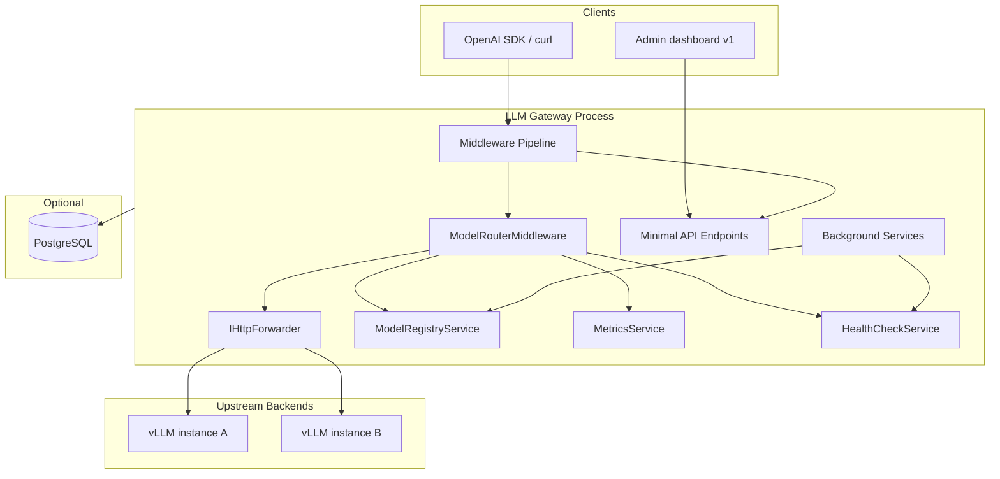

# 01 — Overview and Architecture

## Scope

This document describes **what** the LLM Gateway is, **how** it is structured at the system level, **how** the ASP.NET Core host starts, and **how** it is configured. It does not cover the step-by-step routing algorithm (see [02-core-proxy-and-routing.md](./02-core-proxy-and-routing.md)) or HTTP API contracts (see [03-api-operations-and-observability.md](./03-api-operations-and-observability.md)).

## Audience

Developers rewriting the gateway from scratch who need a complete picture of the host, configuration model, and component boundaries before implementing proxy logic.

---

## 1. Product definition

### 1.1 Purpose

LLM Gateway is an **OpenAI-compatible HTTP reverse proxy** that:

1. Exposes a **single base URL** to all clients.
2. Inspects the **`model` field in the JSON request body** (OpenAI places routing information in the body, not the URL path).
3. Forwards the request to the correct **upstream LLM server** (typically vLLM; health probes also support Ollama-style endpoints).
4. Returns responses with **minimal buffering**, preserving **Server-Sent Events (SSE)** streaming for chat completions.
5. Provides **operational endpoints**: health, statistics, Prometheus metrics, model listing, configuration reload, and (in v1) real-time admin via SignalR.

### 1.2 Non-goals (v1 implementation)

| Area | Not implemented |
|------|-----------------|
| TLS termination | Assumed at ingress / reverse proxy |
| Rate limiting / quotas | None |
| Billing / multi-tenant users | None |
| Load balancing across multiple URLs for one model | One backend URL per model entry |
| Reading persisted history from PostgreSQL | DB is write-only |
| YARP route-table forwarding | Clusters are built but not used for routing (see §3.2) |

### 1.3 OpenAI API compatibility

Clients using the standard OpenAI HTTP API shape are supported as follows:

| Method | Path | Gateway behavior |
|--------|------|------------------|
| POST | `/v1/chat/completions` | Proxied to upstream |
| POST | `/v1/completions` | Proxied to upstream |
| POST | `/v1/embeddings` | Proxied to upstream |
| GET | `/v1/models` | Generated by gateway from registry + health |
| GET | `/v1/models/{model}` | Generated by gateway (lookup by id or alias) |

The upstream receives the **same path** as the client. Example: client `POST /v1/chat/completions` → upstream `POST {backendBaseUrl}/v1/chat/completions`.

---

## 2. Technology stack

| Component | Technology | Version (v1) | Role |
|-----------|------------|--------------|------|
| Runtime | .NET | 8.0 (`net8.0`) | Application host |
| Web server | Kestrel | (built-in) | HTTP + streaming |
| Forwarding | YARP (`Yarp.ReverseProxy`) | 2.1.0 | **`IHttpForwarder` only** |
| Metrics | prometheus-net.AspNetCore | 8.2.1 | `/metrics` scrape endpoint |
| Logging | Serilog | 8.x | Structured JSON logs + custom sink |
| Real-time admin | ASP.NET Core SignalR | (built-in) | WebSocket hub at `/hubs/admin` |
| Database (optional, **v1 only**) | EF Core + Npgsql | 8.0.11 | v1: optional `LogsDb` for logs + request rows — **not in 33pol v2** |

**Application version:** Hardcoded constant `1.2.0` in the host entry point.

**Project type:** Single web SDK project (`Microsoft.NET.Sdk.Web`), assembly name `LlmGateway`.

---

## 3. System architecture

### 3.1 Logical component diagram



### 3.2 Critical design note: two forwarding mechanisms

The codebase registers **two** YARP-related concepts, but only one is used for live traffic:

| Mechanism | Registered? | Used for routing? |
|-----------|-------------|-------------------|
| `ModelRouterMiddleware` + `IHttpForwarder.SendAsync(destinationUrl)` | Yes | **Yes — all inference traffic** |
| `DynamicYarpConfigProvider` (`IProxyConfigProvider`) + `AddReverseProxy()` | Yes | **No — `MapReverseProxy()` is never called** |

On startup and hot reload, `DynamicYarpConfigProvider.BuildConfig()` creates one YARP **cluster** per model (destination = `ModelConfig.Url`). This updates an in-memory config and signals a change token, but **no request is matched against YARP routes**.

**Rewrite guidance:** For v2, omit `AddReverseProxy` and `DynamicYarpConfigProvider` unless you plan cluster-based routing later. Keep `AddHttpForwarder()` and custom middleware.

### 3.3 Process boundaries

Everything runs in **one OS process** (one ASP.NET Core application):

- HTTP proxy logic
- Health polling
- Configuration hot reload
- Metrics and stats
- SignalR hub
- Optional PostgreSQL writer

There is **no separate admin backend** in v1; the Blazor Admin UI is a separate **static WASM container** that calls into this process.

---

## 4. Application startup

### 4.1 Bootstrap sequence

The host follows this order (conceptually):

```text
1.  Create Serilog bootstrap logger (JSON console) for early startup logs
2.  WebApplication.CreateBuilder(args)
3.  Configure Serilog from appsettings + DI services + SignalR sink (Information+)
4.  Bind configuration section "Gateway" → GatewayConfig singleton
5.  Register all services (see §5)
6.  Configure CORS policies (default + SignalR)
7.  Configure Kestrel for streaming (see §7)
8.  builder.Build() → WebApplication
9.  Resolve ModelRegistryService
10. Resolve models.json path (see §6.4) → await LoadModelsAsync
11. DynamicYarpConfigProvider.BuildConfig()  [optional in v2]
12. Register middleware pipeline (see §6)
13. Map endpoints (health, stats, models, admin, SignalR, root)
14. Log startup summary (version, model count)
15. app.Run()
```

**Fatal errors:** Uncaught exceptions in startup are logged at Fatal level; Serilog is flushed in `finally`.

### 4.2 Model configuration file resolution

At startup, the path to `models.json` is resolved as:

```text
configPath = Path.Combine(AppContext.BaseDirectory, gatewayConfig.ModelsConfigPath)

if file does not exist:
    configPath = gatewayConfig.ModelsConfigPath   // relative to current working directory

await modelRegistry.LoadModelsAsync(configPath)
```

Failure to read or parse on **first load** throws and prevents startup (except the empty-models warning path described in doc 02).

---

## 5. Dependency injection registry

### 5.1 Service lifetimes

| Lifetime | Type | Role |
|----------|------|------|
| Singleton | `GatewayConfig` | Bound from `Gateway` configuration section |
| Singleton | `ModelRegistryService` | In-memory model map |
| Singleton | `MetricsService` | Prometheus + in-memory stats |
| Singleton | `HealthCheckService` | Backend probes; also `IHostedService` |
| Singleton | `DynamicYarpConfigProvider` | YARP config; also `IProxyConfigProvider` |
| Singleton | `ConfigReloadService` | File polling + manual reload; also `IHostedService` |
| Singleton | `RequestEventService` | Recent requests ring buffer + events |
| Singleton | `LogPersistenceService` | **v1 only** — if `LogsDb` set; not in v2 |
| Hosted service | `RealTimeBroadcastService` | SignalR metrics/health broadcast loop |
| Scoped | `LogDbContext` | **v1 only** — EF Core for `LogsDb`; not in v2 |
| HttpClient | Named `"HealthCheck"` | 10 second timeout |

### 5.2 Framework registrations

```text
AddHttpForwarder()
AddReverseProxy()                    // v1 only; not used for MapReverseProxy
AddSignalR(EnableDetailedErrors = true)
AddCors(...)                         // default + "SignalR" policy
AddDbContext<LogDbContext>(...)      // v1 only; conditional on LogsDb — not in v2
```

### 5.3 Conditional PostgreSQL (**v1 only — removed in 33pol v2**)

v1 optionally registered `LogDbContext` and `LogPersistenceService` when `ConnectionStrings:LogsDb` was set. **v2 does not persist application logs to PostgreSQL** (Serilog + OpenTelemetry export instead).

---

## 6. HTTP middleware pipeline

### 6.1 Order and rationale

| Order | Middleware | Purpose |
|-------|------------|---------|
| 1 | Serilog request logging | Log method, path, status, duration; **not** request body |
| 2 | `UseRouting()` | Endpoint routing + CORS requirement |
| 3 | `UseCors()` | Default policy (any origin) |
| 4 | `UseApiKeyAuth()` | Optional Bearer / X-API-Key |
| 5 | `UseMetricServer("/metrics")` | Prometheus scrape |
| 6 | `UseModelRouter()` | Core proxy for inference POSTs |

**After middleware:** Minimal API endpoints and SignalR hub are **mapped** on the application.

### 6.2 How router interacts with endpoints

- For **inference POSTs** (`/v1/chat/completions`, etc.), `ModelRouterMiddleware` handles the request end-to-end and typically **does not** call `next()`.
- For **passthrough paths** (prefix match), middleware calls `next()` so mapped endpoints and SignalR run.

Passthrough prefixes (case-insensitive):

```text
/hubs/
/health
/stats
/metrics
/admin/
/v1/models
```

See [02-core-proxy-and-routing.md](./02-core-proxy-and-routing.md) for the full routing algorithm.

---

## 7. Kestrel configuration

Streaming-friendly settings applied to the web host:

| Setting | Value | Effect |
|---------|-------|--------|
| `AllowSynchronousIO` | `false` | Async I/O only |
| `AddServerHeader` | `false` | Omit `Server` header |
| `Limits.MaxResponseBufferSize` | `null` | Disable response buffering limit for streaming |

These reduce latency for SSE/chunked responses from upstream.

---

## 8. Configuration reference

### 8.1 `GatewayConfig` (appsettings `Gateway` section)

| Property | Type | Default | Consumed by |
|----------|------|---------|-------------|
| `ModelsConfigPath` | string | `models.json` | Registry, reload service |
| `HealthCheckIntervalSeconds` | int | `30` | `HealthCheckService` |
| `RequestTimeoutSeconds` | int | `300` | **Defined but not wired to forwarder in v1** |
| `EnableCors` | bool | `true` | **Bound but not checked** — CORS always registered |
| `ApiKeys` | `List<string>` | `[]` | `ApiKeyMiddleware` — empty list disables auth |

**Environment variable mapping** (ASP.NET Core convention):

```text
Gateway__ModelsConfigPath=/app/models.json
Gateway__HealthCheckIntervalSeconds=30
Gateway__RequestTimeoutSeconds=300
Gateway__EnableCors=true
Gateway__ApiKeys__0=your-secret-key
Gateway__ApiKeys__1=another-key
```

### 8.2 `models.json` schema

File format: JSON object with a `models` array.

```json
{
  "models": [
    {
      "id": "Qwen/Qwen3-4B",
      "url": "http://vllm-gpu-1:8000",
      "maxContextLength": 40960,
      "aliases": ["qwen3-4b", "qwen-4b"]
    },
    {
      "id": "meta-llama/Llama-3-8B",
      "url": "http://vllm-gpu-2:8000",
      "maxContextLength": 8192,
      "aliases": ["llama3-8b"]
    }
  ]
}
```

| Field | Required | Description |
|-------|----------|-------------|
| `id` | Yes | **Canonical model id** — used in registry and optionally rewritten into the body sent upstream |
| `url` | Yes | Base URL of backend (scheme + host + port). No trailing slash required; paths are appended by forwarder |
| `maxContextLength` | No | Integer; `0` if omitted. Exposed on `/v1/models` as extension field |
| `aliases` | No | Alternative names clients may send in the `model` field |

**Deserialization:** `System.Text.Json` with `PropertyNameCaseInsensitive = true`.

**Deployment:** In Docker, this file is typically **volume-mounted** read-only (e.g. `/app/models.json`), not baked into the image.

### 8.3 Connection strings (**v1 `LogsDb` — not in 33pol v2**)

v1 used optional `ConnectionStrings:LogsDb` for log/request persistence. v2 uses `ConnectionStrings:GatewayDb` for identity and usage only — see [implementation plan](../implementation-plan/01-solution-architecture.md).

### 8.4 Serilog

Production-style configuration:

- Console sink with **JSON formatter**
- Minimum level Information (Debug in Development)
- Enrichers: `FromLogContext`, `Application`, `Version`, machine name, thread id (from config)
- Custom **SignalR sink** at Information+ (broadcasts to admin clients and optional DB queue)

Request logging template (no body):

```text
HTTP {RequestMethod} {RequestPath} responded {StatusCode} in {Elapsed:0.0000} ms
```

---

## 9. CORS policies

Two policies are registered:

### 9.1 Default policy

```text
AllowAnyOrigin()
AllowAnyMethod()
AllowAnyHeader()
```

Used for general API traffic.

### 9.2 SignalR policy (`"SignalR"`)

```text
SetIsOriginAllowed(_ => true)
AllowAnyMethod()
AllowAnyHeader()
AllowCredentials()
```

Required for WebSocket/SignalR with credentials. Hub mapping: `.RequireCors("SignalR")`.

---

## 10. Suggested v2 module layout

When rewriting, a clean folder structure mirroring responsibilities:

```text
src/LlmGateway/
  Program.cs                 # Host, DI, pipeline only
  Configuration/
    GatewayConfig.cs
    ModelRegistryConfig.cs
  Registry/
    ModelRegistryService.cs
  Proxy/
    ModelRouterMiddleware.cs
    StreamingHttpTransformer.cs
  Security/
    ApiKeyMiddleware.cs
  Observability/
    MetricsService.cs
    HealthCheckService.cs
  Operations/
    ConfigReloadService.cs
  Api/
    HealthEndpoint.cs
    StatsEndpoint.cs
    ModelsEndpoint.cs
    AdminEndpoint.cs
  Admin/                       # v2: REST + static wwwroot (Alpine.js)
  Persistence/                 # optional EF + Postgres
  wwwroot/                     # v2: admin UI static files
```

Omit `Routing/DynamicYarpConfigProvider.cs` unless YARP routes are actually used.

---

## 11. Related documents

| Document | Contents |
|----------|----------|
| [02-core-proxy-and-routing.md](./02-core-proxy-and-routing.md) | Model registry, router middleware, forwarding, auth, health probes, request lifecycle |
| [03-api-operations-and-observability.md](./03-api-operations-and-observability.md) | HTTP endpoints, metrics, hot reload, SignalR, PostgreSQL, deployment, known gaps |
| [README.md](./README.md) | Index and read order |
