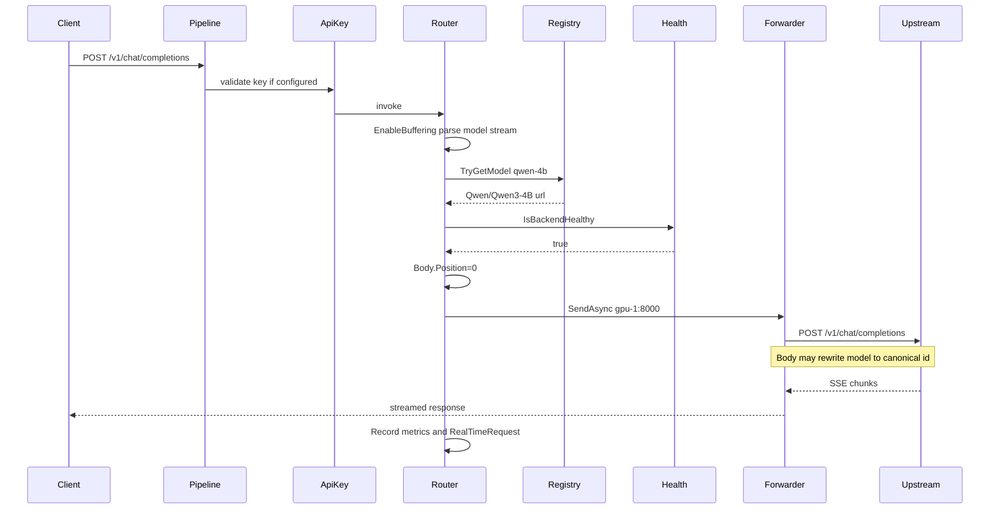

# 02 — Core Proxy and Routing

## Scope

This document specifies **all request-path logic** for the LLM Gateway: model registry, middleware routing, HTTP forwarding, streaming behavior, API key authentication, and backend health gating. Configuration and host startup are covered in [01-overview-and-architecture.md](./01-overview-and-architecture.md). HTTP endpoint contracts and metrics APIs are in [03-api-operations-and-observability.md](./03-api-operations-and-observability.md).

## Audience

Developers implementing or reimplementing the proxy core—the component that makes the gateway work for OpenAI clients.

---

## 1. Model registry (`ModelRegistryService`)

### 1.1 Responsibility

- Load model definitions from `models.json`.
- Maintain a **thread-safe** lookup from model name (canonical id or alias) to `ModelConfig`.
- Provide read APIs for the router, health service, models endpoint, and admin status.

### 1.2 Data structures

```text
_modelLookup: Dictionary<string, ModelConfig>   // case-insensitive keys
_models:      List<ModelConfig>                // unique entries, load order preserved
_lock:        object                           // guards all mutations and reads
```

Each `ModelConfig` contains:

| Field | Type | Meaning |
|-------|------|---------|
| `Id` | string | Canonical model identifier |
| `Url` | string | Backend base URL |
| `MaxContextLength` | int | Metadata for `/v1/models` |
| `Aliases` | `List<string>` | Extra lookup keys |

### 1.3 `LoadModelsAsync(configPath)` algorithm

```text
1. Read entire file as UTF-8 text
2. Deserialize JSON → ModelRegistryConfig { Models: List<ModelConfig> }
3. If Models is null OR Count == 0:
       Log warning "No models found"
       RETURN without clearing existing data
4. Acquire lock
5. Clear _modelLookup and _models
6. For each model in Models:
       Append model to _models
       _modelLookup[model.Id] = model
       For each alias in model.Aliases:
           _modelLookup[alias] = model    // same object reference
7. Release lock
8. Log count loaded
```

**On exception** (IO error, invalid JSON): log error and **rethrow**. Caller behavior:

- **Startup:** application fails to start.
- **Hot reload:** reload returns failure; if exception occurred before step 4, previous registry unchanged.

### 1.4 Public API

| Method | Behavior |
|--------|----------|
| `TryGetModel(name, out ModelConfig?)` | Case-insensitive lookup; returns canonical config |
| `GetAllModels()` | Snapshot copy of `_models` list |
| `GetBackendUrl(name)` | `Url` if found, else null |
| `ModelExists(name)` | Whether key exists in lookup |

### 1.5 Alias semantics

- Multiple aliases may point to one `ModelConfig`.
- The **canonical id** (`ModelConfig.Id`) is what health checks and metrics use internally.
- Clients may send either id or alias in the JSON `model` field; the router may rewrite the body to canonical id before forwarding (see §3.5).

---

## 2. Model router middleware (`ModelRouterMiddleware`)

### 2.1 Responsibility

Intercept OpenAI **POST** inference requests, validate body, resolve backend, check health, forward via `IHttpForwarder`, record metrics and real-time events.

### 2.2 Dependencies (constructor)

| Dependency | Use |
|------------|-----|
| `ModelRegistryService` | Resolve model → URL |
| `MetricsService` | Request timing, counters, stream gauge |
| `HealthCheckService` | Block if backend unhealthy |
| `RequestEventService` | Emit `RealTimeRequest` after completion |
| `IHttpForwarder` | YARP forwarder instance |
| `HttpMessageInvoker` | Dedicated client for upstream calls |

### 2.3 Path classification

#### Passthrough paths → `await _next(context)`

Prefix match, case-insensitive:

```text
/hubs/
/health
/stats
/metrics
/admin/
/v1/models
```

#### Routable endpoints

Must be **POST** and path **ends with** (case-insensitive):

```text
/v1/chat/completions
/v1/completions
/v1/embeddings
```

All other requests → `await _next(context)`.

### 2.4 Processing algorithm (decision table)

| Step | Condition | Action |
|------|-----------|--------|
| 1 | Passthrough path | `next()` |
| 2 | Not routable OR not POST | `next()` |
| 3 | — | `Request.EnableBuffering()` |
| 4 | JSON parse fails | 400 `invalid_request_error` |
| 5 | `model` missing/empty | 400 `invalid_request_error` |
| 6 | Registry miss | 404 `model_not_found` |
| 7 | Backend unhealthy | 502 `backend_error`, record error metric |
| 8 | — | `Body.Position = 0` |
| 9 | — | Start `RequestTracker`; if `stream==true` increment active stream |
| 10 | — | `SendAsync(context, modelConfig.Url, httpClient, Empty, transformer)` |
| 11 | Forwarder error | Mark failed, 502 if response not started |
| 12 | `finally` | Decrement stream gauge; `RecordRequest(event)` |

### 2.5 Body parsing (`ExtractModelFromBodyAsync`)

Uses `JsonDocument.ParseAsync` on the request body stream:

```json
{
  "model": "qwen-4b",
  "stream": true,
  "messages": [ ... ]
}
```

Extracted fields:

| JSON property | Type | Default |
|---------------|------|---------|
| `model` | string | null if absent |
| `stream` | boolean | `false` if absent or not `true` |

**Important:** After parsing, the body stream position is at end; step 8 rewinds to `0` before forward.

### 2.6 Forwarding call

```text
IHttpForwarder.SendAsync(
    httpContext,
    destinationPrefix: modelConfig.Url,      // e.g. http://gpu:8000
    httpClient: _httpClient,
    requestConfig: ForwarderRequestConfig.Empty,
    transformer: StreamingHttpTransformer(isStreaming, clientModelName, canonicalId)
)
```

The forwarder preserves the incoming request path and method. Example:

```text
Client: POST http://gateway/v1/chat/completions
Upstream: POST http://gpu:8000/v1/chat/completions
```

### 2.7 `ForwarderError` handling

If `error != ForwarderError.None`:

- `RequestTracker.MarkFailed()`
- `MetricsService.RecordError(modelId, error.ToString())`
- Set event `Success = false`, `ErrorType = error.ToString()`
- If `!Response.HasStarted`, write 502 OpenAI error JSON

If `error == None`:

- `Success = (StatusCode < 400)`

### 2.8 Exception handling

Any uncaught exception during forward:

- Mark tracker failed, record error type `"exception"`
- Event: status 502, `Success = false`
- If response not started → 502 generic `backend_error` message

---

## 3. HTTP client and transformer

### 3.1 `HttpMessageInvoker` settings

Created once per middleware instance with `SocketsHttpHandler`:

| Setting | Value | Reason |
|---------|-------|--------|
| `UseProxy` | false | Direct to backend |
| `AllowAutoRedirect` | false | Preserve status codes |
| `AutomaticDecompression` | None | Pass through compressed responses as-is |
| `UseCookies` | false | Stateless proxy |
| `EnableMultipleHttp2Connections` | true | Concurrency |
| `PooledConnectionLifetime` | 10 minutes | Connection refresh |
| `PooledConnectionIdleTimeout` | 5 minutes | Resource cleanup |
| `ResponseDrainTimeout` | 5 seconds | Drain abandoned streams |

### 3.2 `StreamingHttpTransformer`

Extends YARP `HttpTransformer`.

#### Request transform

1. Call `base.TransformRequestAsync`.
2. Set `proxyRequest.Headers.Host = null` (let forwarder set host from destination).
3. **Alias rewrite** (optional): If `originalModelName != canonicalModelName` and `proxyRequest.Content != null`:
   - Read body as string
   - Replace `"model":"{alias}"` → `"model":"{canonical}"`
   - Replace `"model": "{alias}"` → `"model": "{canonical}"` (space after colon)
   - Replace content with new `StringContent(application/json)`

**Limitations of string rewrite:**

- Fails if JSON formatting differs (extra spaces, single quotes, unicode).
- Does not handle `model` in nested objects.
- Reads full body into memory for rewrite path.

#### Response transform

When `_isStreaming && proxyResponse != null`:

- Remove `Content-Length` header (chunked/SSE)
- Set `Cache-Control: no-cache`
- Set `X-Accel-Buffering: no` (hint for nginx)

---

## 4. OpenAI error responses (router)

Written as JSON:

```json
{
  "error": {
    "message": "Human-readable description",
    "type": "error_type_string",
    "code": "error_type_string"
  }
}
```

| HTTP | type | When |
|------|------|------|
| 400 | `invalid_request_error` | Invalid JSON; missing `model` |
| 404 | `model_not_found` | Unknown model or alias |
| 502 | `backend_error` | Unhealthy backend; forwarder failure; exception |

Content-Type: `application/json`.

---

## 5. API key middleware (`ApiKeyMiddleware`)

### 5.1 Behavior

```text
IF GatewayConfig.ApiKeys is empty:
    pass through all requests

IF request path starts with /health, /metrics, or /stats:
    pass through

ELSE:
    Extract key from:
        Authorization: Bearer <token>
        OR header X-API-Key: <token>
    IF missing or not in ApiKeys set (case-sensitive exact match):
        401 + authentication_error JSON
    ELSE:
        pass through
```

### 5.2 Security implications

| ApiKeys configured | Protected | Anonymous |
|--------------------|-----------|-----------|
| No | Everything | Everything |
| Yes | `/v1/*`, `/admin/*`, `/`, SignalR, etc. | `/health`, `/metrics`, `/stats` only |

**Production risk:** With empty `ApiKeys`, `POST /admin/reload` is unauthenticated.

---

## 6. Health checking (`HealthCheckService`)

### 6.1 Background loop

Hosted service runs forever:

```text
loop until cancellation:
    await CheckAllBackendsAsync()    // parallel per model
    await Delay(HealthCheckIntervalSeconds)
```

### 6.2 Per-backend probe

For each `ModelConfig` from registry:

```text
Try GET {Url}/health
    if success → healthy, stop
Try GET {Url}/api/tags     // Ollama-style
    if success → healthy, stop
Try GET {Url}/
    if success → healthy, stop
Else → unhealthy

Store BackendHealth in ConcurrentDictionary[modelId]
```

Uses named HttpClient `"HealthCheck"` with 10s timeout per request.

### 6.3 `BackendHealth` record

| Field | Type |
|-------|------|
| `ModelId` | string |
| `Url` | string |
| `IsHealthy` | bool |
| `StatusCode` | int? |
| `Error` | string? (timeout message, HTTP error, etc.) |
| `LastChecked` | DateTime UTC |

### 6.4 `IsBackendHealthy(modelId)`

```text
if dictionary contains modelId:
    return stored IsHealthy
else:
    return true    // optimistic until first probe completes
```

### 6.5 Impact on other components

| Component | Behavior when unhealthy |
|-----------|-------------------------|
| `ModelRouterMiddleware` | 502 before forward |
| `GET /v1/models` | Model **omitted** from list |
| `GET /v1/models/{model}` | Still returned if in registry; `available: false` |
| `GET /health` (gateway) | Counts toward unhealthy backend tally |

---

## 7. YARP config provider (v1 only — optional for v2)

`DynamicYarpConfigProvider` implements `IProxyConfigProvider`.

### 7.1 `BuildConfig()` behavior

For each model in registry:

```text
clusterId = SanitizeClusterId(model.Id)
  // lowercase, replace / with -, . with -

cluster = {
  ClusterId: clusterId,
  Destinations: { primary: { Address: model.Url } },
  HttpClient: { DangerousAcceptAnyServerCertificate: true },
  HttpRequest: { ActivityTimeout: 10 minutes }
}
```

Also adds a catch-all route (unused without `MapReverseProxy`).

### 7.2 Hot reload

On reload, creates new `InMemoryConfig`, swaps under lock, calls `oldConfig.SignalChange()` to cancel previous change token.

**v2 recommendation:** Remove this class unless implementing real YARP routing.

---

## 8. End-to-end request lifecycle

### 8.1 Example: streaming chat completion

**Client request:**

```http
POST /v1/chat/completions HTTP/1.1
Host: gateway.example.com
Content-Type: application/json

{
  "model": "qwen-4b",
  "messages": [{"role": "user", "content": "Hello"}],
  "stream": true
}
```

**Registry:** `qwen-4b` → alias for `Qwen/Qwen3-4B` at `http://gpu-1:8000`.

**Sequence:**



### 8.2 Non-streaming request

Same flow except:

- `stream` is false → no active stream gauge increment/decrement
- Response transform still runs but streaming headers are not forced

---

## 9. Concurrency and thread safety

| Component | Synchronization |
|-----------|-----------------|
| `ModelRegistryService` | `lock` on all public methods |
| `MetricsService` | `Interlocked` + `ConcurrentDictionary` + concurrent queue |
| `HealthCheckService` | `ConcurrentDictionary` for health state |
| `ConfigReloadService` | `SemaphoreSlim(1,1)` for reload |
| `RequestEventService` | `ConcurrentQueue` + `lock` for RPS calculation |
| `ModelRouterMiddleware` | Stateless per request; single shared `HttpMessageInvoker` |

Each HTTP request is processed independently on the thread pool. Hot reload does not interrupt in-flight forwards.

---

## 10. Related documents

| Document | Contents |
|----------|----------|
| [01-overview-and-architecture.md](./01-overview-and-architecture.md) | Startup, DI, configuration, Kestrel, CORS |
| [03-api-operations-and-observability.md](./03-api-operations-and-observability.md) | `/health`, `/stats`, `/metrics`, `/v1/models`, admin reload, SignalR, Postgres |
| [README.md](./README.md) | Index and read order |
